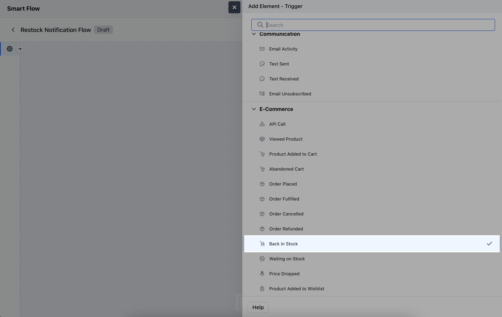
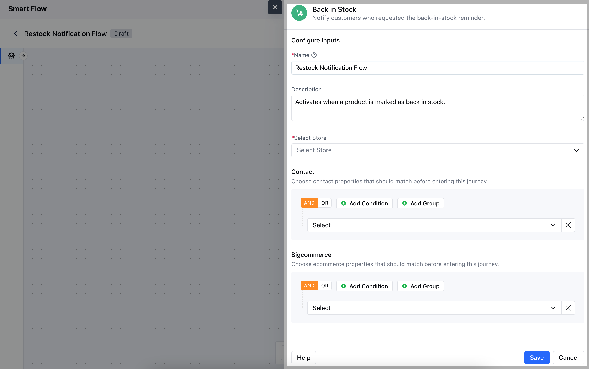
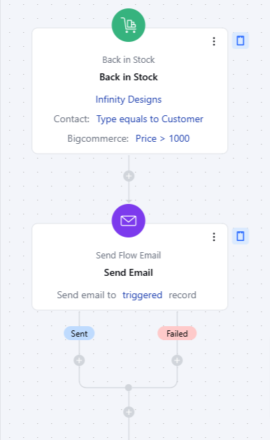

The **Back in Stock** trigger activates a flow when an out-of-stock product becomes available again.

**Note:** This Trigger is a part of [BigCommerce](https://support.salesmate.io/hc/en-us/articles/6774740880153-Introduction-and-Installation-of-BigCommerce) Integration

- **Topics covered:** -
- [How to Configure Back in Stock Trigger](#how-to-configure-back-in-stock-trigger)

- [Practical Example](#practical-example)

###  How to Configure Back in Stock Trigger

While creating the Trigger Based Flows select **Back in Stock** trigger.

When setting up the **Back in Stock** trigger, you will need to configure the following:- **Name:** Provide a clear and descriptive name for the trigger.

- **Description:** Write a brief explanation of the trigger’s purpose.

- **Select Store:** Choose the appropriate **BigCommerce Store** where the product is managed.

- **Contact:** Specify conditions to target specific customer segments who are interested in the product.

- **BigCommerce:** Add specific BigCommerce conditions related to the Back in Stock process.Once the configuration is completed, hit **Save**.

###  Practical Example

Let's create a Smart Flow to send out the notification email to the set of contacts that requested to be notified when a particular product is back in stock.

