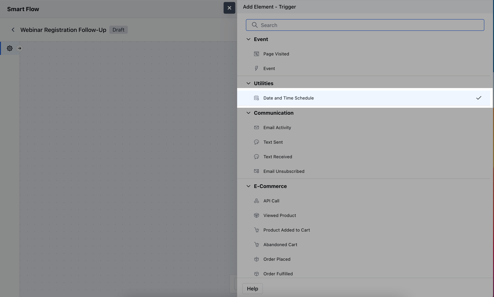

The **Date and Time Schedule** trigger initiates a flow at a specific date and time you set. This is useful for automating actions based on predetermined schedules, such as sending reminders, and updates, or executing tasks at specific intervals.

### **Topics covered:**

- [How to Configure Date and Time Schedule Trigger](#how-to-configure-date-and-time-schedule-trigger)

- [Practical Example](#practical-example)

### How to Configure Date and Time Schedule Trigger

While creating the Trigger Based Flows select the **Date and Time Schedule** trigger.

When setting up the **Date and Time Schedule** trigger, you'll need to configure the following details:

- **Name:** Provide a clear, descriptive name for the trigger to identify its purpose in the flow.

- **Description:** Write a brief explanation of the trigger’s function, specifying what actions it will initiate and when.

- **Start Date:** Select the specific date when the trigger should first activate. This defines the day the flow will begin.

- **Start Time:** Choose the exact time for when the trigger should fire on the scheduled date, ensuring actions happen at the desired moment.

- **Start Frequency:** Set how often the trigger will repeat to define the recurrence of the flow.

- **Timezone:** Specify the time zone for the trigger’s execution to ensure the actions occur at the correct local time.

- **Triggering Module:** Select the module where the flow will be applied, determining which records will be impacted by the scheduled actions.

- **Configure Entry-Level Conditions:** Set specific criteria that records must meet to enter and trigger the flow.

### Practical Example

Here, we will send monthly emails about the sale on the 1st date of every month, this way you can implement a monthly discount promotion to boost sales and encourage customer loyalty.

- **NOTE:** This trigger works only once. In case you intend to trigger the Smart Flow for another date, configure a new Smart Flow with Date and Time Schedule Trigger. You can also clone an existing Smart Flow if created and choose a different date/time before publishing it.
