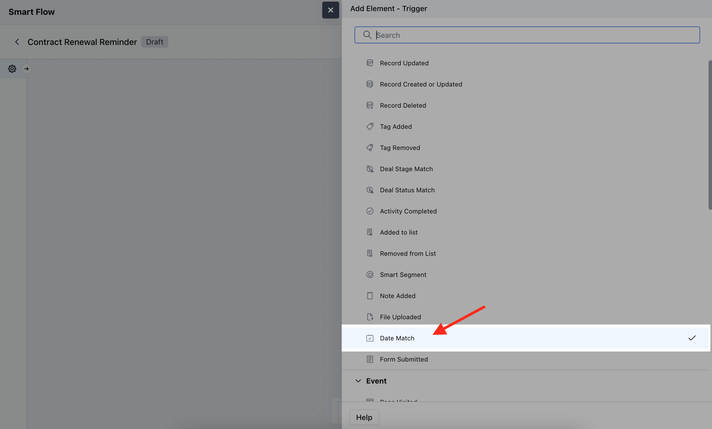
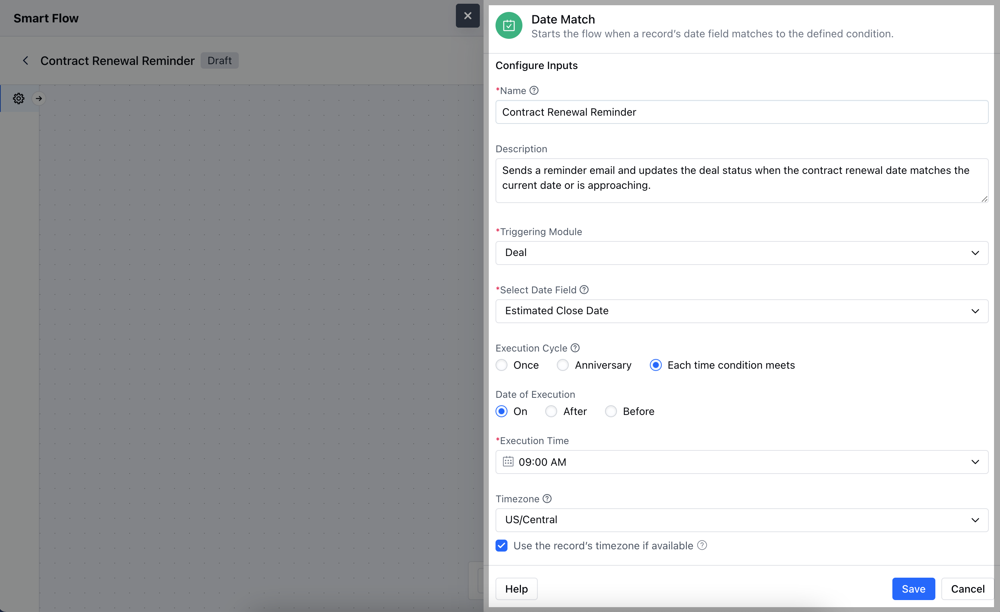
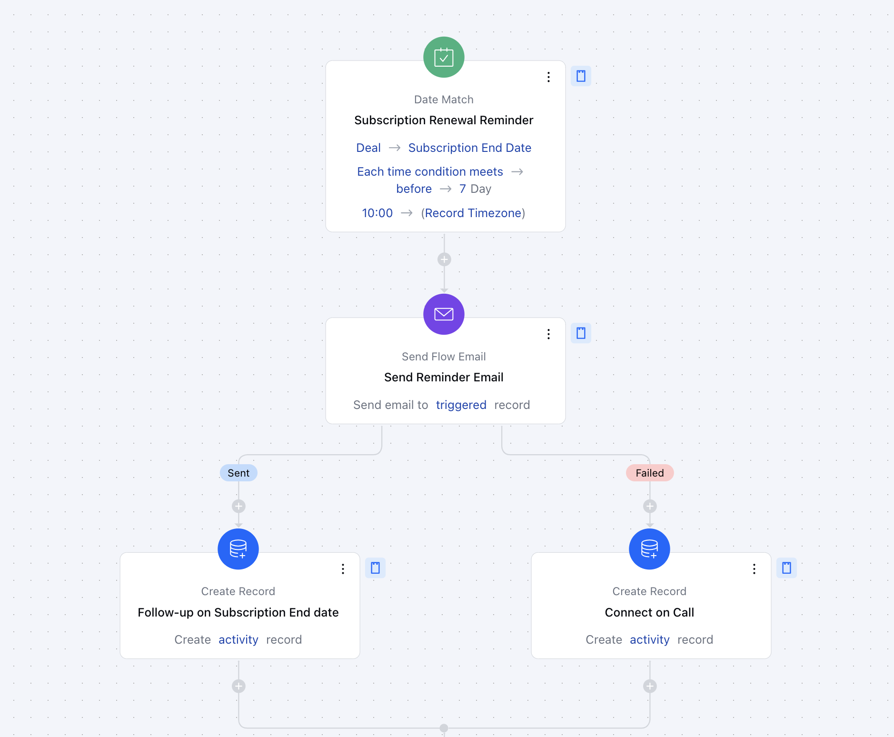

- The **Date Match** trigger activates a flow when a specific date field in a record matches a defined date.

###  **Topics covered:**

[How to Configure Date Match Trigger](#how-to-configure-date-match-trigger)

- [Practical Example](#practical-example)

###  How to Configure Date Match Trigger

While creating the Trigger Based Flows select Date Match trigger.

After selecting the **Date Match** trigger, you'll need to configure the block by entering the following details:

- **Name:** Provide a clear and descriptive name for the trigger to identify its purpose within the flow.

- **Description:** Write a brief explanation of what the trigger does and its role in the flow, helping to clarify its function and impact.

- **Triggering Module:** Choose the specific module where the date field is located and where the trigger will be applied.

- **Select Date Field:** Specify the date field in the record that the trigger will monitor for a match.

- **Execution Cycle:** Define how often the trigger should check for the date match.

- **Date of Execution:** Set the specific date or date range that the trigger will use to match against the selected date field.

- **Execution Time:** Specify the time of day when the trigger should execute its actions.

- **Time Zone:** Select the time zone in which the date and time should be interpreted to ensure accurate timing.

- **Use Contact's Timezone:**Choose whether to use the contact’s time zone for the trigger, if applicable, to align with their local time.Click **Save** to save the information.

###  Practical Example

Here, we are managing a subscription-based service, and we want to send a renewal reminder email to customers a week before their subscription expires.

With this setup, every day, the system will check for subscriptions that are set to expire in one week. When a match is found, customers will receive a timely reminder, helping to improve renewal rates and customer satisfaction.
