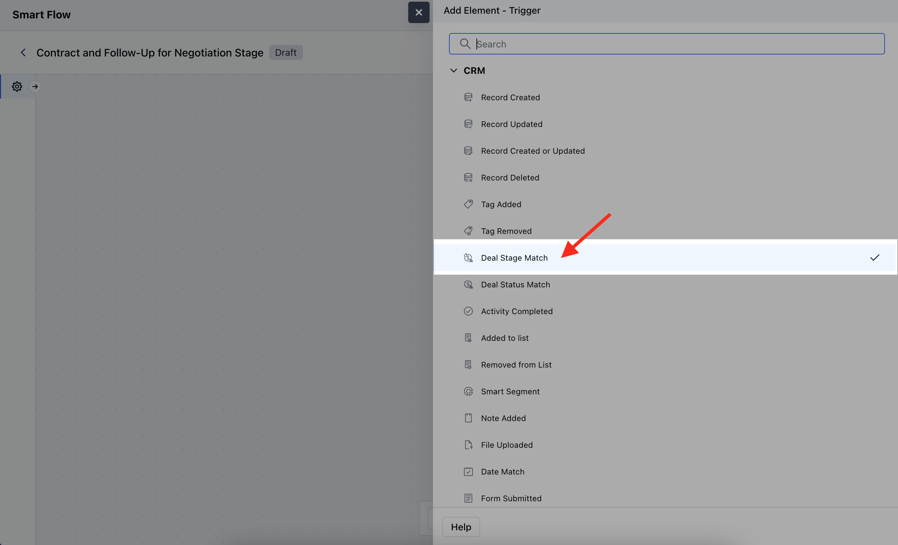
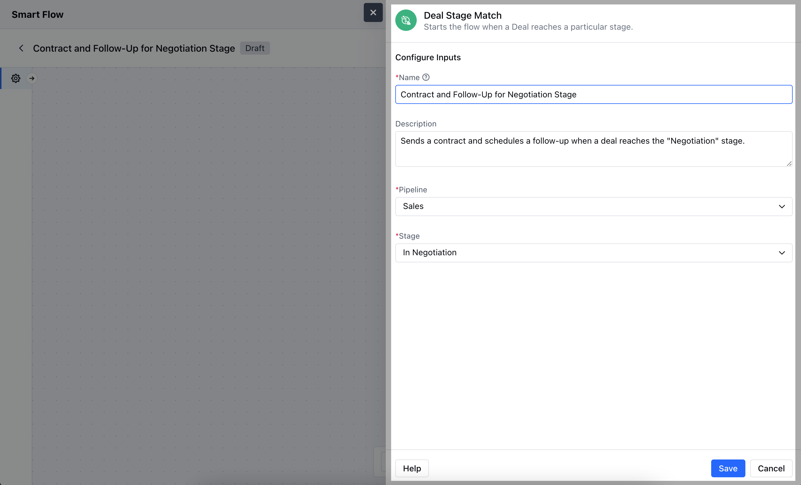
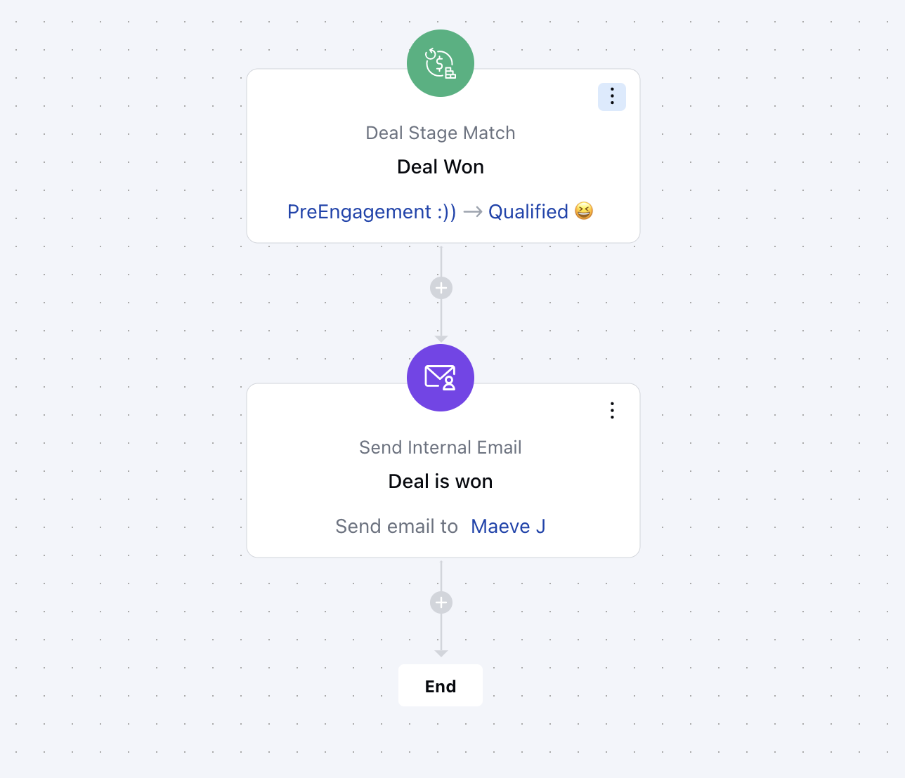

The**Deal Stage Match**trigger activates the flow when a deal reaches a specific stage, allowing automated actions to occur based on that stage.**Topics Covered:**[How to Configure Deal Stage Match Trigger](https://support.salesmate.io/hc/en-us/articles/36768388746521-Deal-Stage-Match#h_01J7WP58MANFW05SADNCDH1HCD)[Practical Example](https://support.salesmate.io/hc/en-us/articles/36768388746521-Deal-Stage-Match#h_01J7WPM8C65WWG989NZZP56JAG)

### How to Configure Deal Stage Match Trigger

While creating the Trigger Based Flows select**Deal Stage Match**trigger.

Once selected, you would then need to configure the block.As you click on the block, a pop will open to add following details.**Name:**Enter a clear and descriptive name for the trigger to easily identify its purpose within the flow.**Description:**Provide a brief explanation of what the trigger does and its role in the flow, helping to clarify its function.**Pipeline:**Choose the specific pipeline where the trigger should apply, defining the context within which the deal stage change will be monitored.**Stage:**Select the particular deal stage that, when matched, will activate the flow.Once added, hit on**Save**.

### Practical Example

When a deal is marked as "Won", an automatic text goes out to the sales team to celebrate the achievement and remind them to follow up with the customer. This fosters a positive relationship and encourages future sales opportunities.

