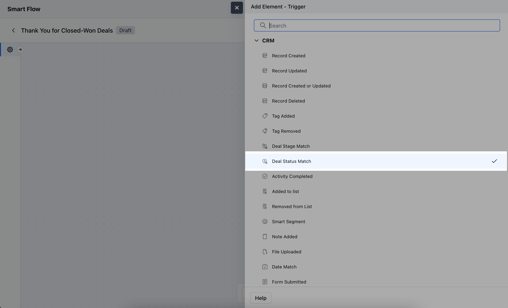
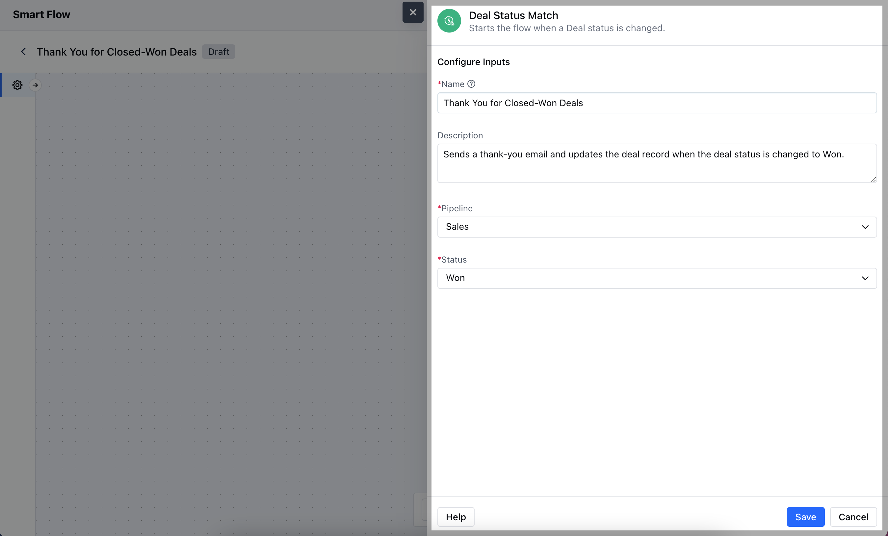
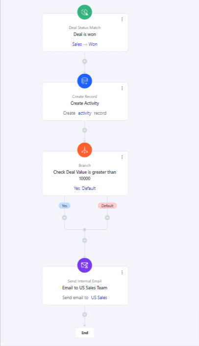

The Deal Status Match trigger activates the flow when a deal reaches a specified stage initiating automated actions based on that status.

### **Topics covered:**

- [How to Configure Deal Status Match Trigger](#how-to-configure-deal-status-match-trigger)

- [Practical Example](#practical-examplehttpssupportsalesmateiohcen-usarticles36768404490393-deal-status-matchh_01j7wr44y96g5ft52y14qx6g1v)

### How to Configure Deal Status Match Trigger

While creating the Trigger Based Flows select **Deal Status Match** trigger.

Once selected, you would then need to configure the block.As you click on the block, a pop will open to add following details.

- **Name:** Enter a clear and descriptive name for the trigger.

- **Description:** Provide a brief explanation of what the trigger does and its role in the flow.

- **Pipeline:** Choose the specific pipeline where the trigger will be applied. This defines which pipeline's deals will be monitored for status changes.

- **Status:** Select the specific deal status that, when updated to this status, will trigger the flow.Once selected, hit** Save.

- **

**

###
[Practical Example](#practical-examplehttpssupportsalesmateiohcen-usarticles36768404490393-deal-status-matchh_01j7wr44y96g5ft52y14qx6g1v)

Suppose you want to create an onboarding task for your team once a deal is won or notify the US team whenever a deal is closed, having a value of more than ten thousand dollars.

