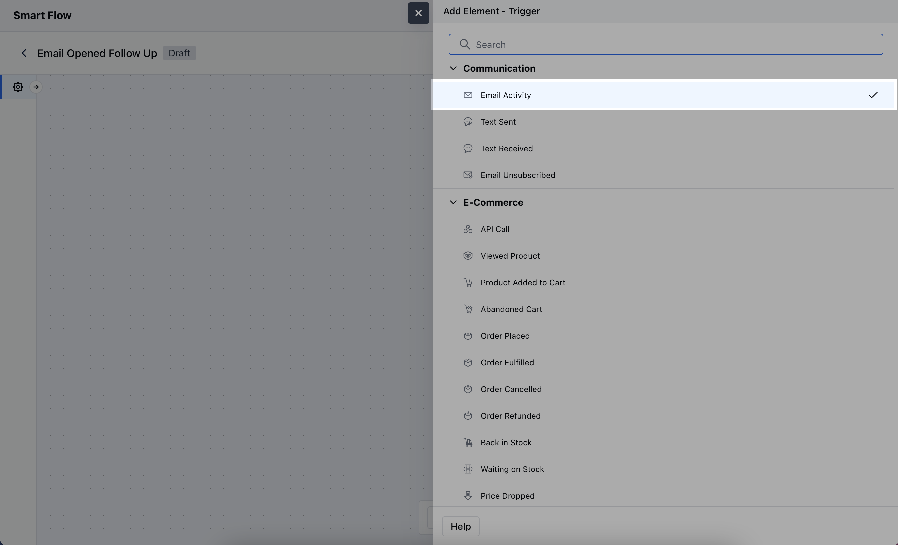
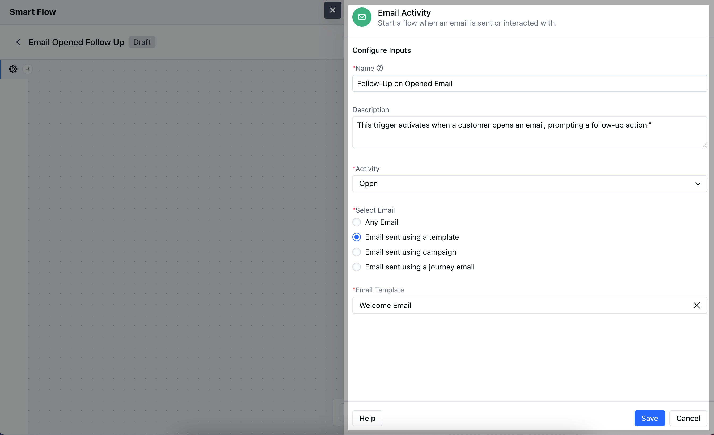
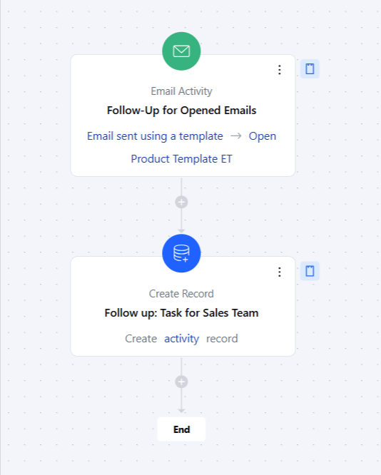

The**Email Activity**trigger initiates a flow based on specific email interactions, such as when an email is sent, opened, clicked, replied , bounced or unsubscribed.**Topics Covered:**[How to Configure Email Activity Trigger](https://support.salesmate.io/hc/en-us/articles/37780050890905-Email-Activity#h_01J81V2290RZ116QRSCZEYF6GV)[Practical Example](https://support.salesmate.io/hc/en-us/articles/37780050890905-Email-Activity#h_01J8203DX4539T3J5RY4B379WS)

### How to Configure Email Activity Trigger

While creating the Trigger Based Flows select the**Email Activity**trigger

After selecting the Email Activity trigger, you'll need to configure the block by entering the following details:**Name:**Provide a clear and descriptive name for the trigger to easily identify its purpose.**Description:**Enter a brief explanation of what the trigger does, describing how it fits into your flow. For example, "This trigger activates when a customer opens an email, prompting a follow-up action."**Activity:**Choose the specific email activity that will activate the flow.**Select Email:**Choose the specific email Template, Campaign or Journey Email that this trigger should monitor for activity.Once done, click on**Save**.

### Practical Example

Here, we want to follow up with customers who open a promotional email but do not click on any links, to encourage them to engage further with your offerings.

