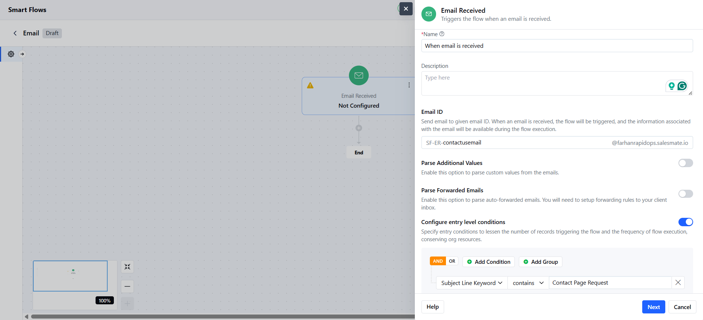

Get started with the Email Received trigger in Salesmate CRM to kick off a Smart Flow whenever an email lands in your designated inbox. It’s a simple way to automate tasks like following up with customers, creating records, or pulling key details from emails.**Note:**You’ll need permission to manage Smart Flows to set up this trigger.Topics Covered:

[Steps to Set Up an Email Received Trigger](https://support.salesmate.io/hc/en-us/articles/48767576180377-Email-Received-Trigger#h_01K06J6FVXXTKBCFDY9BHBN73R)[Set Up the Trigger](https://support.salesmate.io/hc/en-us/articles/48767576180377-Email-Received-Trigger#h_01K06J6FW4VNQKEFNSRVA80TCD)[Create Parsing Rules](https://support.salesmate.io/hc/en-us/articles/48767576180377-Email-Received-Trigger#h_01K06J6FX3KYBBTEY1ZKG7TQAX)[Data Available in Your Flow](https://support.salesmate.io/hc/en-us/articles/48767576180377-Email-Received-Trigger#h_01K06J6FXZG5N3C1ZPYADYRST6)[Practical Use Cases](https://support.salesmate.io/hc/en-us/articles/48767576180377-Email-Received-Trigger#h_01K06J6FY3A484DSMX449DB6D1)

### Steps to Set Up an Email Received Trigger

Navigate to the left S**idebar.**Click**Smart Flows**, then choose**Create Flow**.

Add the**Email Received**trigger to start your flow when an email arrives.

### Set Up the Trigger

Here’s what you need to configure:**Email Address**:
You’ll get a custom email address like SF-ER-\[yourtext\]@yourdomain.salesmate.io.The “SF-ER” part is fixed, but you can pick a custom word (3-20 characters, using letters, numbers, hyphens, or dots).**Name**: Give the trigger a name that matches its purpose (e.g., “Order Emails”).**Description**: Add a short note to explain what the trigger does.

**Parse Additional Values**: Turn this on to pull specific details from the email, like an order number. If enabled, you’ll have to set up parsing rules in the next step.**Parse Forwarded Emails**: Turn this on to grab details like the original sender’s name or email from forwarded messages. You can’t use this if Parse Additional Values is turned on.**Filter Conditions**: Set rules to trigger the flow only for certain emails (e.g., emails with “invoice” in the subject, from a specific sender, or with certain words in the body).

### Create Parsing Rules

If you turned on**Parse Additional Values**, here’s how to set up parsing:**Send a Test Email**:
Send an email to your parser address. You can copy the address from the screen.The system saves the last 3 non-test emails, listed from newest to oldest.**Pick an Email**: Choose one email from the list to set up data extraction.

**Map Variables**: Highlight text in the email to extract (e.g., “12345” from “Order ID: 12345”).**Advanced Options**:**Extract Part of Text**: Pull only part of the highlighted text (e.g., “$100” from “Total: $100.00”).**DOM Path (CSS Selector)**: Use a selector to pinpoint data.**Content Path (XPath)**: Use a path as a backup.**Text Position**: Set start and end points for the text you want.**Review Variables**: You can see all mapped variables in a list on the right. You can edit or delete them using the**X**icon. To change mappings, click**Modify**to update or pick a different email, which re-parses the data.**Save**: Save your variable mappings. You can’t edit variable names later; delete and recreate them if needed.

### Data Available in Your Flow

When the flow starts, you can use these email details:

Sender NameSender Email AddressCC and BCC AddressesSubjectEmail Body (HTML and plain text)Received Date and TimeThread IDForwarded Sender Name and EmailParsed Variables

### Practical Use Cases

Create a lead (contact) in Salesmate when someone emails your support inbox.Start a support ticket for emails with words like “urgent” or “refund.”Parse the email signature in emails to create a contact in Salesmate.
