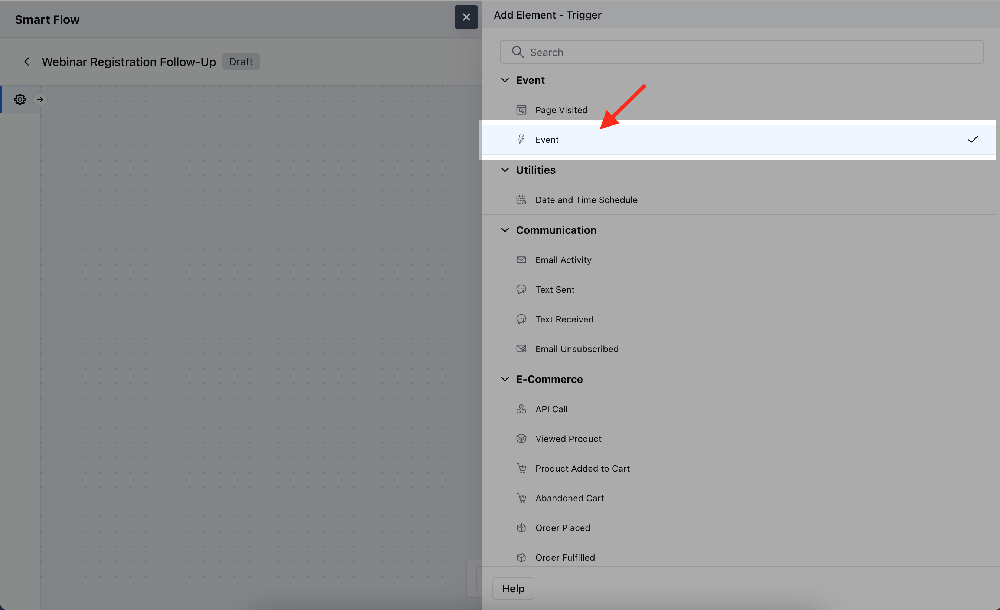
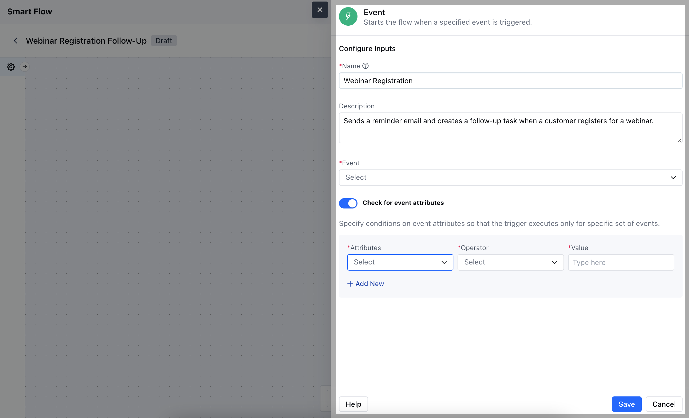
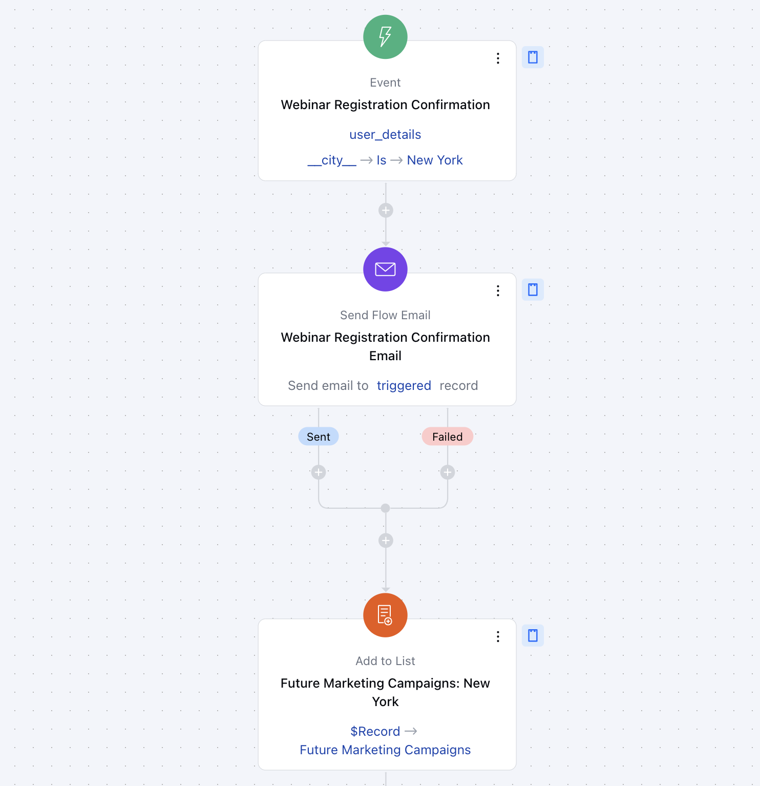

The**Event Trigger**activates a flow based on the occurrence of a specific event, such as a webinar registration, meeting, or any other scheduled event.**Topics Covered:**[How to Configure Event Trigger](https://support.salesmate.io/hc/en-us/articles/37779943650713-Event#h_01J81M49CNA5H2J8N0KVJJ82CB)[Practical Example](https://support.salesmate.io/hc/en-us/articles/37779943650713-Event#h_01J81P1628XZBTBBX33BGX3ZDE)

### How to Configure Event Trigger

While creating the Trigger Based Flows select the**Event**trigger

After selecting the**Event Trigger**, you’ll need to configure the block by providing the following details:**Name:**Enter a clear and descriptive name to define the trigger's purpose within the flow.**Description:**Provide a short explanation of what this trigger will do, outlining how it fits into the overall automation process.**Event:**Select the specific event that will trigger the flow.**Check for Event Attributes:**Enable this option if you want to set additional conditions based on the attributes of the event.**Attributes:**Define specific event details that you want to monitor.**Operator:**Choose how the attribute should be compared.**Value:**Enter the specific value the attribute must meet for the trigger to activate.Once done, click on**Save**.**Note:**Before configuring the Event Trigger, the user must have at least one event recorded in the system.

### Practical Example

Here, We have organized a webinar on digital marketing strategies and want to send a confirmation email to participants once they register. We will segment our data based on the particular city and add them to specific lists.

