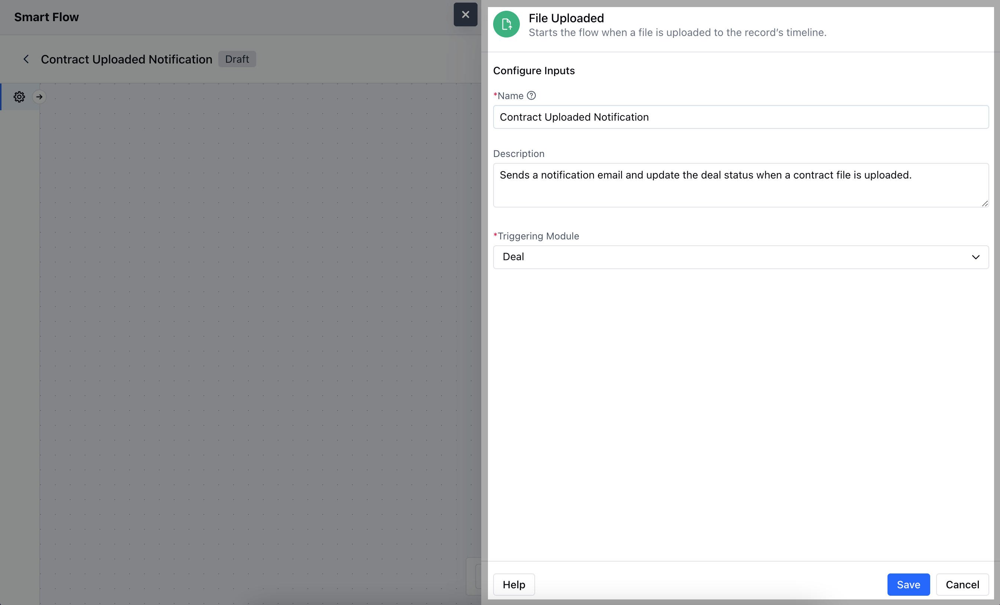

- The **File Uploaded** trigger activates a flow when a file is uploaded to a specific record. This can initiate automated actions based on the upload.

- **Topics covered:** -
- [How to Configure File Uploaded Trigger](#how-to-configure-file-uploaded-trigger)

- [Practical Example](#practical-example)

### How to Configure File Uploaded Trigger

While creating the Trigger Based Flow, select File Uploaded trigger.

Once selected, you would then need to configure the block.As you click on the block, a pop will open to add following details.

- **Name:** Enter a clear, descriptive name to identify the purpose of the trigger in the flow

- **Description:** Write a brief explanation of what the trigger does and how it fits into the flow

- **Triggering Module:** Choose the specific module where the file upload will activate the trigger. Hit on **Save** to save the information.

### Practical Example

Suppose you want your compliance team to verify all the docs associated with contacts. Whenever a new document is uploaded inside the contact record, the compliance team will get a task to verify the newly uploaded doc.

