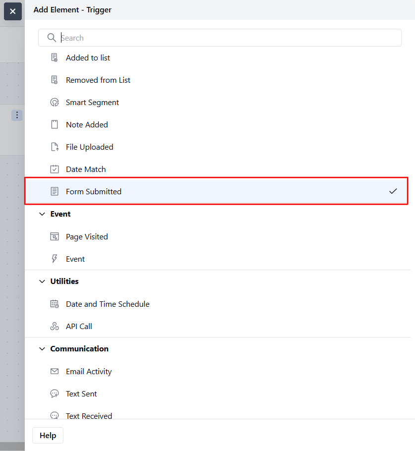
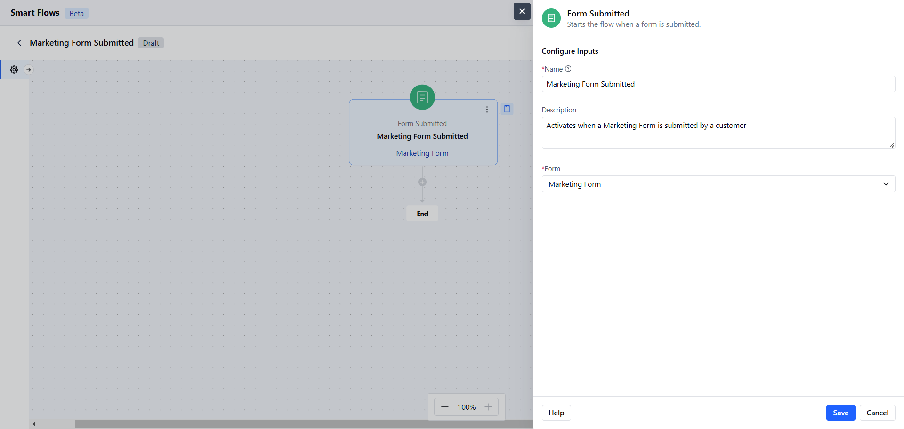
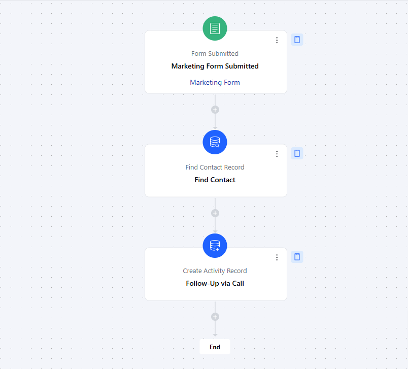

The **Form Submitted** trigger activates a flow when a form is submitted.

###  **Topics covered:**

How to Configure Form Submitted Trigger.Practical Example

###  How to Configure Form Submitted Trigger

While creating the Trigger Based Flows select the **Form Submitted** trigger

When setting up the **Form Submitted** trigger, you'll configure the following details:

- **Name:** Assign a clear and descriptive name to the trigger to identify its purpose (e.g., "Marketing Form Submitted").

- **Description:** Provide a brief explanation of what the trigger does and how it fits into the workflow (e.g., "Activates when a Marketing Form is submitted by a customer").

- **Form:** Need to select the form on which the smart flow needs to be triggered.Once done, click on Save

###  Practical Example

Here, We will create follow-up tasks for our sales team to reach out to the contacts who have demonstrated interest in our marketing campaign by submitting the "Marketing Form".

