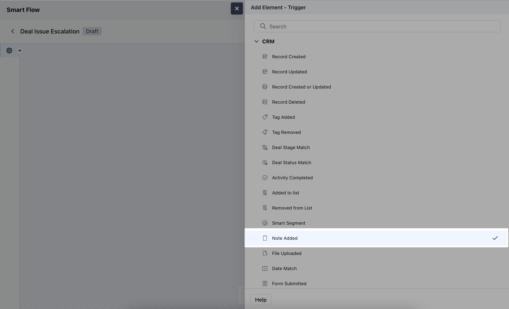
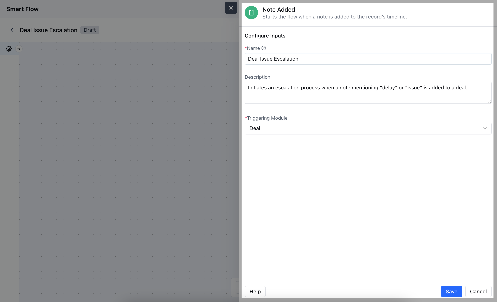
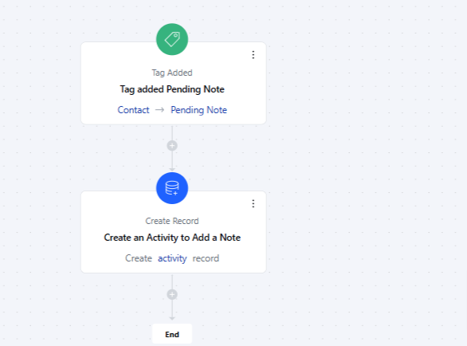
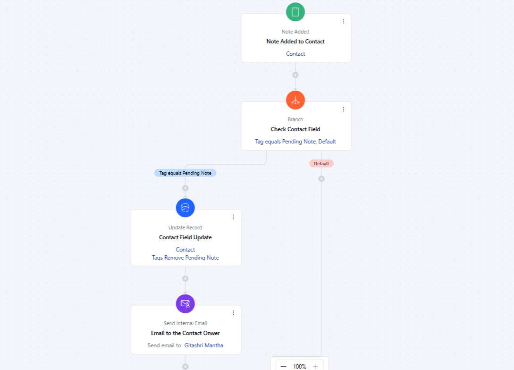

The**Note Added**trigger initiates the flow when a note is added to a record.**Topics Covered:**[How to Configure the Note Added Trigger](https://support.salesmate.io/hc/en-us/articles/37775211665433-Note-Added#h_01J7X37WPNXYJT3PBR60AWPZGF)[Practical Example](https://support.salesmate.io/hc/en-us/articles/37775211665433-Note-Added#h_01J7X4KSXTH8NYJXVW9DPYPPBG)

### How to Configure the Note Added Trigger

While creating the Trigger Based Flows select**Note Added**trigger.

Once selected, you would then need to configure the block.As you click on the block, a pop will open to add following details.**Name:**Provide a descriptive name for the trigger to understand the purpose of Flow**Description:**Write a brief explanation outlining the trigger's role in the flow, helping to clarify its function and how it contributes to the automation.**Triggering Module:**Choose the specific module where the trigger will be applied, indicating which module's records will activate the flow.After entering all the required details, click**Save**.

### Practical Example

As a manager, review recent conversations with high-value accounts. If a salesperson hasn’t added a note for their last conversation with a client, add a “Pending Note” tag to the record.This tag assigns a to-do to the record owner, reminding them to add the conversation note.Once the salesperson adds the note, the tag is automatically removed.An email summary is then sent to you to confirm the update details.

