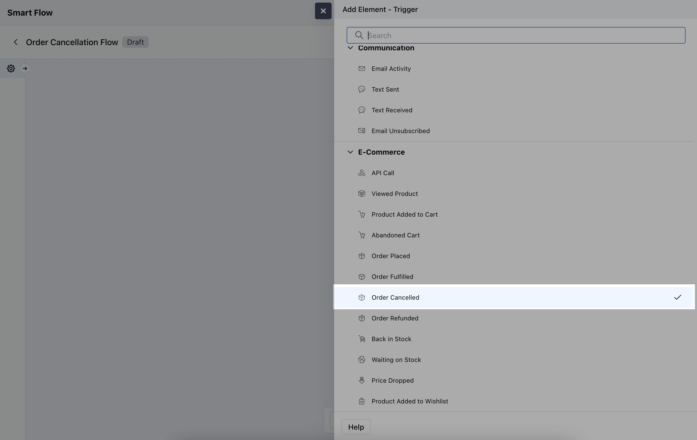
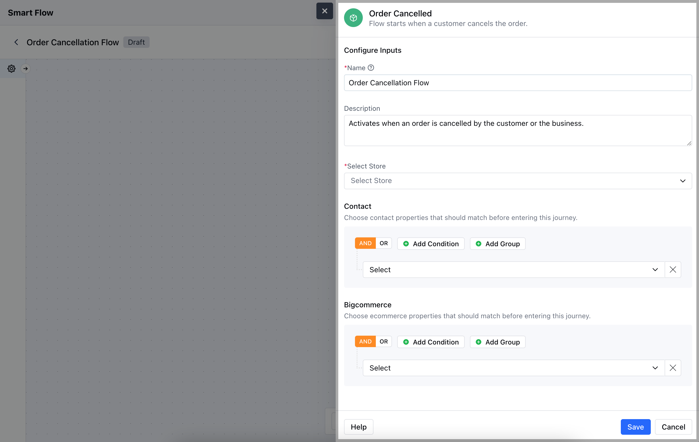
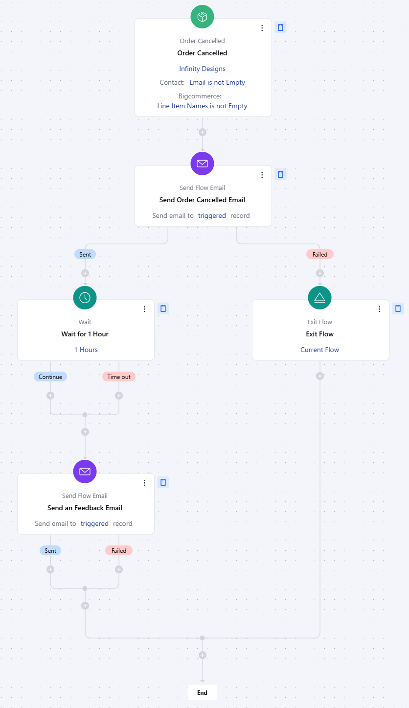

The**Order Cancelled**trigger activates a flow when an order is marked as cancelled in the system. This trigger is useful for automating follow-up actions, such as notifying the customer, offering assistance, or initiating refund processes.**Note:**This Trigger is a part of [BigCommerce](https://support.salesmate.io/hc/en-us/articles/6774740880153-Introduction-and-Installation-of-BigCommerce) Integration**Topics Covered:**[How to Configure Order Cancelled Trigger](https://support.salesmate.io/hc/en-us/articles/37780201843609-Order-Cancelled#h_01J8H9EXXDHMNT92M1266CV799)[Practical Example](https://support.salesmate.io/hc/en-us/articles/37780201843609-Order-Cancelled#h_01J8H9J29QACCQYCYTT891DRD4)

### How to Configure Order Cancelled Trigger

While creating the Trigger Based Flows select**Order Cancelled**trigger.

When setting up the**Order Cancelled**trigger, you'll need to configure the following:**Name:**Provide a clear name for the trigger.**Description:**Briefly explain the trigger's purpose.**Select Store:**Choose the**BigCommerce Store**or where the order is managed.**Contact:**Add specific contact conditions, such as the customer’s email or account status.**BigCommerce:**Set additional conditions for the order to ensure the trigger only activates for relevant ordersOnce the configuration is completed, hit**Save**.

### Practical Example

Let's create a Smart Flow to send out a cancellation confirmation Email to the contact who has initiated an order cancellation and after that we will send them an email asking why they have cancelled the order.

