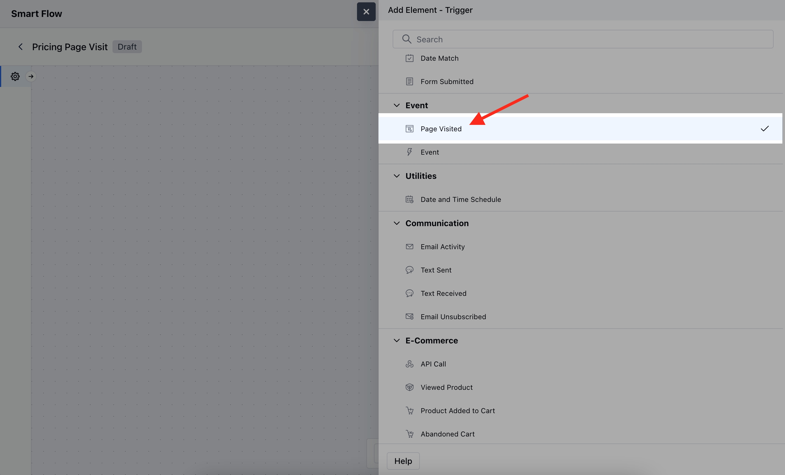
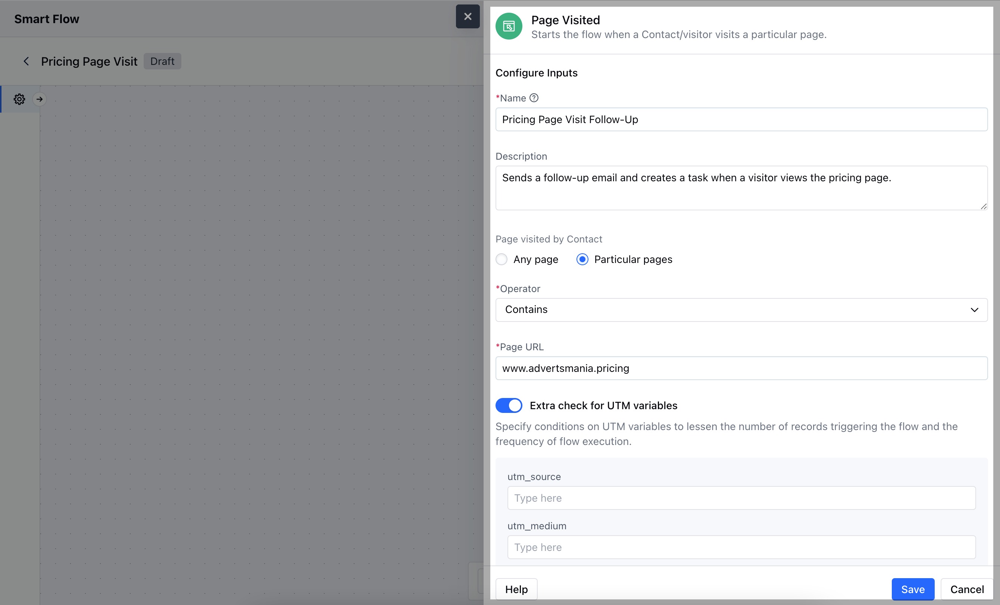
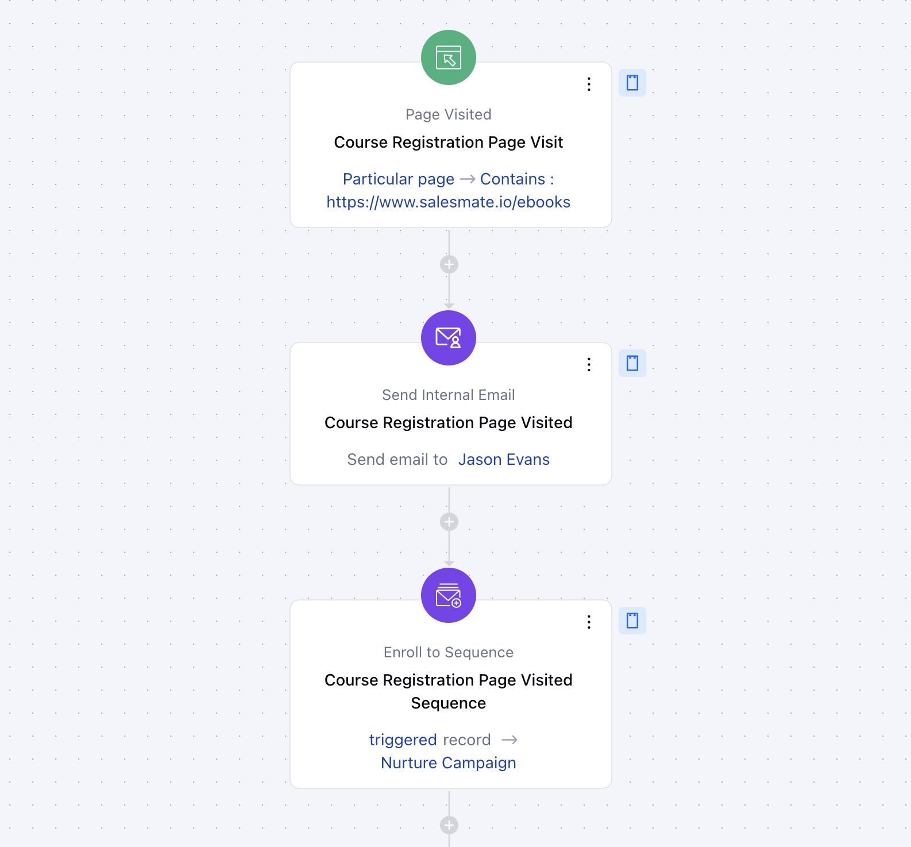

The **Page Visited** trigger activates a flow when a specific webpage is visited by a contact. This is helpful for tracking engagement and triggering actions based on interactions with your website.

### **Topics covered:**

- [How to Configure Page Visited Trigger](#how-to-configure-page-visited-trigger)
- [Practical Example](#practical-example)

### How to Configure Page Visited Trigger

While creating the Trigger Based Flows select the **Page Visited** trigger

After selecting the **Page Visited** trigger, you'll need to configure the block by entering the following details:

- **Name:** Provide a clear and descriptive name for the trigger to easily identify its purpose within the flow.

- **Description:** Write a brief explanation of what the trigger does and how it fits into the flow, helping to clarify its function.

- **Page Visited by Contact:** Specify the URL or webpage that will activate the trigger when visited by a contact.

- **Extra Check for UTM Variables:** Optionally, define specific UTM parameters (e.g., source, medium, campaign) that must be present in the URL for the trigger to activate.

### Practical Example

You run an online marketing course and want to send an internal email to the team about the contacts who visited your course registration page. This helps you gauge interest and nurture potential leads.

With this setup, whenever a contact visits a specific page, the system will automatically send an email to teammates. This proactive approach can significantly improve enrollment rates by keeping potential customers engaged.
