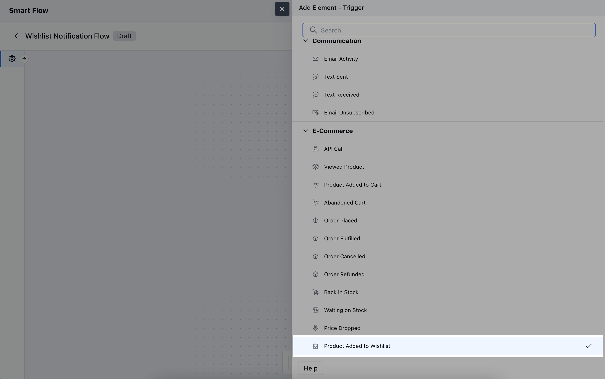
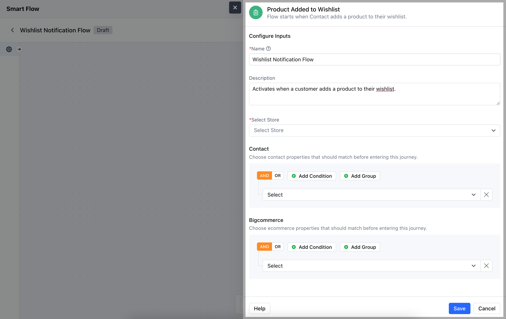
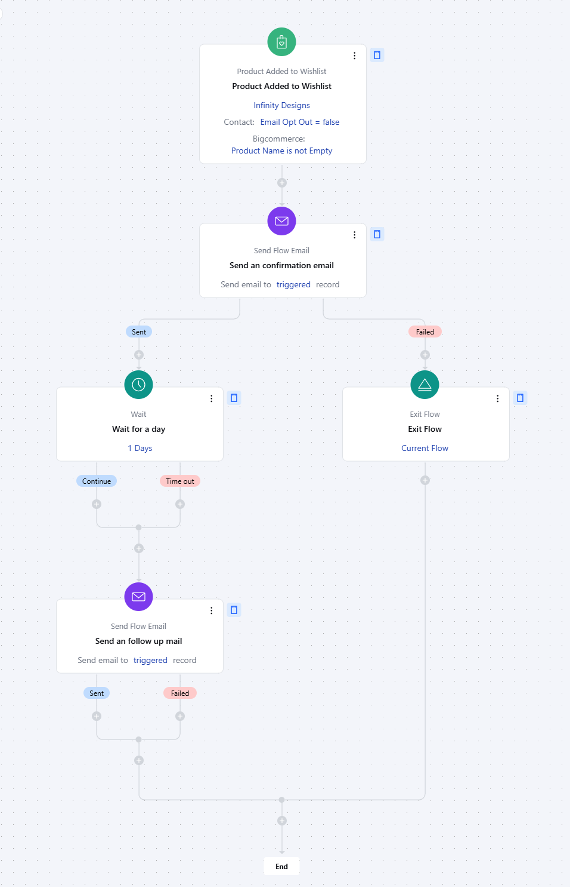

The**Product Added to Wishlist**trigger activates a flow when a customer adds a product to their wishlist.**Note:**This Trigger is a part of [BigCommerce](https://support.salesmate.io/hc/en-us/articles/6774740880153-Introduction-and-Installation-of-BigCommerce) Integration**Topics Covered:**[How to Configure Product Added to Wishlist Trigger](https://support.salesmate.io/hc/en-us/articles/37780302735641-Product-Added-to-Wishlist#h_01J8HKJPDCBNA4DPGPJMFWC1FT)[Practical Example](https://support.salesmate.io/hc/en-us/articles/37780302735641-Product-Added-to-Wishlist#h_01J8HMTMKD8QNB8GKXK56PQE7D)

### How to Configure Product Added to Wishlist Trigger

While creating the Trigger Based Flows select**Product Added to Wishlist**trigger.

When setting up the**Product Added to Wishlist**trigger, you will need to configure the following elements:**Name:**Provide a specific and descriptive title for the trigger to easily identify its function within your system.**Description:**Write a concise explanation detailing the purpose of the trigger.**Select Store:**Choose the appropriate BigCommerce Store that supports wishlist functionality, ensuring the trigger is linked to the correct inventory.**Contact:**Define any specific criteria related to customer behaviour or preferences.**BigCommerce:**Specify conditions related to the products themselves, to ensure the trigger activates only for the desired products in the wishlist.Once the configuration is completed, hit**Save**.

### Practical Example

Let's create a Smart Flow to send out an email to the set of customers who have just added a particular product to their Wishlist. Further, we can wait for a couple of days and if the product is still on the wish list we can send out another reminder Email.

