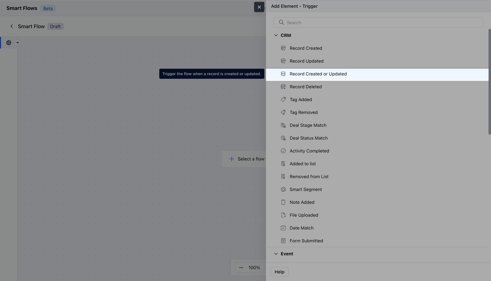
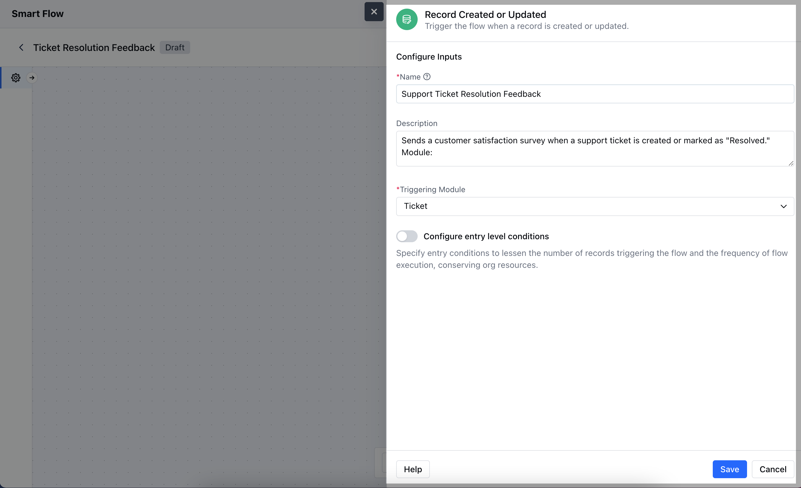
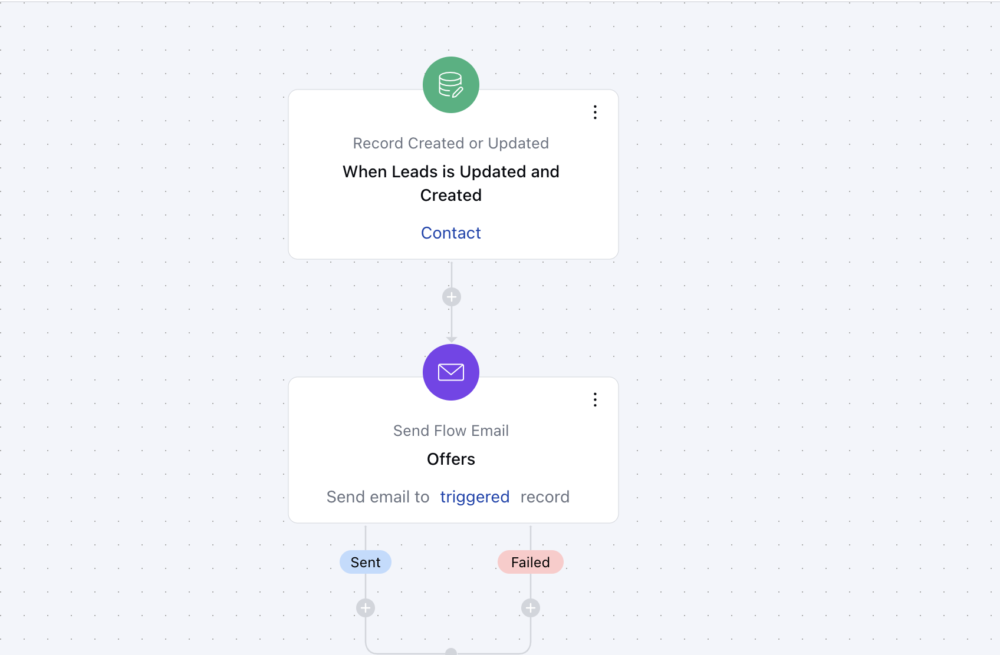

The Record Created/ Updated trigger in Salesmate starts a Smart Flow automatically whenever a record is created or updated.

- **Topics covered:**
- [How to Configure Record Updated or Created Trigger](#how-to-configure-record-updated-or-created-trigger)

- [Practical Example](#practical-example)

###  How to Configure Record Updated or Created Trigger

While creating the Trigger Based Flows select **Record Created or Updated** trigger

Once selected, you would then need to configure the Trigger.As you click on the block, a pop will open to add following details.

- **Name:** Provide a clear and descriptive name for the trigger to easily identify its purpose and function within your flow.

- **Description:** Enter a brief explanation of what the trigger does and its role in the flow.

- **Module:** Select the specific module where the trigger should be applied.

- **Configure Entry-Level Conditions:** Define the conditions that must be met for the trigger to activate. These conditions specify when and how the trigger should respond to record creation or updation, ensuring it only acts when the specified criteria are satisfied.**

- *Once done, click on** Save **Note:**If you want to execute the smart flow based on a specific field update, you can include that field in the enrollment condition and apply the**'Is change'** condition.

###  Practical Example

For example, if you want to send an automated email to new customers whenever a new lead is added, you can set up a trigger for this action. You can also do the same for existing leads. Additionally, once the email is sent, you can automatically add a tag called "Welcome Sent" to keep track of those who have received the email.

