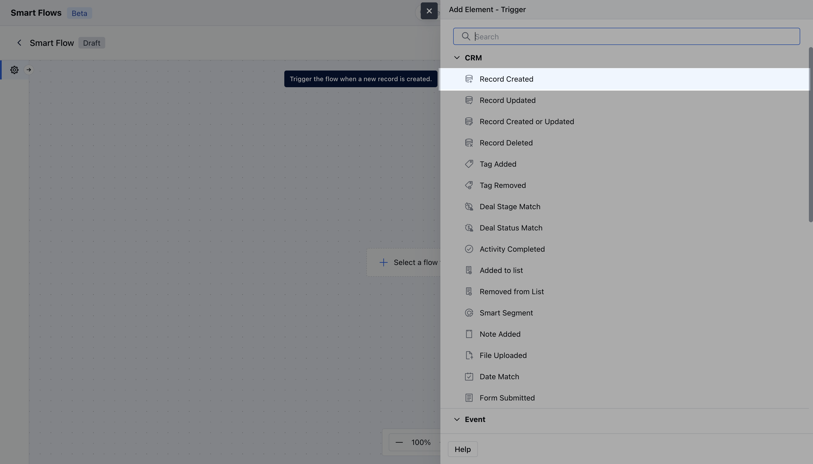
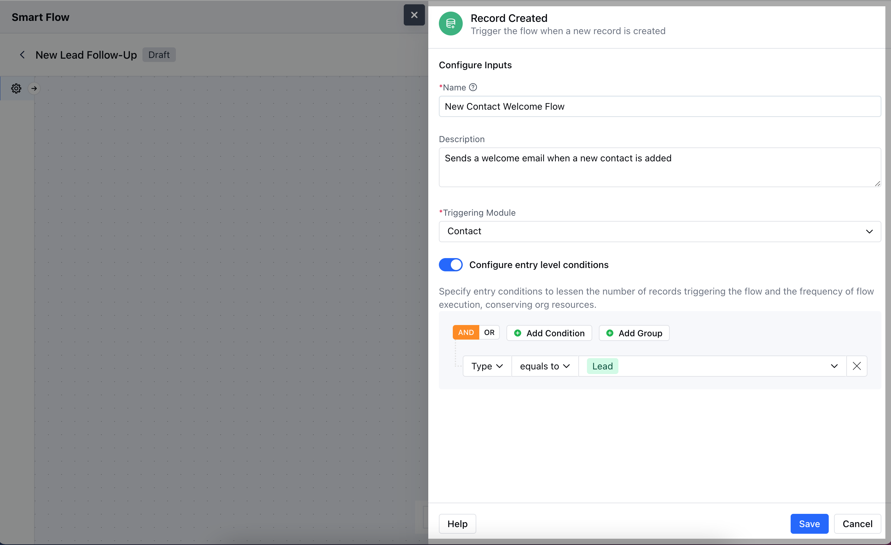
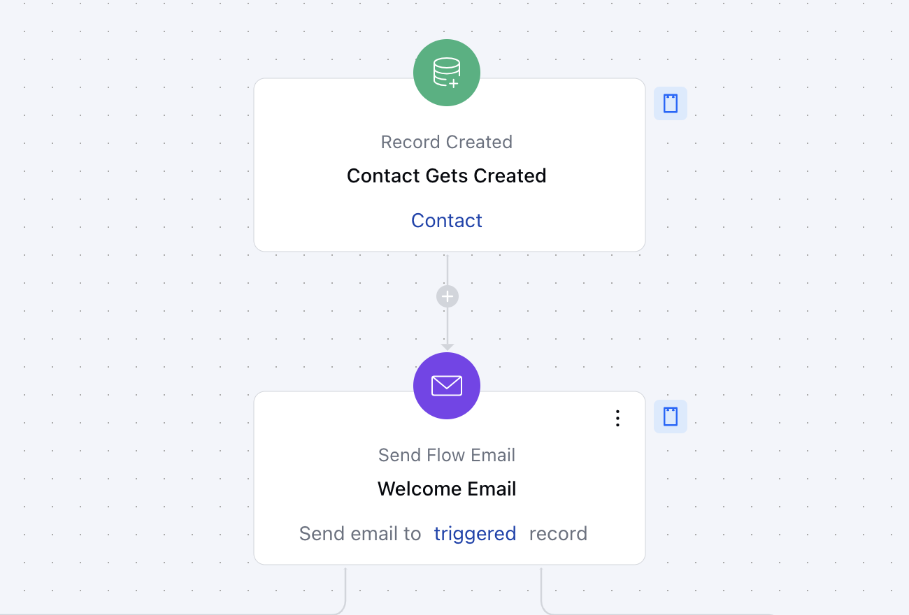

The Record Created trigger in Salesmate starts a Smart Flow automatically whenever a new record is added.

- **Topics covered:**
- [How to Configure Record Created Trigger](#how-to-use-record-created-trigger)

- [Practical Example](#practical-example)

###  How to Use Record Created Trigger

While creating the Trigger Based Flows select Record Created trigger

Once selected, you would then need to configure the Trigger.As you click on the block, a pop will open to add following details.

- **Name:** Provide a clear and descriptive name for the trigger to easily identify its purpose and function within your flow.

- **Description:** Enter a brief explanation of what the trigger does and its role in the flow.

- **Module:** Select the specific module where the trigger should be applied.

- **Configure Entry-Level Conditions:** Define the conditions that must be met for the trigger to activate. These conditions specify when and how the trigger should respond to record creation, ensuring it only acts when the specified criteria are satisfied.Once done, click on **Save**

###  Practical Example

For example, you wish to send an automated email to new customers when a new lead is added and add the tag Welcome once the email has been sent.

