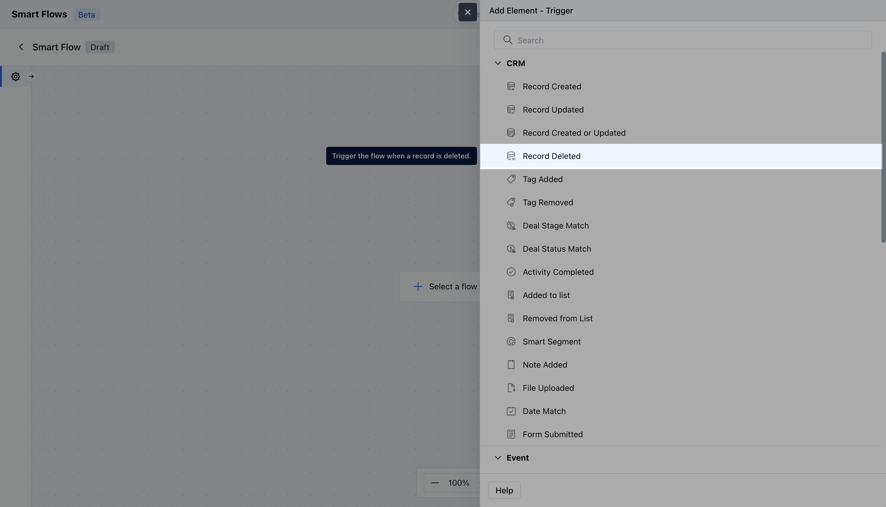
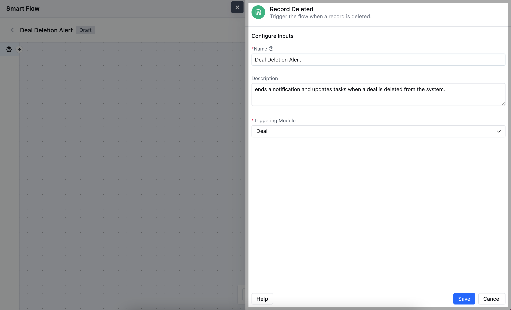
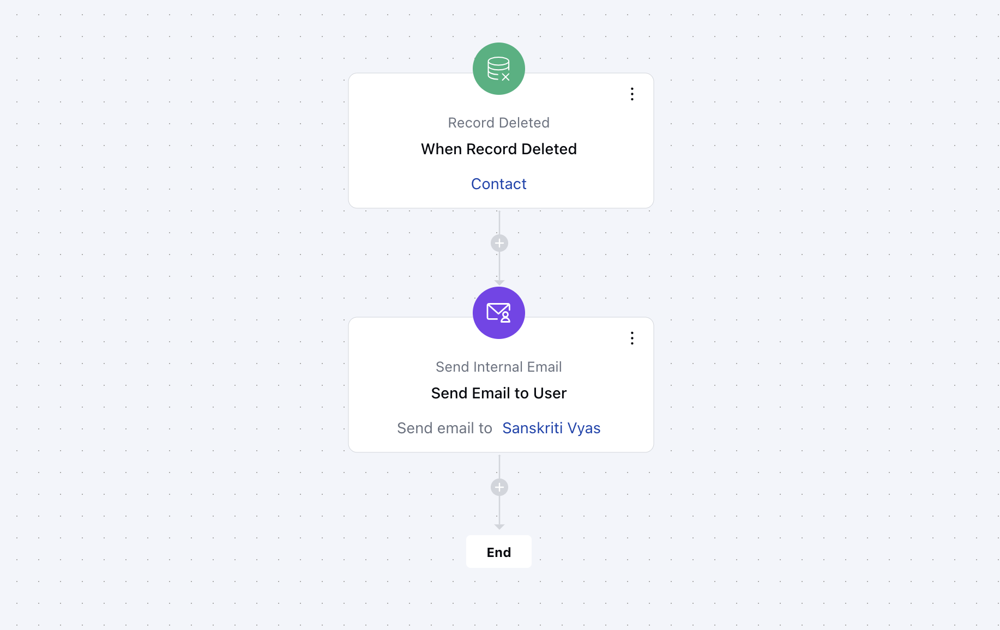

The Record Updated trigger in Salesmate starts a Smart Flow automatically whenever a record is deleted.

- **Topics covered:**
- [How to Configure Record Deleted Trigger](#how-to-configure-record-deleted-trigger)

- [Practical Example](#practical-example)

### How to Configure Record Deleted Trigger

While creating the Trigger Based Flows select **Record Deleted** trigger.

Once selected, you would then need to configure the Trigger.As you click on the block, a pop will open to add following details.

- **Name:** Provide a clear and descriptive name for the trigger to easily identify its purpose and function within your flow.

- **Description:** Enter a brief explanation of what the trigger does and its role in the flow.

- **Module:** Select the specific module where the trigger should be applied.Once done, click on** Save.

- **

**

### Practical Example

When a customer record is deleted, a notification is generated automatically and sent to the help desk, along with the reason for the deletion. This serves to establish transparency and follow-up measures in order to maintain the relationship with the customer for future purposes.

