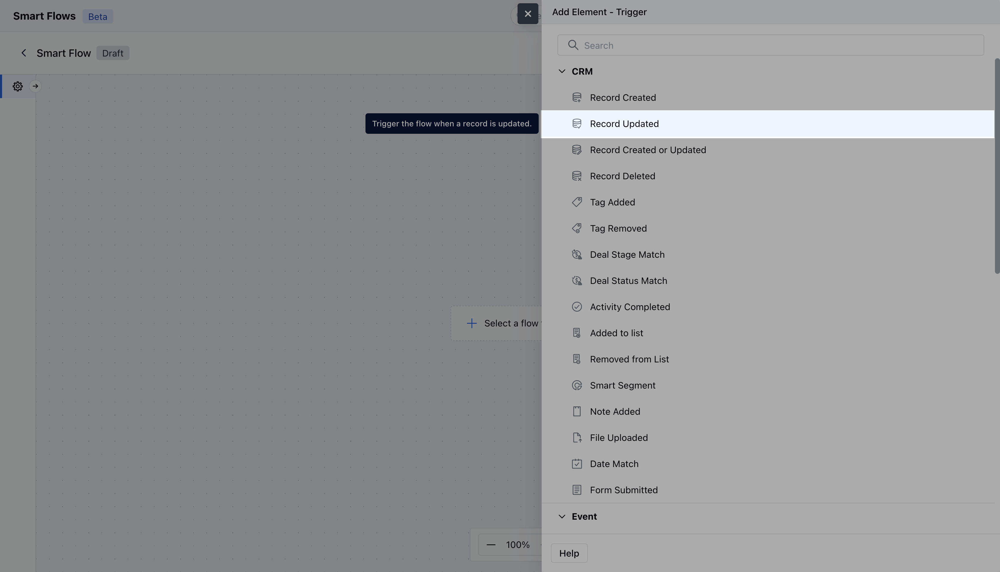
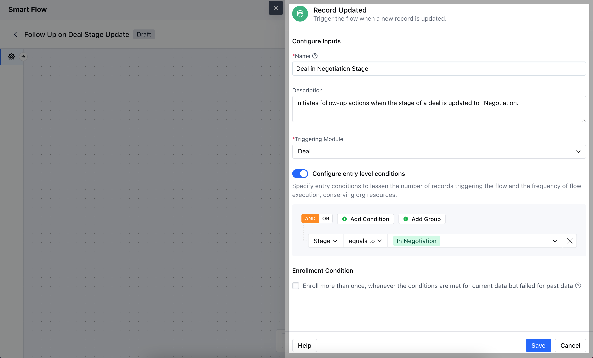
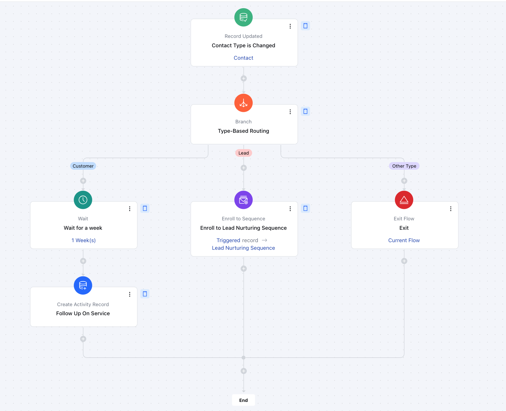

The Record Updated trigger in Salesmate starts a Smart Flow automatically whenever a record is updated.

- **Topics covered:**
- [How to Configure Record Updated Trigger](#how-to-configure-record-updated-trigger)

- [Practical Example](#practical-example)

###  How to Configure Record Updated Trigger

While creating the Trigger Based Flows, select the **Record Updated** trigger.

Once selected, you would then need to configure the Trigger.As you click on the block, a pop will open to add the following details.

- **Name:** Provide a clear and descriptive name for the trigger to easily identify its purpose and function within your flow.

- **Description:** Enter a brief explanation of what the trigger does and its role in the flow.

- **Module:** Select the specific module where the trigger should be applied.

- **Configure Entry-Level Conditions:** Define the conditions that must be met for the trigger to activate. These conditions specify when and how the trigger should respond to record updating, ensuring it only acts when the specified criteria are satisfied.

Once done, click on** Save.

**Note:** If you want to execute the smart flow based on a specific field update, you can include that field in the enrollment condition and apply the **'Is change'** condition.

###  Practical Example

Here, we have created a smart flow that triggers only when a **contact's type** is changed. Once triggered, the flow uses [**Branch**](https://support.salesmate.io/hc/en-us/articles/37780627045657-Branch) to direct the record down a dedicated path, executing specific actions based on the updated contact type.

