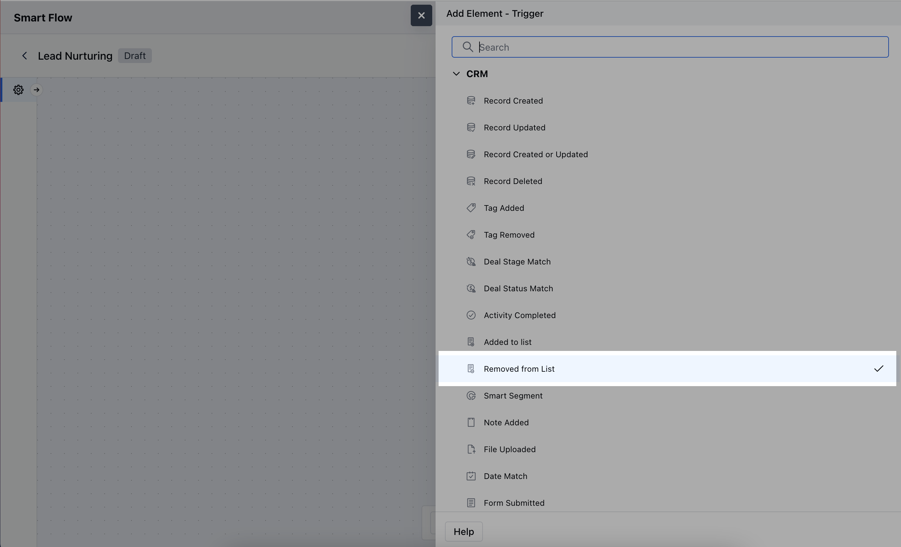
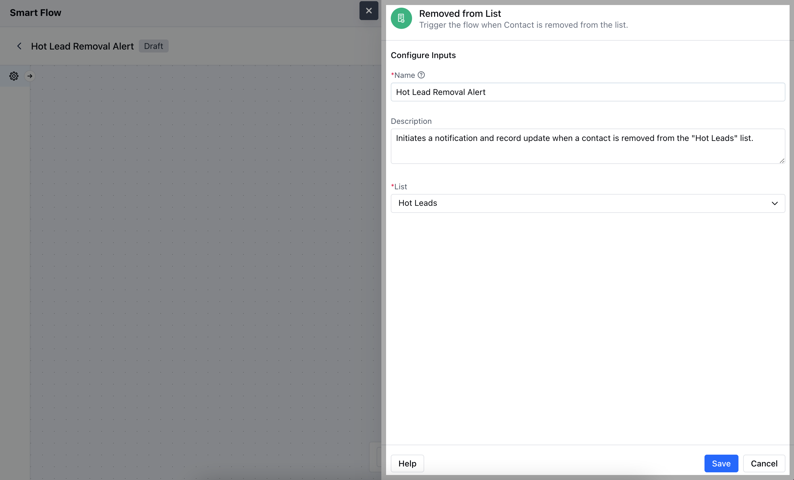
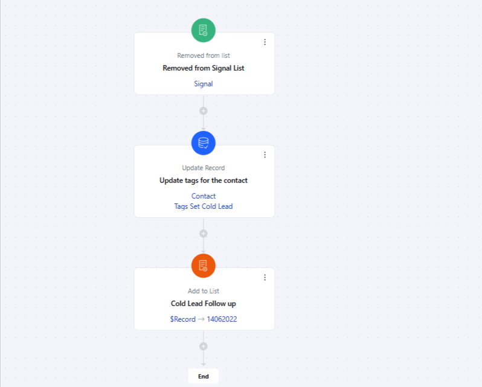

- *Removed from List** trigger activates the flow when a record is removed from a specified list, allowing automated actions to occur based on the record’s removal from that list.Topics Covered:

- [How to Configure the Removed From List Trigger](#how-to-configure-the-removed-from-list-trigger)
- [Practical Example](#practical-example)

###  How to Configure the Removed From List Trigger

While creating the Trigger Based Flows select **Removed from List** trigger.

Once selected, you would then need to configure the block.As you click on the block, a pop will open to add following details.

- **Name:** Enter a clear and descriptive name for the trigger to easily identify its purpose within the flow.

- **Description:** Provide a brief explanation of what the trigger does and its role in the flow, helping to clarify its function and impact.

- **List:** Select the specific list from which the record removal will trigger the flow.Hit on **Save** to save the information

###  Practical Example

The "Removed from List" trigger is valuable for responding to changes in a contact's preferences. For example, contacts can be automatically or manually removed from a list if they opt out of an email campaign or cancel their subscription. By setting up a Smart Flow that triggers when a contact is removed from a list, you can automatically tag the contact for follow-up, assign them to another list, or plan future outreach to re-engage them.

