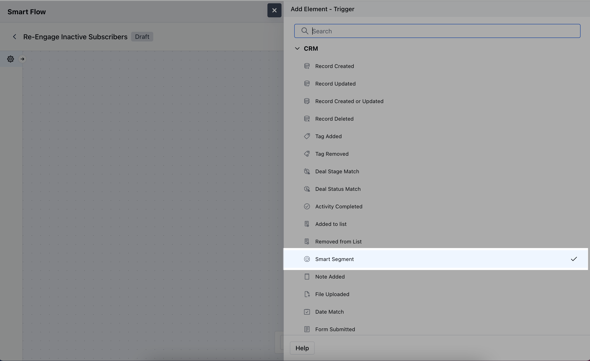
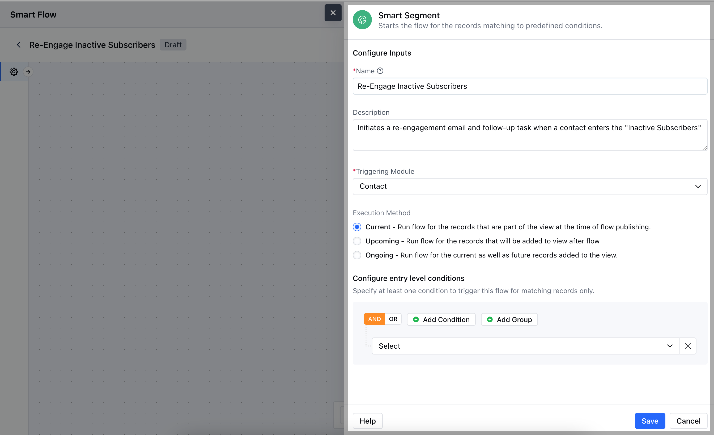

Smart Segment starts the flow for the records matching to predefined conditions.

- **Topics covered:**
- [How to Configure Smart Segment Trigger](#how-to-configure-smart-segment-trigger)

- [Practical Example](#practical-example)

### How to Configure Smart Segment Trigger

While creating the Trigger Based Flows select **Smart Segment** trigger

Once selected, you would then need to configure the block.

As you click on the block, a pop will open to add following details.

- **Name:** Give the trigger a name that clearly describes what it does.

- **Description:** Write a short explanation of what the trigger will do and how it fits into the flow.

- **Triggering Module:** Choose the module that will activate the trigger, specifying where the records will come from.

- **Execution Method**- **Current:** Run flow for the records that are part of the view at the time of flow publishing.

- **Upcoming:** Run flow for the records that will be added to view after flow

- **Ongoing:** Run flow for the current as well as future records added to the view.

- **Configure entry level conditions:** Define the conditions that must be met for the trigger to activate.Once added, hit on **Save**.

### Practical Example

Automatically send a re-engagement email to customers who haven’t interacted in the last 6 months
