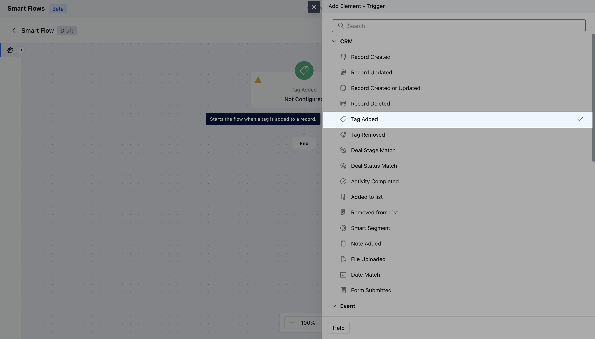
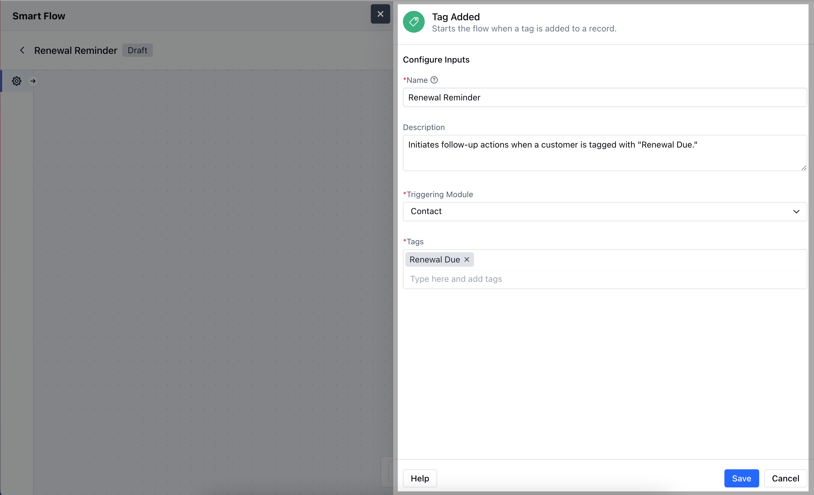
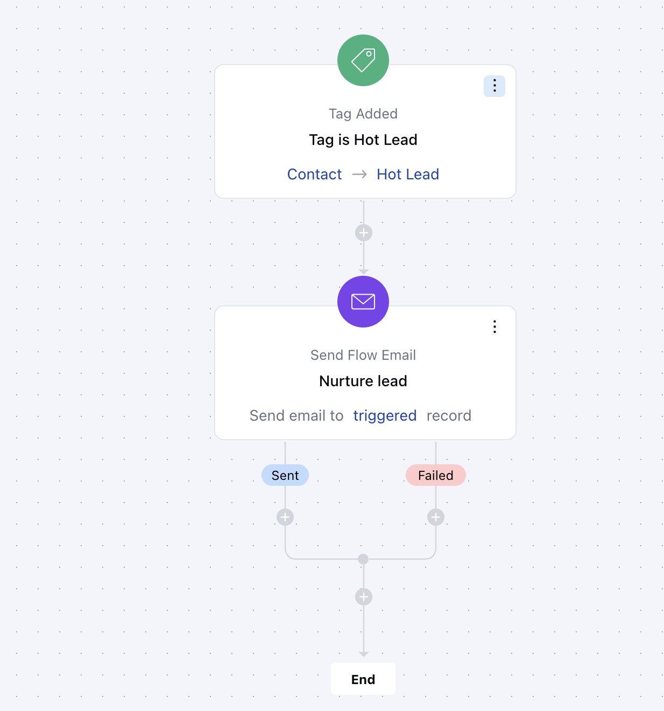

- The **Tag Added** trigger in Salesmate starts a Smart Flow automatically whenever a tag is added to the record.

###  **Topics covered:**

[How to Configure Tag Added Trigger](#how-to-configure-tag-added-trigger)

- [Practical Example](#practical-example)

###  How to Configure Tag Added Trigger

While creating the Trigger Based Flows select **Tag Added** trigger.

Once selected, you would then need to configure the Trigger.As you click on the block, a pop will open to add following details.

- **Name:** Provide a clear and descriptive name for the trigger to easily identify its purpose and function within your flow.

- **Description:** Enter a brief explanation of what the trigger does and its role in the flow.

- **Module:** Select the specific module where the trigger should be applied.

- **Tags:** Specify the tag that will activate the trigger when added to a record, ensuring the flow is initiated based on this specific label.Once done click on **Save**.

###  Practical Example

When the tag “Hotlead” is added to a contact, an automated email or text message is sent to that contact with the intent of welcoming their interest and sharing something useful. This increases engagement and also helps to move them down the sales funnel.

