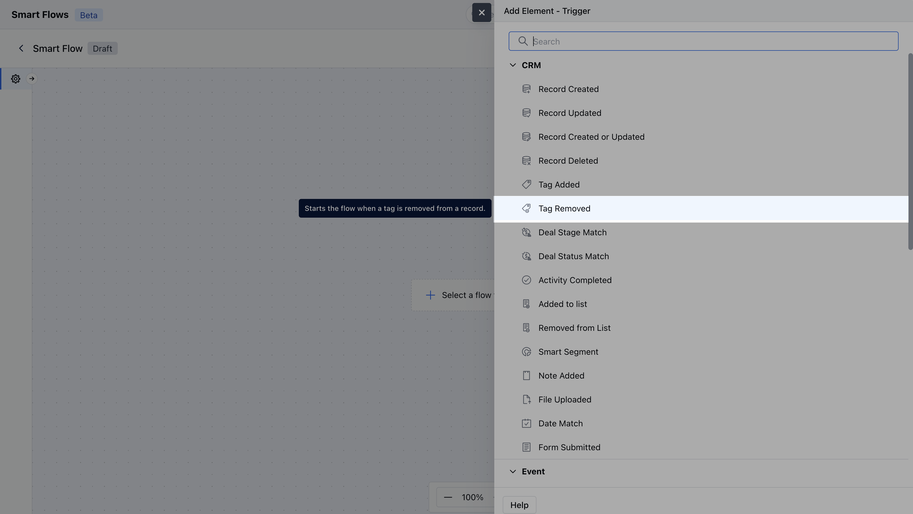
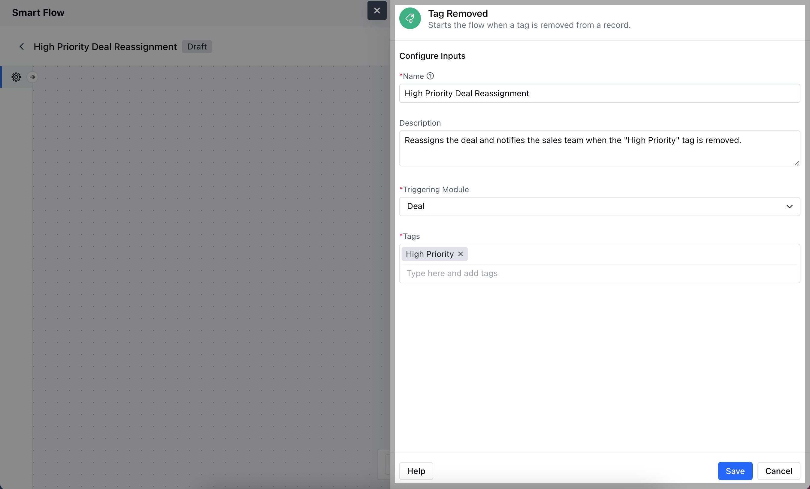
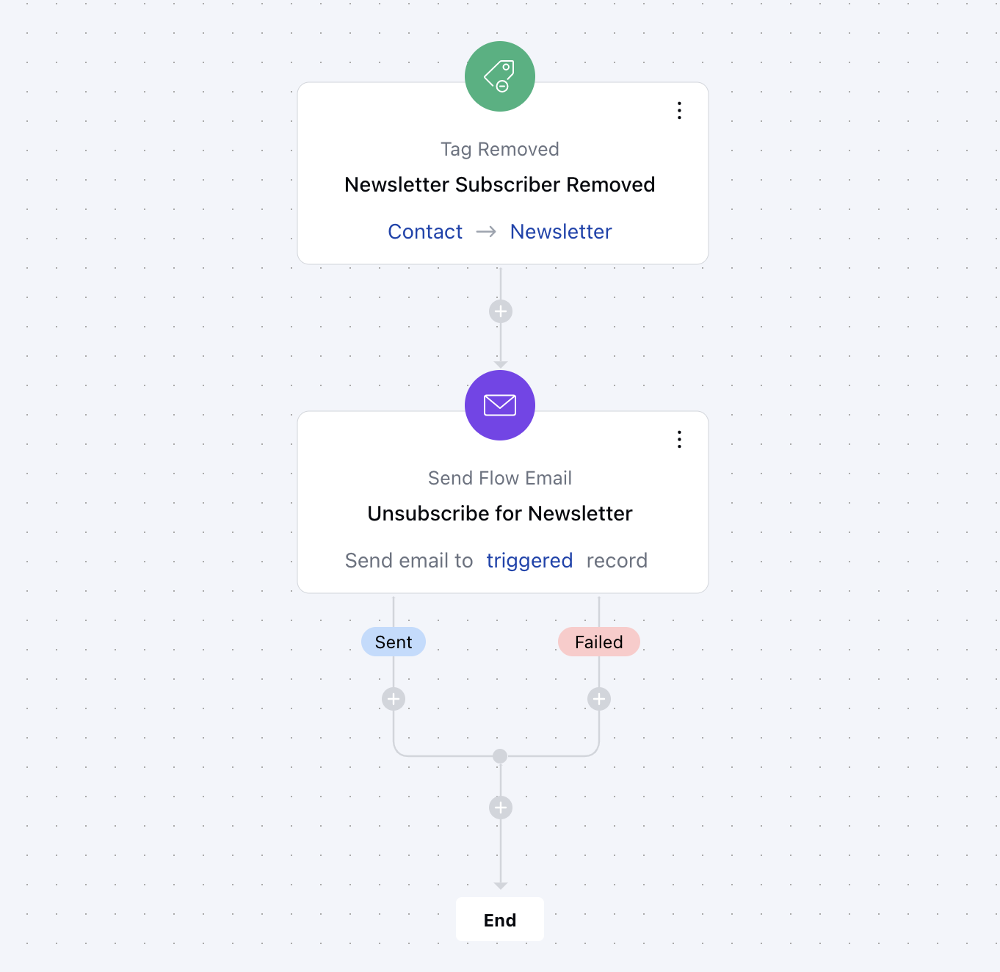

The**Tag Removed**Trigger activates the flow when a specific tag is deleted from a record, allowing automated actions to follow the removal of that particular label.**Topics Covered:**[How to Configure Tag Removed Trigger](https://support.salesmate.io/hc/en-us/articles/36768316773145-Tag-Removed#h_01J7WM2ECBKFGH5JME35Z72DV0)[Practical Example](https://support.salesmate.io/hc/en-us/articles/36768316773145-Tag-Removed#h_01J7WMTC7PMYKYMY0JBT78QAF9)

### How to Configure Tag Removed Trigger

While creating the Trigger Based Flows select**Tag Removed**trigger.

Once selected, you would then need to configure the Trigger.As you click on the block, a pop will open to add following details.**Name:**Provide a clear and descriptive name for the trigger to easily identify its purpose and function within your flow.**Description:**Enter a brief explanation of what the trigger does and its role in the flow.**Module:**Select the specific module where the trigger should be applied.**Tags:**Specify the tag that will activate the trigger when removed from a record, ensuring the flow is initiated based on this specific label.Once done click on**Save**.

### Practical Example

When the "NewsletterSubscriber" tag is removed from a contact, an automatic email is sent to let them know they've been unsubscribed. This keeps them informed and gives them a chance to re-subscribe if they want to continue receiving updates.

