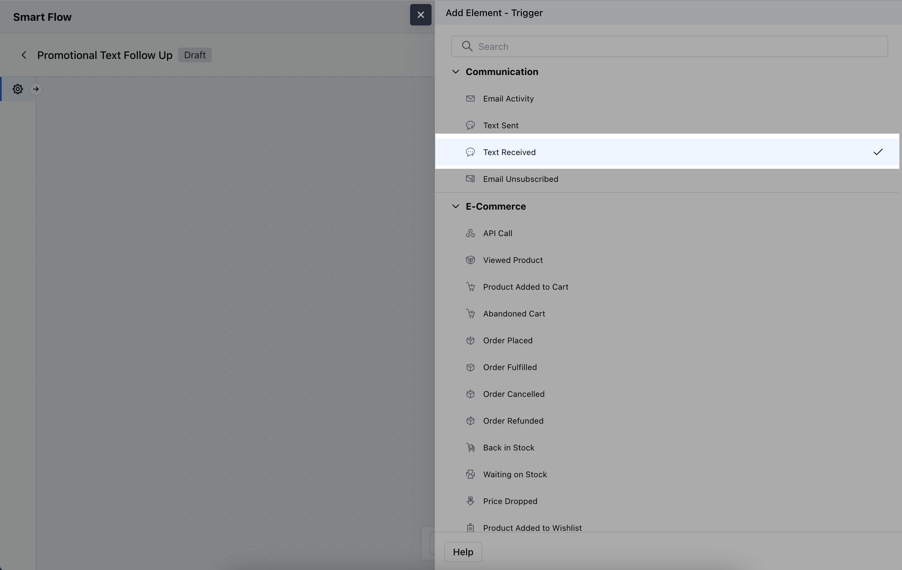
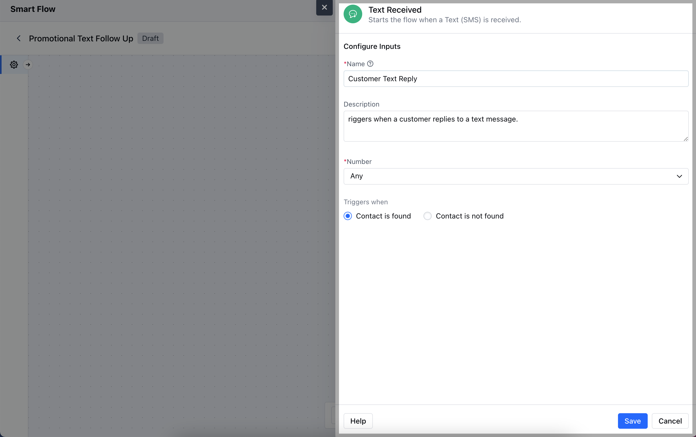
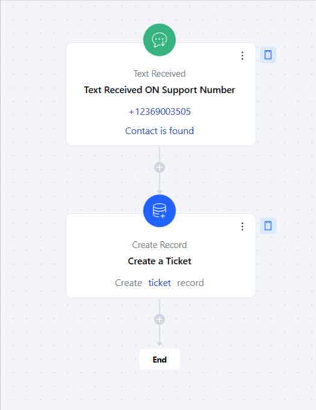

The **Text Received** trigger activates a flow whenever a text message (SMS) is received from a contact. This trigger is useful for automating follow-up actions or responses based on incoming messages.

### **Topics covered:**

- [How to Configure Text Received Trigger](#how-to-configure-text-received-trigger)

- [Practical Example](#practical-example)

### How to Configure Text Received Trigger

While creating the Trigger Based Flows select **Text Received** trigger.

When setting up the **Text Received** trigger, you'll configure the following details:

- **Name:** Assign a clear and descriptive name to the trigger to identify its purpose (e.g., "Customer Reply Trigger").

- **Description:** Provide a brief explanation of what the trigger does and how it fits into the workflow (e.g., "Activates when a text message is received from a customer").

- **Number:** Specify the phone number(s) or messaging channel that will receive the text and trigger the flow.

- **Trigger When:** Choose the condition that activates the trigger:
- **Contact Found:** The trigger activates when the text is received from a known contact already in your CRM.

- **Contact Not Found:** The trigger activates when the text is received from an unknown number, prompting actions like creating a new contact.Once done, click on **Save**.

### Practical Example

Here, Whenever a customer sends a text message to our support number, this will create a support ticket for the support team to get in touch with the contact.

