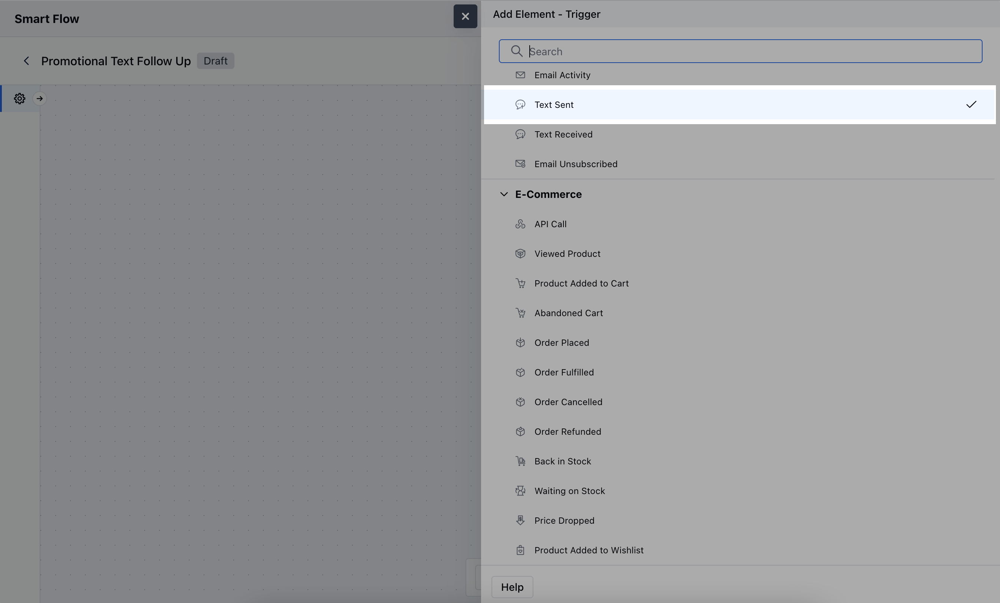
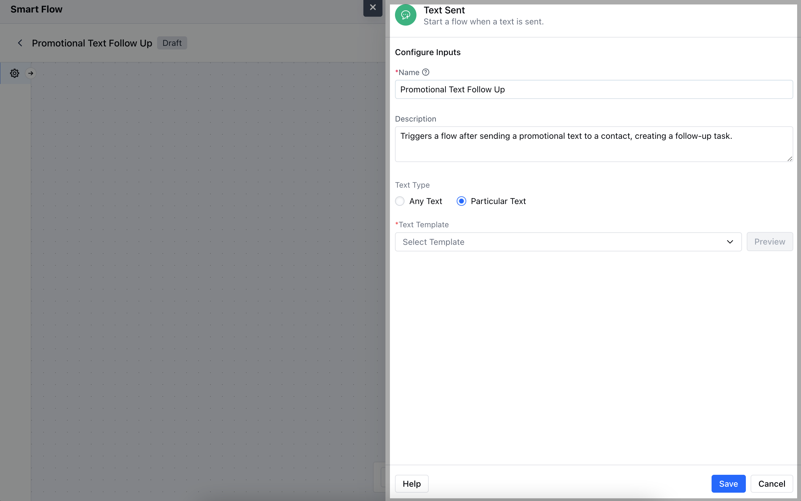
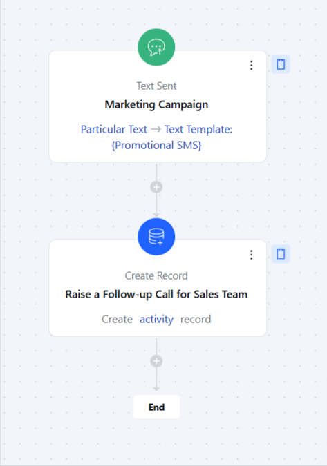

- The **Text Sent** trigger activates a flow whenever a text message (SMS)is sent to a contact.

###  **Topics covered:**

- [How to Configure Text Sent Trigger](#how-to-configure-text-sent-trigger)

- [Practical Example](#practical-example)

###  How to Configure Text Sent Trigger

While creating the Trigger Based Flows select the **Text Sent** trigger

After selecting the trigger, you'll need to configure it by providing the following details:

- **Name:** Give the trigger a clear and descriptive name to identify its purpose.

- **Description:** Briefly explain what the trigger does and how it functions within the flow.

- **Text Type:** Specify the type of text that will activate the trigger.

- **Any Text:** Choose this option if the trigger should respond to any text input.

- **Particular Text:** Set a specific text that will activate the trigger.

- **Text Template:** Select a predefined text template that will be used to initiate the trigger.

###  Practical Example

Here, Once the promotional SMS has been dispatched, we will initiate a follow-up task for our Sales Team to contact the customer through a call.

