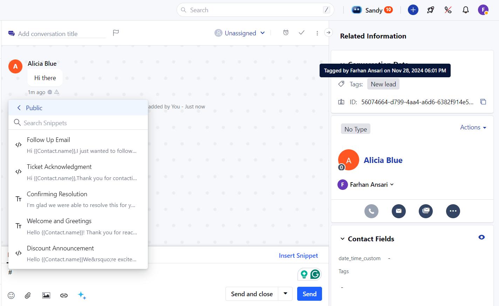
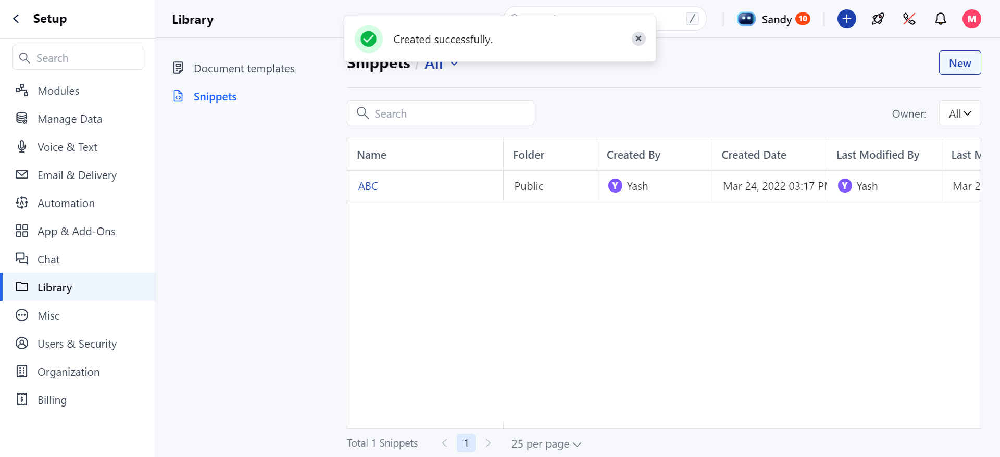

- **Topics covered:**

*
[How to Archive the Snippets](#how-to-archive-the-snippets)

*
[How to Unarchive a Snippet](#how-to-unarchive-a-snippet)

### How to Archive the Snippets

Follow these steps to archive a snippet:

- **Navigate to the Profile Icon and Go to** Setup .

- **Select** Library and then choose

- **Snippets** from the menu.

- **Hover over the snippet you wish to archive.

- An Action button will appear. Click on it and select the **‘Archive’** option.

- **Once the snippet is archived, a success message will appear stating,** "Archived Successfully."

### How to Unarchive a Snippet

Recover important content effortlessly without the need for recreating it from scratch. If you need to restore a previously archived snippet for use, follow these steps to unarchive it:

- **Navigate to the** Profile Icon in the top right corner.

- **Go to** Setup.

- **Select** Library and then choose

- **Snippets** from the menu.

- **Go to the archived folder and locate the archived snippet you want to restore. Use the search bar or filter options if the list is long.

- Hover over the snippet you wish to Unarchive.
- Click on the **Action** button that appears and select the **‘Unarchive’** option.

- **Once the snippet is successfully unarchived, a success message will appear stating,**"Unarchived Successfully."

<Note>

**Note:** When a snippet is unarchived, it will return to its original folder. If the original folder no longer exists, the snippet will appear in the "All" folder.

</Note>
