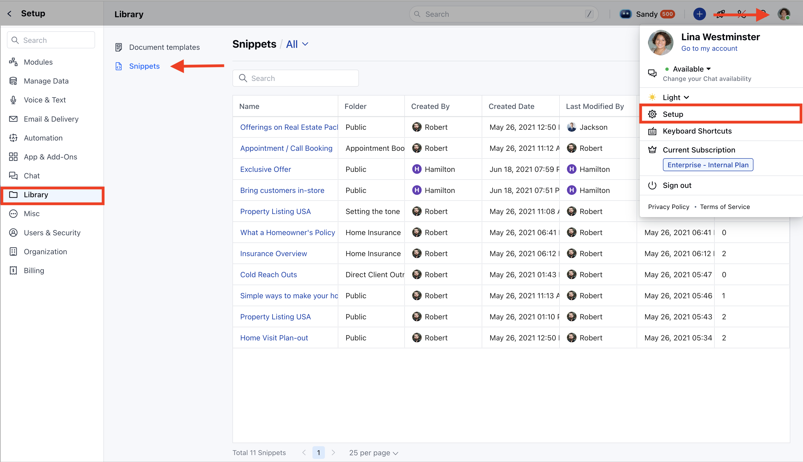

Snippets in Salesmate allow you to standardize and streamline text, making repetitive communication faster and more consistent.

<Note>

- **Note:** A User with Create snippets rights can perform this operation

</Note>

####**How to Create a Snippet** To create a new Snippet,

- **Navigate to the** Profile Icon on the top right corner.

- **Click on the** Set Up.

- Head over to the **Library** category.

- **Click on the** Snippets option.

- **Click on the** New button to start creating a snippet.

A popup will appear where you need to fill in the following information:**Name:** Enter the name for the Snippet.

- **Description:** Enter the brief information about the Snippet you are creating.

* Choose the type of snippet: **Plain Text **: Suitable for simple, unformatted text.

- **HTML **: Allows rich text formatting and personalization.

- **Folder:** Select the folder where you want to save the Snippet.
- [Learn More.](https://support.salesmate.io/hc/en-us/articles/40451958619033)

- **Body ***Text Snippets**: Supports only plain text and emojis. **HTML Snippets**: Allows formatting (font size, color, alignment) and includes image insertion (max 20 MB) and variable personalization.

- ** HTML Snippet **

- *Text Snippet**

- **Once all details are provided, hit the** Save button.

- The snippet is now available for use by users with the appropriate permissions.
