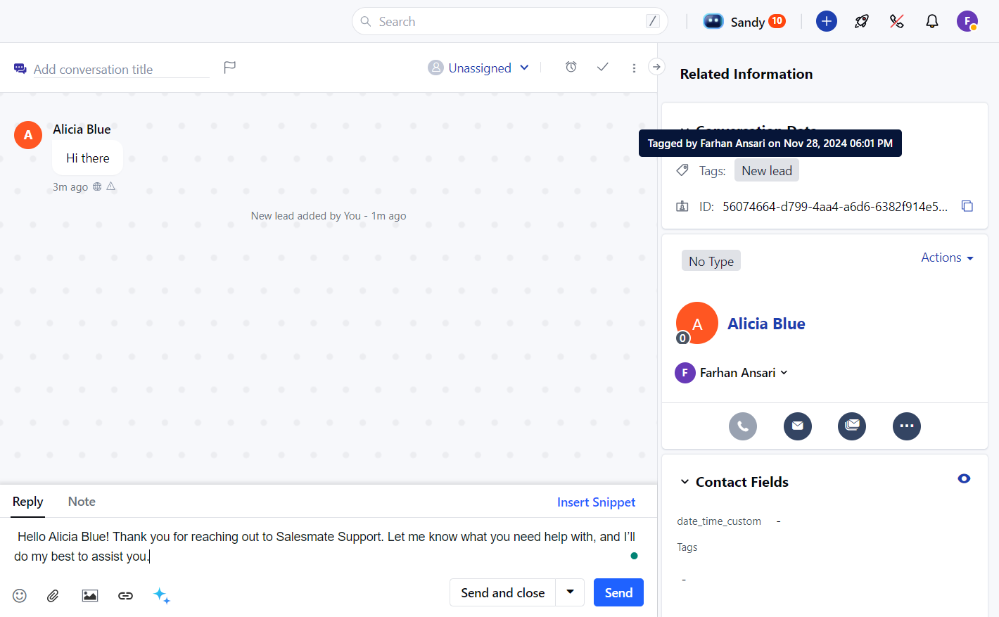

Snippets are reusable pieces of text or HTML that you can insert into various parts of Salesmate. They can help you save time and ensure consistency in your communication.

###  **Topics covered:**

- [Where can you use Snippets](#where-can-you-use-snippets)

- [How to use Snippets](https://support.salesmate.io/hc/en-us/articles/40451960520217-How-to-Use-Snippets#h_01JDQ0JBJ95YXJ5SK7AVWSXWXD)

- [Snippet Access and Permissions](#snippet-access-and-permissions)

###  Where Can You Use Snippets?

You can use snippets in the following areas:

- **Chat:** Insert snippets directly into your chat conversations.

- **Reply Editors:** Use snippets in your replies to emails, tickets, and notes.

- **Note Editor:** Add snippets to your notes.

- **Text:** Insert snippets into text fields.

- **Ticket Reply Editors:** Use snippets in your replies to tickets.

- **Ticket Note Editor:** Add snippets to your ticket notes.

- **Notes:** Use snippets in notes for any module.

- **Emails:** Insert snippets into your email drafts. (Variables are not replaced when a snippet is inserted)
- **Composing windows:**Use snippets in various composing windows.

- **How to Use Snippets **Type #:** And then start typing the name of the snippet you want to use.

- **Select a Snippet:** Choose the desired snippet from the list of suggestions.

- **Insert Snippet:** The snippet will be inserted into the text editor.

###  Snippet Access and Permissions

- **Shared Snippets:** You can only use snippets that are shared with you or that you own.

- **View Access:** You must have at least view access to a snippet to use it.
