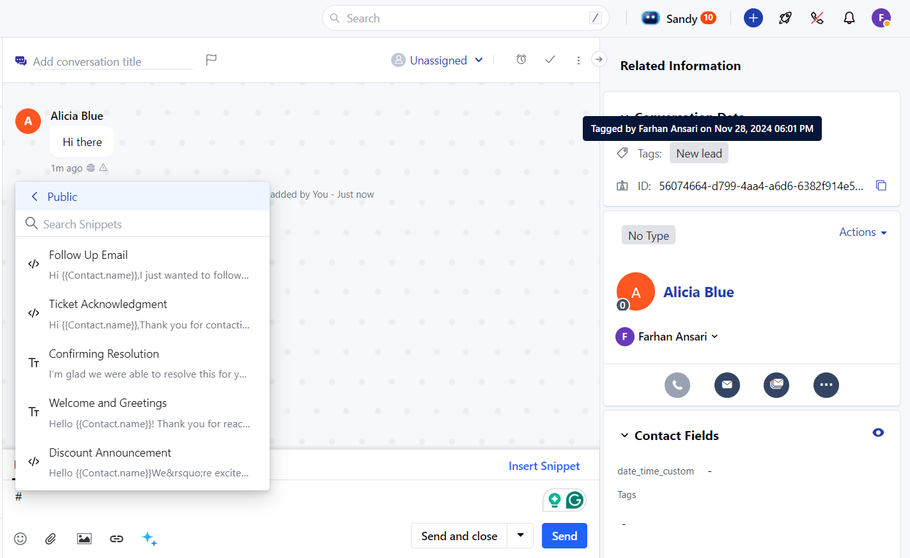
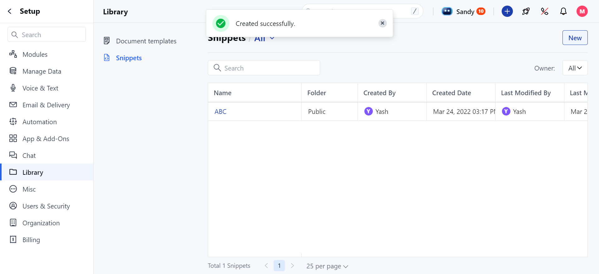
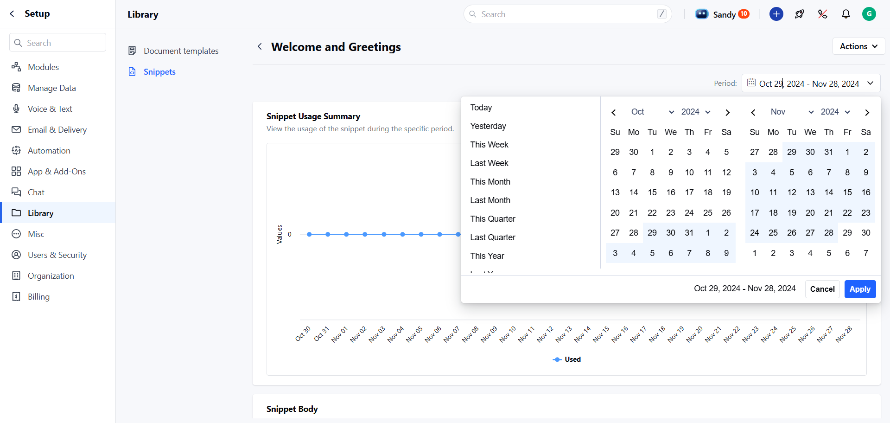
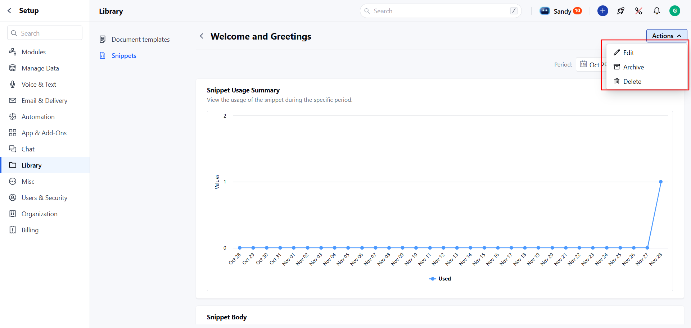

The Snippet Detail View allows you to see detailed information about a specific snippet, including its usage statistics and actions you can perform and helps you manage and analyze your snippets effectively, ensuring better utilization and streamlined organization.

To view the details of a snippet, follow these steps:

* **Navigate to the** Profile Icon in the top right corner.

* **Click on the** Set Up.

* Head over to the**Library**category.

* **Click on the** Snippets option

* Click on the title of the snippet you wish to view

* **You will be redirected to the** Snippet Detail View screen

* In the detail view of the snippet, you can see the content of the snippet for easy review.

* In the Snippet Body, you can see the content of the Snippet

* Usage Statistics: Track how many times the snippet has been used over different time durations

* You can apply the filters over a time period to view the Usage Statistics.

* Today * Yesterday

* This Week * Last Week

* This Month * Last Month

* This Quarter * Last Quarter

* This Year * Last Year and Custom Range.

* You can perform the following actions directly from the Snippet Detail View. You can [Edit](https://support.salesmate.io/hc/en-us/articles/40451899848345), [Archive](https://support.salesmate.io/hc/en-us/articles/40451894683417), or [Delete](https://support.salesmate.io/hc/en-us/articles/40451894683417) the snippet

