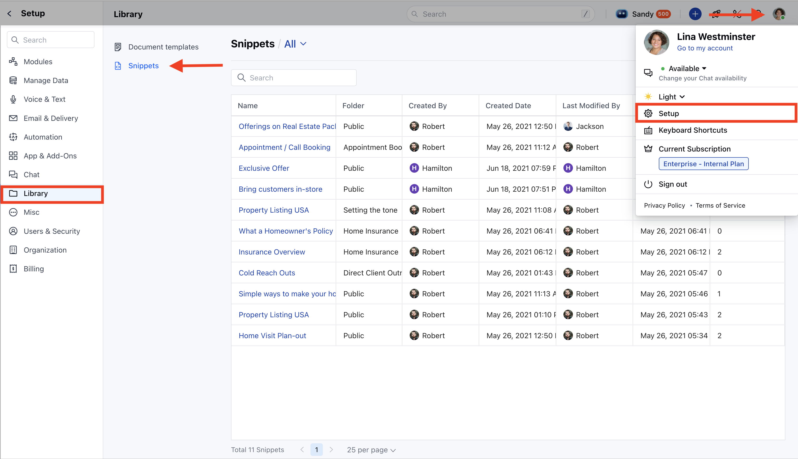
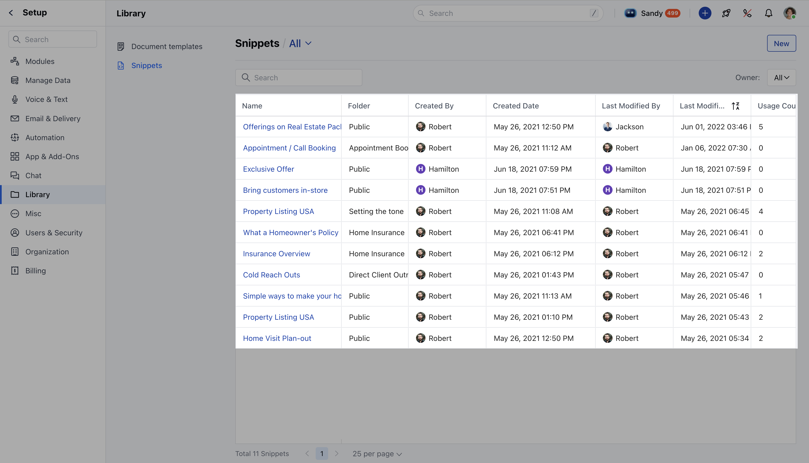
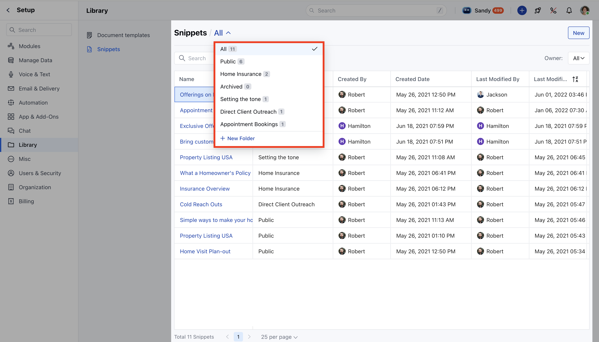
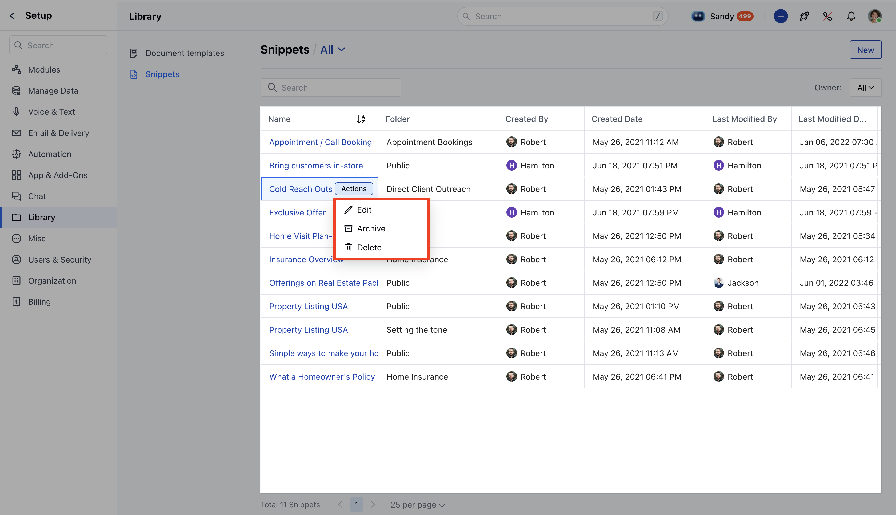

Snippet Listing provides a comprehensive overview of all snippets in a tabular format.

To access Snippet Listing,

* **Navigate to the** Profile Icon on the top right corner

* **Click on the** Setup

* Navigate to**Library*** Go to**Snippets**, all the active Snippets by default will be shown

You will see the snippets in a tabular format with the following columns:

***Snippet Name**: The title of the snippet.

***Folder**: The folder where the snippet is stored.

***Created By**: The user who created and owns the snippet.

***Created Date**: The date the snippet was created.

***Last Modified**: The date the snippet was last updated.

***Usage Count**: The number of times the snippet has been used.

<Note>
**Note:**Only users with edit rights can archive or unarchive snippets.

</Note>

***Snippet Preview:**Click on a snippet to view its details on the [Snippet Detail Page](https://support.salesmate.io/hc/en-us/articles/40451925654297).

***Managing folders**: We can add a new folder directly from the Snippet Listing Page, edit an existing folder and delete a folder. [Learn more](https://support.salesmate.io/hc/en-us/articles/40451925654297) on how to organize folders.

In order to Edit a Snippet,

* **Hover on the snippet's name and click on the** Actions button

* You can perform the following operations

* [Edit](https://support.salesmate.io/hc/en-us/articles/40451899848345) * [Archive](https://support.salesmate.io/hc/en-us/articles/40451894683417)

* [Delete](https://support.salesmate.io/hc/en-us/articles/40451899848345)

