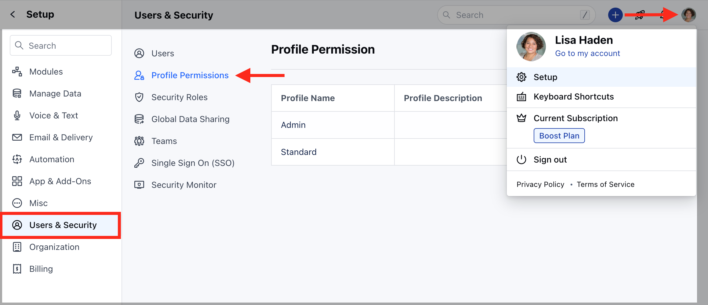
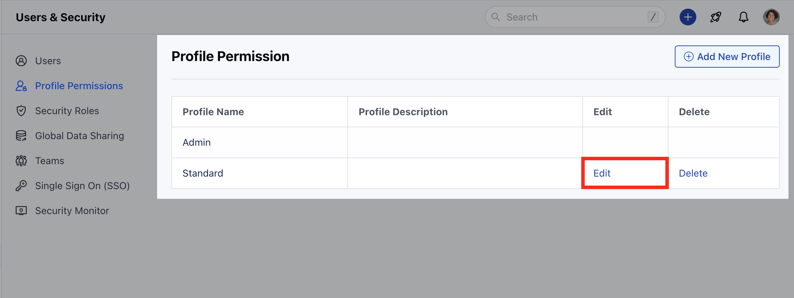
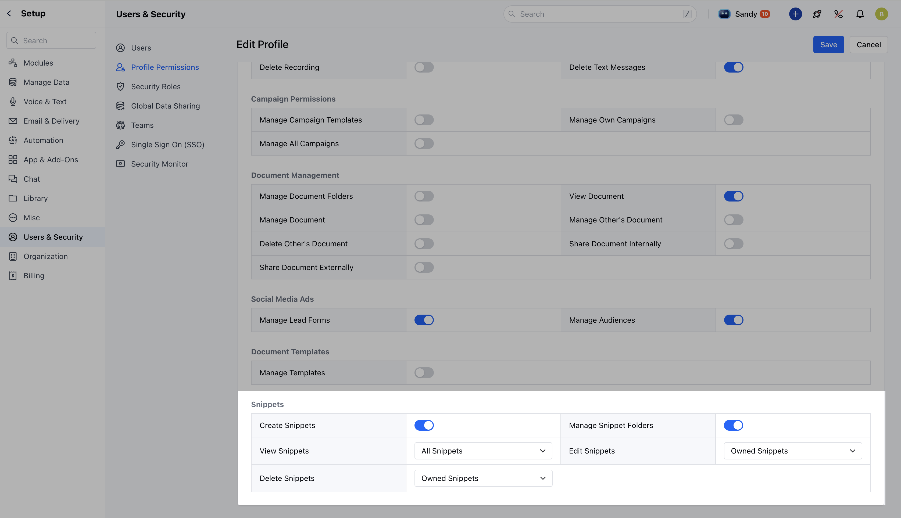

### To Manage Snippet Roles & Permissions:

* **Navigate to the** Profile Icon in the top right corner

* **Click on** Setup .

* **Head over to the** Users & Security category.

* **Click on** Roles & Permission

*  **Click on** Edit button of the Profile you want to edit the Permission.

* **These snippet permissions will be displayed under the** "Snippet Permissions" section at the bottom of the profile settings.

Here, you will get the list of following options

* **View Permissions:**
    * **Shared Snippets**: This permission allows users to view only the snippets that have been specifically shared with them. 
    * **All Snippets**: With this permission, users can view all available snippets, bypassing folder permissions and the global data-sharing policy. This is useful for users who need access to the entire snippet library.

* **Create Snippets**: 
    * **Create Snippets**: This permission allows users to create new snippets. If enabled, users can add custom predefined text blocks for their use or for sharing within their team.

* **Edit Permissions:**
    * **Owned Snippets**: This permission lets users edit the snippets they own. They can update or modify their own predefined text blocks but can’t make changes to others’ snippets. 
    * **All Snippets**: With this permission, users can edit all snippets, regardless of ownership or folder permissions. If this permission is enabled, the **View All Snippets** permission is automatically selected.

* **Delete Permissions:**
    * **Owned Snippets**: Users with this permission can delete only the snippets they own. They cannot delete snippets created by others. 
    * **All Snippets**: This permission allows users to delete any snippet, bypassing folder permissions and ownership restrictions. Enabling this permission will also automatically enable the **View All Snippets** permission.

* **Manage Snippet Folders**:  
    * This permission allows users to create, edit, or delete snippet folders. Organizing snippets into folders helps manage and categorize snippets for easy access, and this permission gives users control over folder management.
