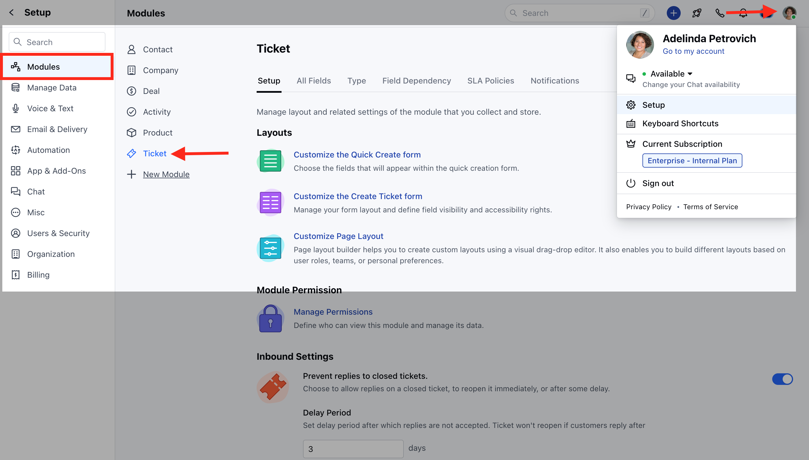
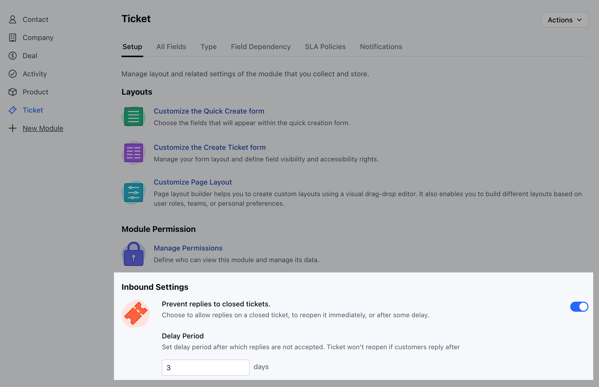

To Prevent Replies on Closed Tickets,

*   Navigate to the **Profile Icon** on the top right corner
*   Click on the **Set Up**
*   Head over to the **Tickets** Module

*   Under the **Setup** section head to the **Inbound Settings**
*   Here configure the following options
    *   **Prevent Replies to Closed Tickets:** Enable this option to allow replies to a closed ticket, allowing it to be reopened immediately or in specified delay period.
    *   **Delay Period:** Set a delay period after which replies are not accepted. Ticket won't reopen if customers reply after

