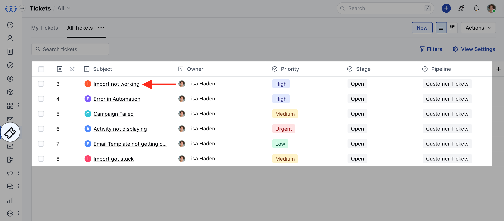
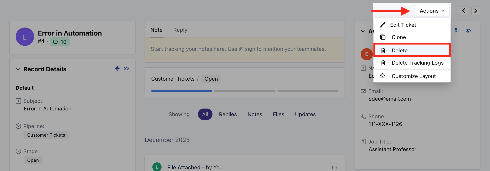
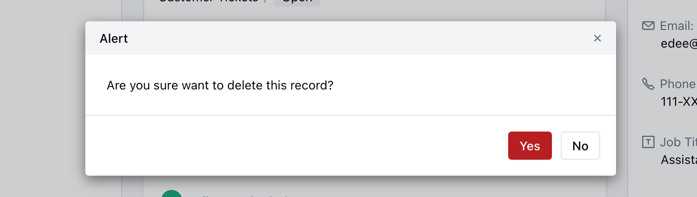
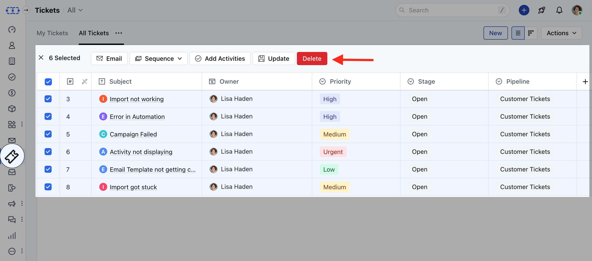
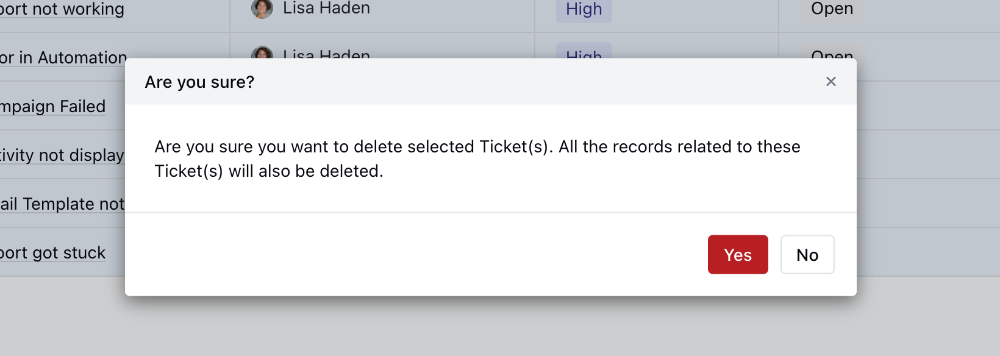

Salesmate allows you to Delete unwanted Tickets from the system.

<Note>
**Note:** A User with Mange Permission Rights can perform this action. The deleted records remain in the Deleted Records section for 30 days. You can recover deleted tickets within the next 30 days from the deletion date.
</Note>

You can,

*   [Delete the Single Ticket](https://support.salesmate.io/hc/en-us/articles/26029752603929#h_01HGWQRBG1MJF7GB3YS50P046B)
*   [Bulk Delete the Tickets](https://support.salesmate.io/hc/en-us/articles/26029752603929#h_01HGWT98MJG7QK9Q34X3YHR5NC)

### Delete the Single Ticket

To Delete the single Ticket,

*   Navigate to the **Tickets** module from the left menu bar
*   Select and click on the **Title** of the created ticket, you will be redirected to the detail screen

*   Navigate to the **Actions** button on the top right
*   Select the **Delete** option from the list

*   Confirm the Action to continue deleting the Ticket

### Bulk Delete the Tickets

To Bulk Delete the Tickets,

*   Navigate to the **Tickets** Module from the left menu bar
*   Bulk-select the Tickets
*   Click on the **Delete** option to continue the deleting process

*   Click on **Yes** to confirm the **Delete**

