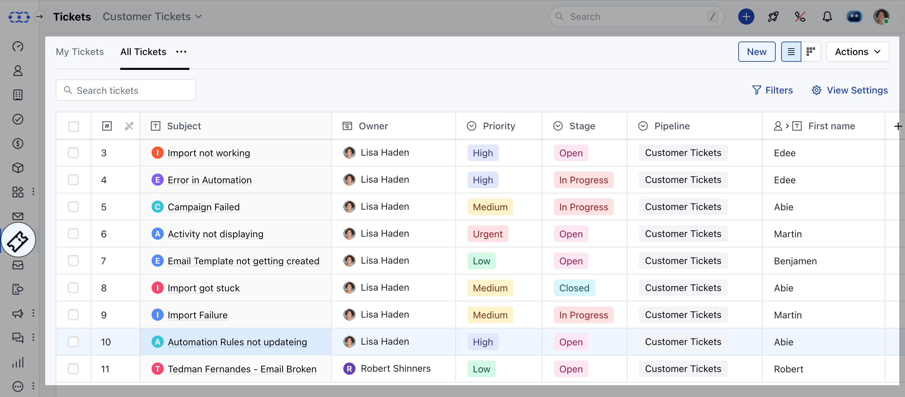
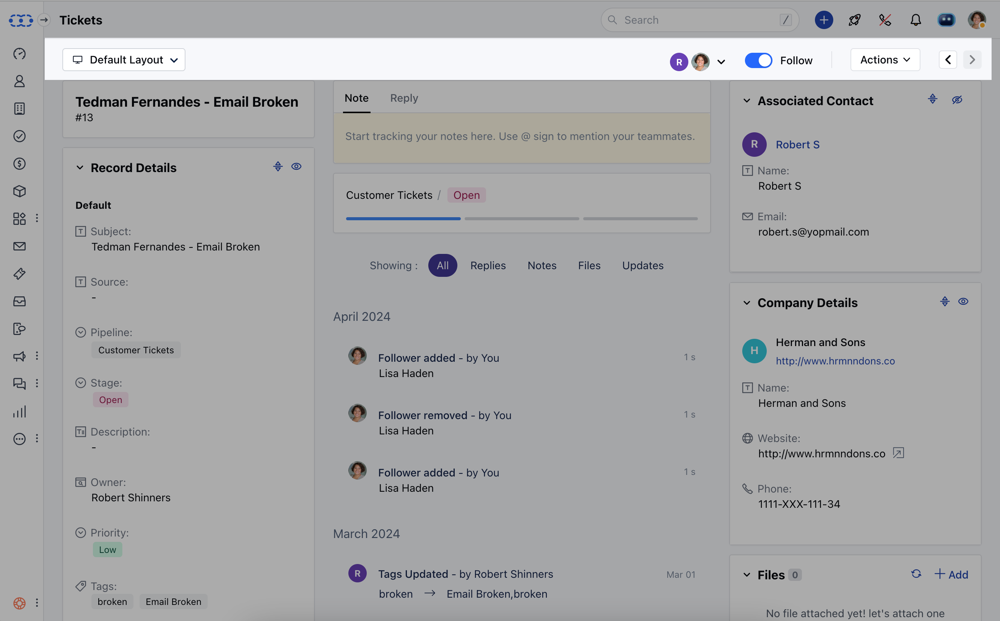
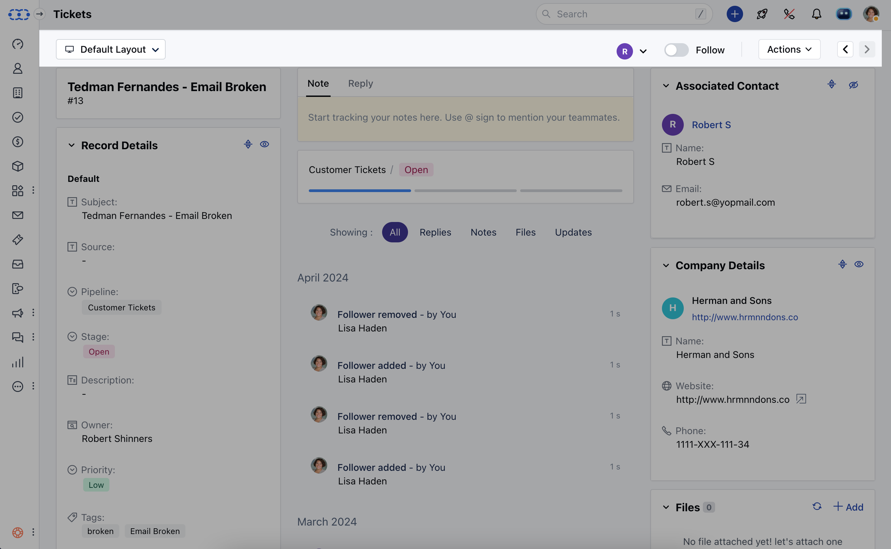

Once the Ticket is created Salesmate allows the flexibility to Follow/ Unfollow the Tickets to the Users with appropriate rights

To Follow/ Unfollow the Tickets,

*   Navigate to the **Ticket module** from the left sidebar
*   Click on the Ticket you wish to **Follow/ Unfollow** and open it in the Detail View

*   **Enable** the Follow option to start Following the Ticket

*   Likewise, you have the ability to disable the option to Unfollow a Ticket

