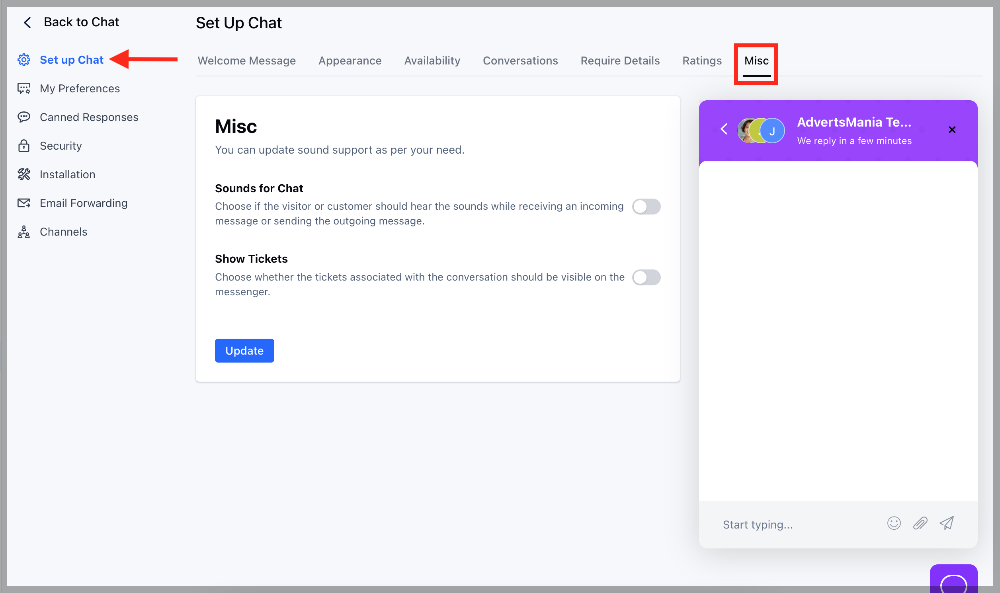
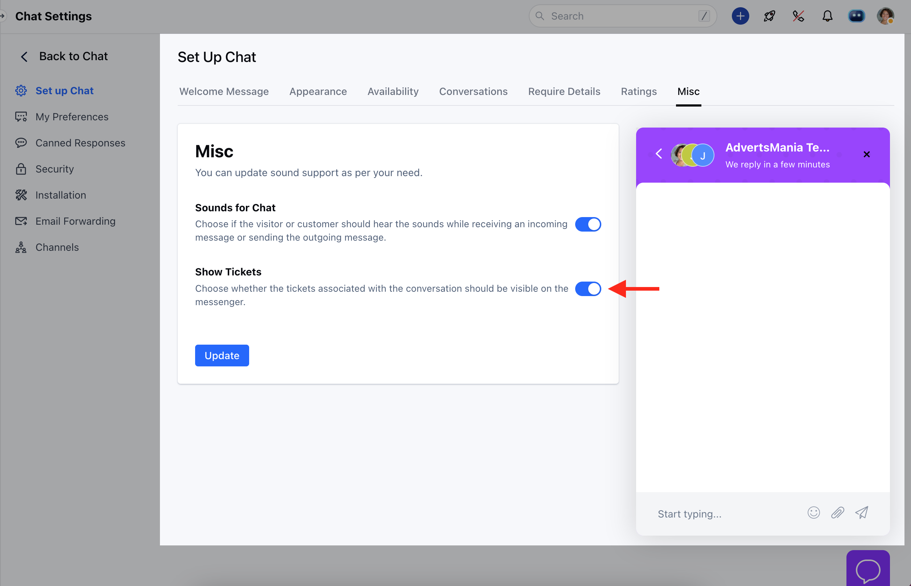

Tickets that are created and linked to a conversation can also be displayed on the Chat widget. Users have the option to configure whether these tickets are shown or hidden on the widget

To View the Tickets in Chat Widget,

*   Navigate to the **Conversations** **Icon** from the left menu bar
*   Select **Chats**
*   Click **Chat Settings** from the bottom left corner

*   Head to the **Set Up Cha**t option
*   Click on the Misc option at the end

*   To be able to view the Tickets under Chat Widget you would need to enable the Show Tickets option 
*   Hit **Update** button

*   Like wise you can disable the option if you no longer wish the Tickets to be visible under associated conversations