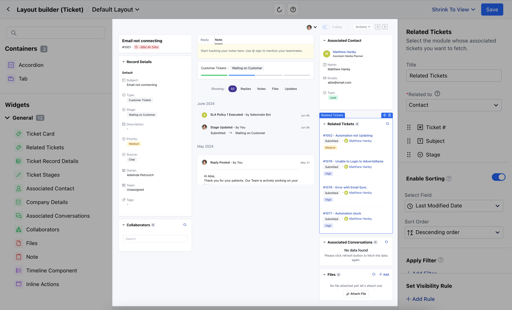
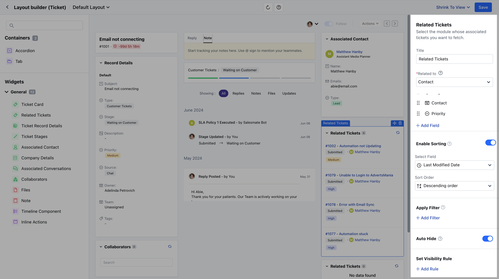
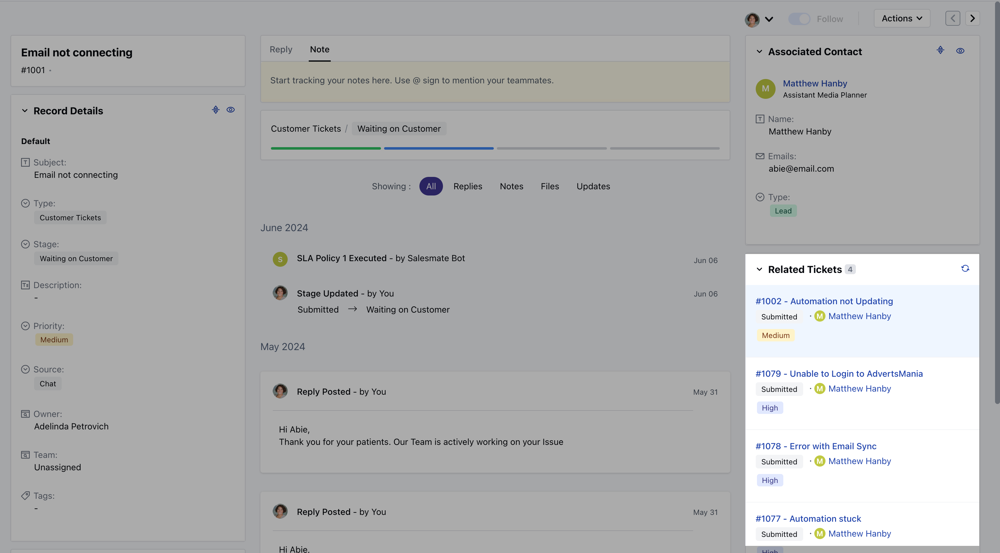

Related Ticket widget displays tickets linked to the primary contact or company associated with the current ticket.

<Note>
  **Note:** This widget is only available for the Ticket Module.
</Note>

### **Topics covered:**

- [How to add the Related Ticket Widget to the
  Layout](#how-to-add-the-related-ticket-widget-to-the-layout)
- [Customize the Related Ticket
  Widget](#how-to-add-the-related-ticket-widget-to-the-layout)
- [How would it appear in Detail
  Page](#how-would-it-appear-in-detail-page)

### How to add the Related Ticket Widget to the Layout

To add the widget,

- Navigate to the **Profile Icon** on the top right corner.
- Click on the **Set Up**.
- Head over to the **Modules** Category.
- Select the **Tickets** Module.

- Click on the **Customize Page Layout** option under **Set Up** section.

- Here you can either edit the Default Layout or create the new Layout \* Simply drag and drop the widget to the Layout.

### Customize the Related Ticket Widget

- Once the Widget is added to the Layout, as you click on the Widget the following options will appear
- **Title:** Customize the Widget as per your preference
- **Related to:** Select the module whose associated tickets you want to fetch.
- **(Contact, Company, or Product)**
- **Fields:** Select which ticket fields should be displayed in the widget.
- **Enable Sorting:** Choose a field to apply default sorting. Learn More
- **Auto Hide:** Enable this option to hide this widget automatically when no tickets are found.
- **Apply Filter:** Apply filters to view specific data only.
- **Set Visibility Rule:** Set a visibility rule to control when the widget is displayed, based on specific conditions.
- Once you’ve configured the widget to your liking, **Save** the changes.

### How would it appear in Detail Page

- When you view a ticket, this widget will automatically fetch and display related tickets based on the Related To setting:
- **If set to Contact:** It will show other tickets associated with the primary contact of the ticket you're viewing.
- **If set to Company:** It will show other tickets associated with the primary company linked to the ticket.

