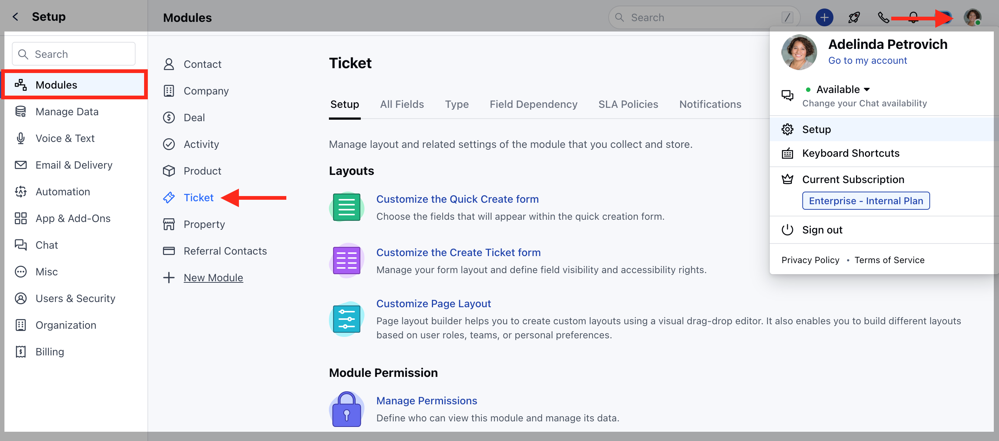
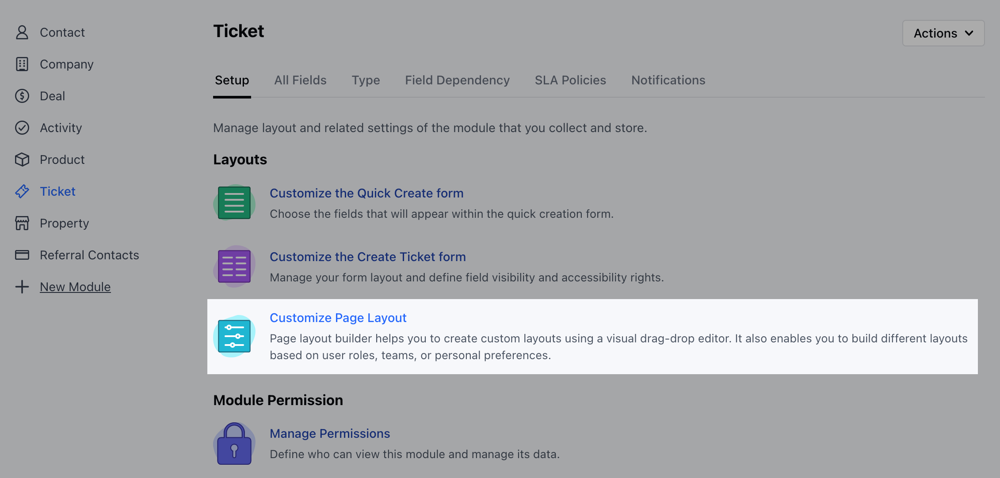

Related Ticket widget displays tickets linked to the primary contact or company associated with the current ticket.

<Note>
**Note:** This widget is only available for the Ticket Module.
</Note>

**Topics Covered:**

*   [How to add the Related Ticket Widget to the Layout](https://support.salesmate.io/hc/en-us/articles/36447187217817-Related-Ticket-Widget#01J5D8HMXCHT1E79CV6ZMN1MV3)
*   [Customize the Related Ticket Widget](https://support.salesmate.io/hc/en-us/articles/36447187217817-Related-Ticket-Widget#h_01J5D8QPY90AASGGX0KDMT7ED1)
*   [How would it appear in Detail Page](https://support.salesmate.io/hc/en-us/articles/36447187217817-Related-Ticket-Widget#h_01J5D9VEXY6GNW9Y78YA15V8V7)

### How to add the Related Ticket Widget to the Layout

To add the widget,

*   Navigate to the **Profile Icon** on the top right corner.
*   Click on the **Set Up**.
*   Head over to the **Modules** Category.
*   Select the **Tickets** Module.

*   Click on the **Customize Page Layout** option under **Set Up** section.

*   Here you can either edit the Default Layout or create the new Layout 
*   Simply drag and drop the widget to the Layout.

### Customize the Related Ticket Widget

*   Once the Widget is added to the Layout, as you click on the Widget the following options will appear
    *   **Title:** Customize the Widget as per your preference
    *   **Related to:** Select the module whose associated tickets you want to fetch. **(Contact, Company, or Product)**
    *   **Fields:** Select which ticket fields should be displayed in the widget.
    *   **Enable Sorting:** Choose a field to apply default sorting. Learn More
        
    *   **Auto Hide:** Enable this option to hide this widget automatically when no tickets are found.
    *   **Apply Filter:** Apply filters to view specific data only.
        
    *   **Set Visibility Rule:** Set a visibility rule to control when the widget is displayed, based on specific conditions.
        
*   Once you’ve configured the widget to your liking, **Save** the changes.
    

### How would it appear in Detail Page

*   When you view a ticket, this widget will automatically fetch and display related tickets based on the Related To setting:
    
    *   **If set to Contact:** It will show other tickets associated with the primary contact of the ticket you're viewing.
        
    *   **If set to Company:** It will show other tickets associated with the primary company linked to the ticket.
        

