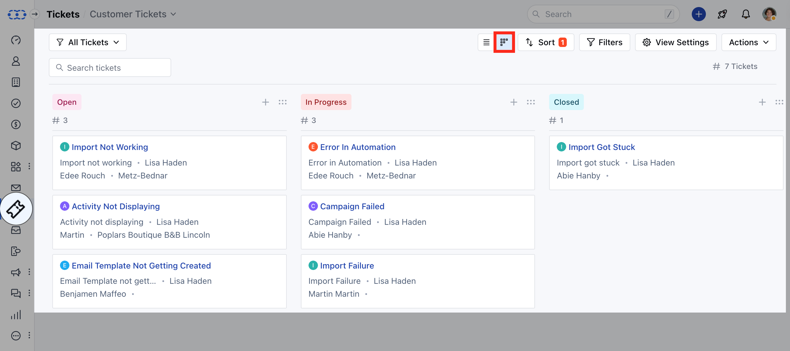
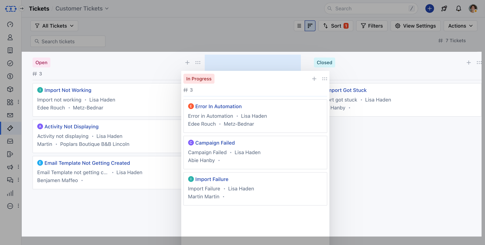
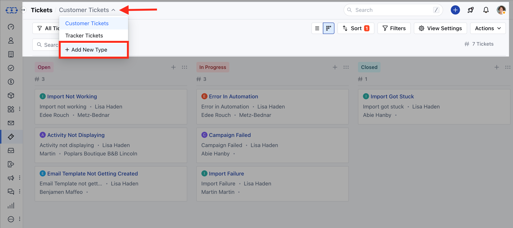
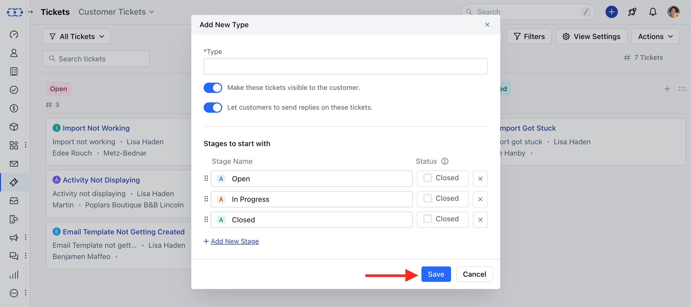
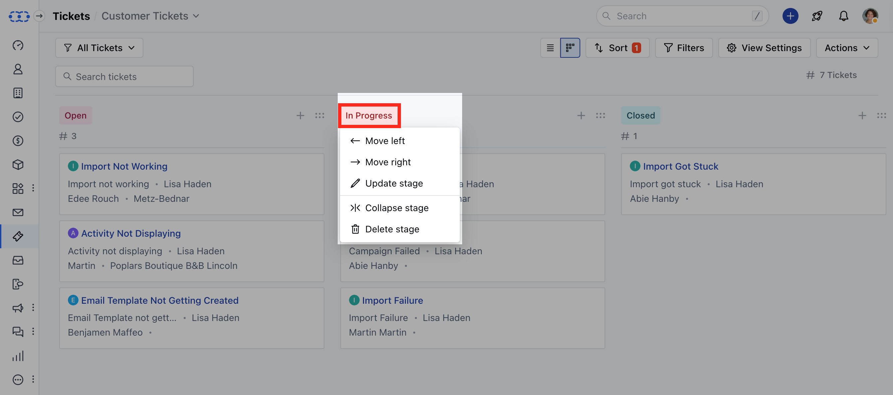
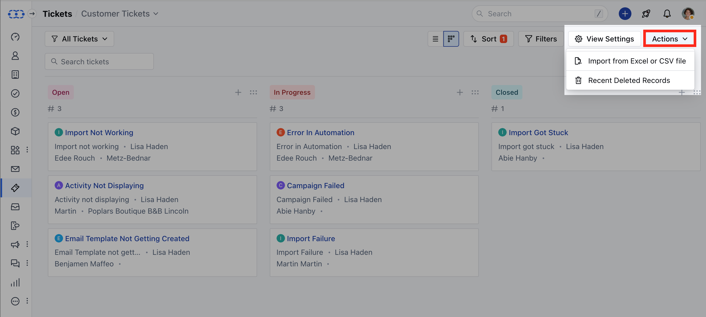

Salesmate offers a dynamic and visual representation of Tickets, allowing users to manage and track the Tickets as they progress through various phases, from creation to resolution

To manage the Board View,

- Navigate to the **Tickets** module from the left menubar
- Head over to the **Board View** option on the top right
- You will be redirected to the **Board View** screen
- In the board view, the columns will be displayed based on the stages you have created.

* You can drag and drop the Stages to reposition 

Here you can perform multiple Actions,

- [Create a New Type](#create-a-new-type)

- [Customize the Card](#customize-the-card)

- [Actions Under Stage Title](#actions-under-stage-title)

- [Operations under Actions](#operation-under-actions)

###  Create a New Type

- Navigate to the **All Pipeline** option
- Click on the **Add New Pipeline** options

* Enter the **Pipeline Name** * **Make these tickets visible to the custome** r
- Enable this option if you wish the pipeline to be visible to your customers. *
As soon as you enable this option another option will appear. * **Let customers
to send replies on these tickets** \- Enable this option if you want your
customers to engage in ticket discussions and add their comments on it * If you
wish to Add in any new stages click on **Add New Stage** * Click on **Save**

###  Customize the Card

- You can also choose the design of the card and what details should be shown by clicking on the **View Settings** button and configuring the popup with your desired details

- **Pipeline** - Select the Pipeline for which you wish to Customize the Card

- **Add Field** - Select the Fields you would like to appear on the Card, you can easily Add or remove the fields.

- Then, choose the **Card Layout,**
- **Default** - To display the values of the selected fields with their icons on the card.

- **With Label** - To display the field label and their values for the selected fields in the card.

- **Compact** - To display the values of the selected field in a compact view.

- **Preview** - Will show how the Card would appear with any of the above Card layouts.

- Once you have chosen your preferences, hit the **Save** button

###  Actions Under Stage Title

- As you click on the stage Title, it will allow you to perform the following actions,
- **Move Left** - This option allows you to move the Stage to Left

- **Move Right** - This option would allow you to move the Stage to Right

- **Update Stage** - This option would allow you to Update the Stage

- **Collapse Stage** - This option lets you temporarily hide the Stage

- **Delete Stage** - This option would let you Delete the Stage if not required

###  Operation under Actions

- **Import from Excel or CSV file** - This lets you Import Tickets using CSV or Excel files

- **Recent Deleted Records** - Here you can view records deleted recently

