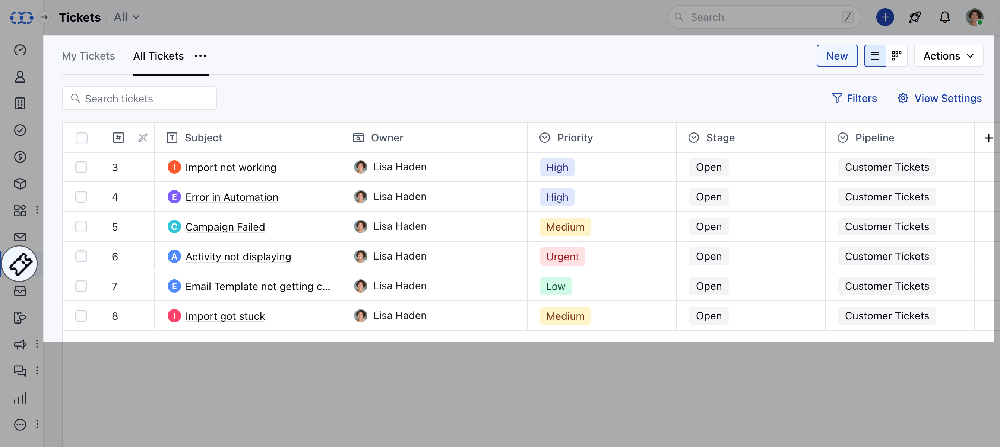
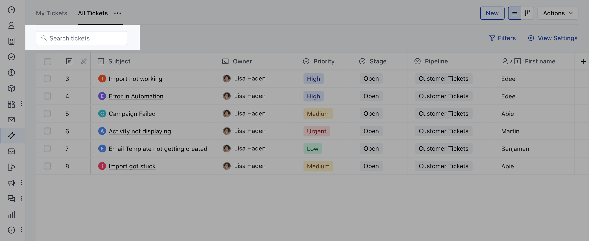
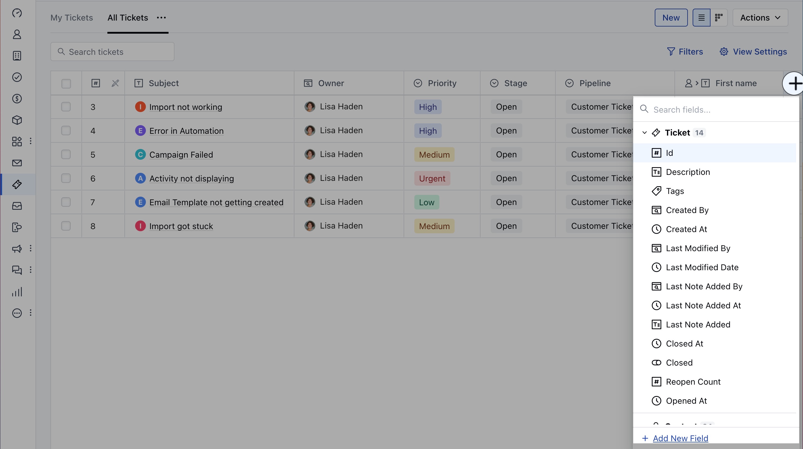
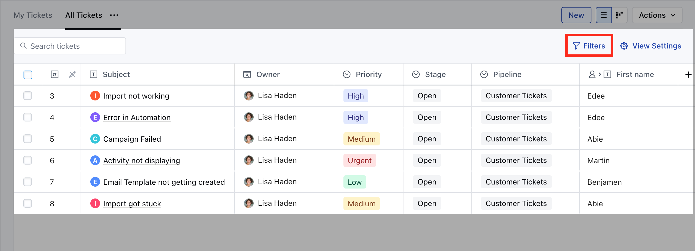
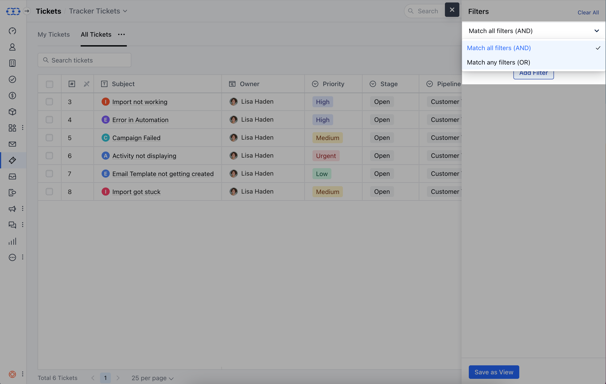
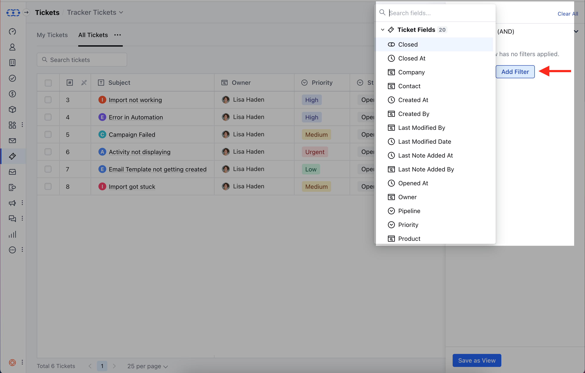
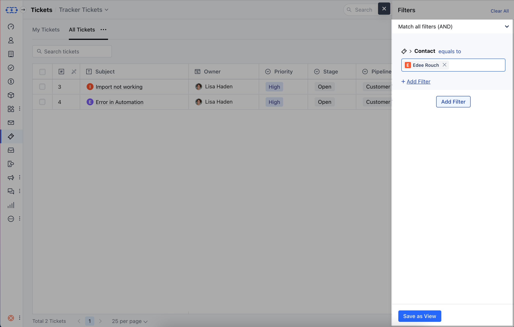
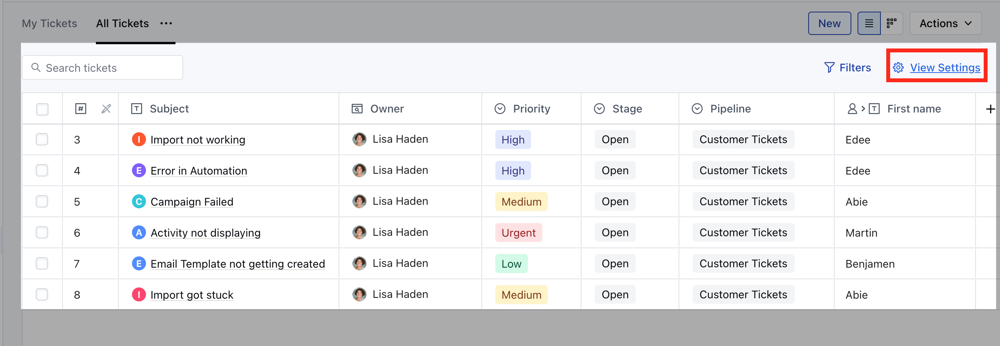
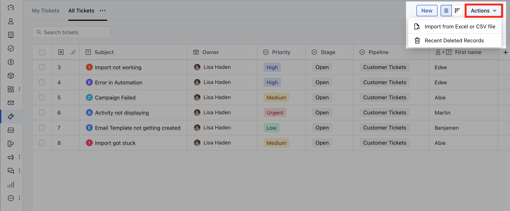
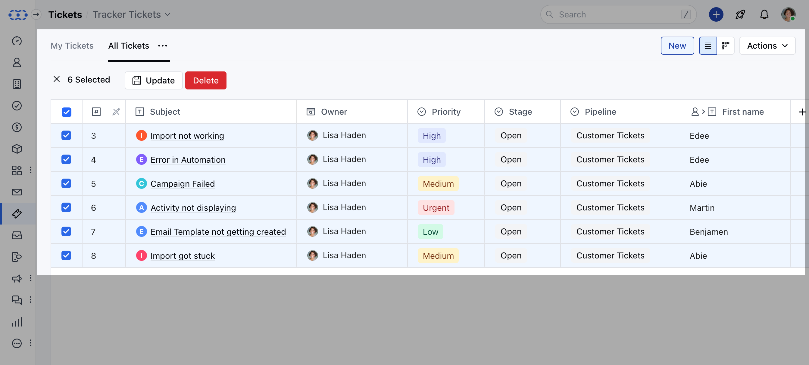

Ticket List View is the organized display of the support tickets. Users can customize the list view to prioritize and filter tickets based on specific criteria, streamlining ticket management and enhancing overall efficiency in customer support operations.

To View the Listing Operation,

- Navigate to the **Tickets** module from the left menu bar
- You will be presented with the **Ticket module's List View**.

On the list view, multiple actions can be performed as follows:

- [Quick Search](#quick-search)

- [Multiple Column Actions](#multiple-column-actions)

- [Add a Column](#add-a-column)

- [Add Filters](#add-filters)

- [Manage View Settings](#manage-view-settings)

- [Operations Under Actions](#operations-under-actions)

- [Bulk Operations](#bulk-operations)

###  Quick Search

- Navigate to the **Quick Search** Option on the top
- You can easily search any Ticket details within a View using the **Quick Search** Option 
- You can search for a ticket in the current view by Title/Subject, or ID field

###  Multiple Column Actions

- Hover on the Field Name, three dots will appear on the right, click on these three dots to perform any of the following actions,
- **Sort Ascending:** Click to sort your Records in ascending order.

- **Sort Descending:** Click to sort your Records in descending order

- **Move Left:** Click to move the column to the left. You can also drag and drop the column.

- **Move Right:** Click to move the column to the right. You can also drag and drop the column.

- **Pin Column:** Click to pin the column. You can pin the column to the **left side or the right side of the screen or unpin the column.

- **Rename Field:** Click to rename the field.

- **Add As Filter:** Click to apply filters on this column, with the default condition “Field contains”.

- **Collapse Column:** Click to collapse the column.

- **Hide From View:** Click to hide this column from your current view.

- **Auto Size This Column:** Click to adjust the size of this column automatically, according to its values.

- **Auto Size All Column:** Click to adjust the size of all columns automatically, according to their values.

###  Add a Column

- **+** icon on the right corner will allow you to **Add a Column** or **Create a New Field**.
- You can also use the shortcut key (ac) to quickly add the Column

###  Add Filters

- Click on the **Filter** option

* Select the filter logic * **Match all filters (AND)** – filter records that
match “all” defined filter conditions. * **Match any filters (OR)** – filter
records that match ”anyone” of the defined filter conditions.

* Click on **Add Filter**

* Select the Field which you want to use for segmenting the records. * Click on
- *Save as View**

###  Manage View Settings

- Click on the **View Settings** button

* A popup of “Manage Column Settings” would appear that has two sections: *
- *The section on the left will display:**

- A search bar to search for a field that you want to add to your columns.

- All fields will be displayed in their respective sections; the system fields, internal fields, smart fields, analytics fields, etc. along with the available sections.

- **The section on the right will display:**
- The list of selected fields that are added to your view.
- You can rearrange these fields in the order they should be displayed. i.e. the field on top will always be displayed as the first column.
- You can remove all fields by clicking on the **“Clear All”** option.

- **You can provide the preference for saving these columns with a view**

- **“This view” - “For Me”:** It only saves the field column for the selected view only

- **“All views” - “For Me”:** This will save the selected field columns as default for the owner of the view across all the views.

- **“This view” - “For Everyone”:** The User can perform this option and save the selected columns for everyone for this view.

- **“All views” - “Everyone”:** The user can save the selected columns for everyone.

###  Operations Under Actions

- **Import from Excel or CSV file:** This lets you Import your Records from CSV or Excel files

- **Recent Deleted Records:** Here you can view the records deleted recently

#

###  Bulk Operations

- You can perform the following **bulk operations** by selecting the Bulk Tickets from the Listing Page.

- **Update** the Tickets

- **Delete** the Tickets

