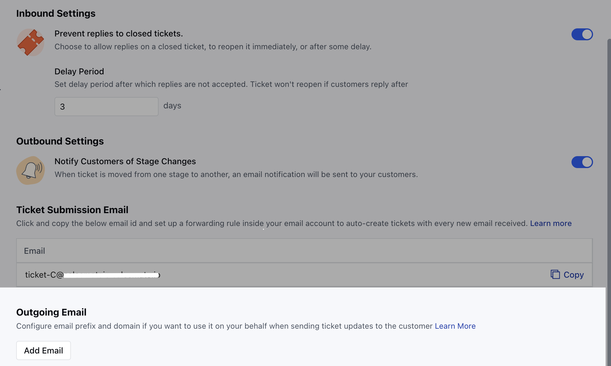
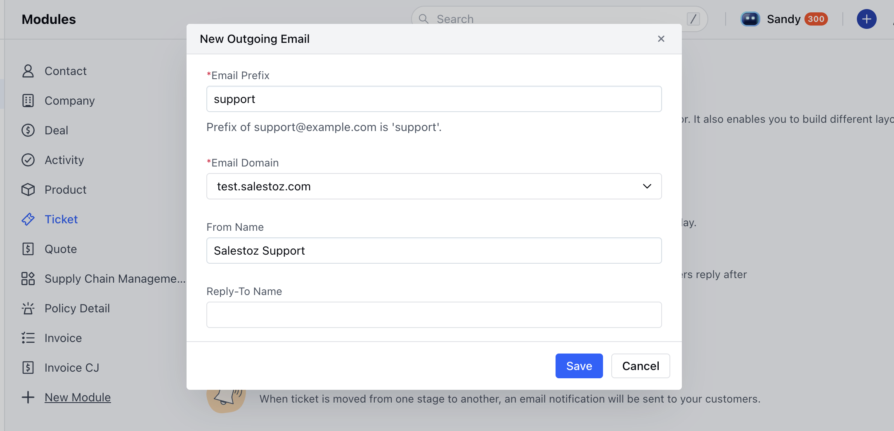

Proper configuration of outgoing email settings ensures consistent and branded communication with your customers when responding to support tickets. Follow the steps below to configure, verify, and manage your outgoing email addresses in Skara.

**Topics covered:**

- [Verify your Domain](#verify-your-domain) 
- [Configure Outgoing Email](#configure-outgoing-email)

Steps to navigate to ticket module:

- Navigate to the **Profile Icon** on the top right corner
- Click on **Set Up**
- Head over to the **Modules** category
- Click on **Tickets**

- Here, on the bottom of the Page, you will see the option **Outgoing Email**

### Verify your Domain:

Depending on the domain verification status, the options available to you may vary:**If the domain is not verified** a warning message will appear: “Your email domain is not verified. Verify it now to send ticket updates from Skara using your domain.”

- Until verified, ticket update emails will be sent from the Skara domain: [**noreply@salesmatemail.com**](mailto:noreply@salesmatemail.com)
- Click **‘Verify it now’** will redirect you to **Email Sending Domain** setup
- [Learn More](https://support.salesmate.io/hc/en-us/articles/360006983771) to verify your domain in Salesmate

- **If the domain is verified:** You will see the option to Add a new outgoing email address

- Click **Add** to proceed to the next step

### Configure Outgoing Email:

Upon clicking **Add**, a popup will prompt you to fill in the following fields:

- **Email Prefix:**
- Enter the part of the email before the @ symbol
- Example: For [support@yourdomain.com](mailto:support@yourdomain.com), the prefix is support
- Max limit: 64 characters
- **Email Domain:** 
- If multiple verified domains exist, select one from the dropdown
- If only one domain exists, it will be pre-selected
- Only one domain can be selected at a time
- **From Name:**
- This name will appear as the sender in customer inboxes
- Defaults to your organization name if left blank
- Max limit: 50 characters
- **Reply-To Name:**
- This name appears when customers reply to the email
- Defaults to your organization name if left blank
- Max limit: 50 characters

Now, hit on **Save**

