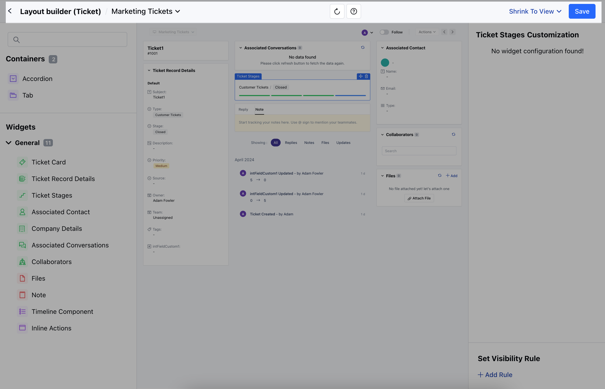

Page layout builder helps you to create custom layouts using a visual drag-drop editor. It also enables you to build different Ticket layouts based on user roles, teams, or personal preferences.

<Note>
  **Note:** A User with **Manage Permission** Rights can perform this action
</Note>

To Customize the Ticket Layout,

- Navigate to the **Profile Icon** in the top right corner.
- Click on **Set Up**
- Head over to the **Modules** category
- Select **Tickets** 

- <Tooltip tip="">Click on the </Tooltip>**Customize the Page Layout option**
- Here, you can **Create a New Layout** Customize the Default Page Layouts

### Create a New Layout

To create a New Page Layout,

- Click on the **Create New Layout** option on the right

- A pop will open asking for the following details 
  - **Layout Name**: Enter the layout Name 
  - **Choose Layout Frame**: Select the appropriate Layout Frame from
    - 3 Column Layout - Default Layout 
    - 2 Column Layout - Left Sidebar 
    - 2 Column Layout - Right Sidebar 
    - 2 Column Layout - Equal width 
    - Once you have provided the information, click the **Start Customization** button

- You will be redirected to the **Visual Layout Builder** Page 
- Here, a blank canvas will open with the selected layout frame and one action bar at the top. You can drag-drop the required widget on the screen to create a preferred layout.

- Build different **Accordion** and **Tabs** to organize the content in a specific structure.

- When accessing the Ticket Record Details, you have the flexibility to customize your view. You can choose to display either All Available Fields or only specific ones by selecting the **"Add Field"** option

- You can also **Set the Visibility Rule** from the **\+ Add Rule** option 
- Set the **Condition Criteria **and**Save**  

- Once you are done making the changes, you can hit on **Save**.

- A pop will open asking for the following information, 
  - **Layout Name**: It will display the name that you provided earlier, but you can change it before saving. 
- **Description**: Add a description of the newly created layout. \* Choose if you want to Enable this layout for usage. If you enable the option it will open an option to allow access, 
  - **Organization Level**: Everyone in the organization will have access to this layout. 
  -  **Role**: Only users with specific roles can access this layout.
  - **Teams**: Only users in the specific team can access this layout.
  - **User**: Only specific users can access this layout.
- Then, **Save** the information

<Note>
  **Note:** If you have one layout set as organization level and then you save another then the previous one loses its org level setting and becomes inactive from usage at user level.
</Note>

### Customize the Default Layouts

To customize the Default Layout

- Hover on the **Default Layout** option,**Actions** button will appear
- Click on the **Actions** button and select the **Edit** option.

- You will be redirected to the **Layout Builder Page**. Here, you can drag and drop the Widgets to align with your specific business processes 
- Make the desire changes, once done click on **Save**

- Once you click on the Save option a pop will open asking for the following information 
- Here, you can **Change the Layout Name** 
- Add the **Description** 
- Enable/Disable the Layout for Usage 
- Change the Layout **Access** 
- Once done, **Save** the information.

