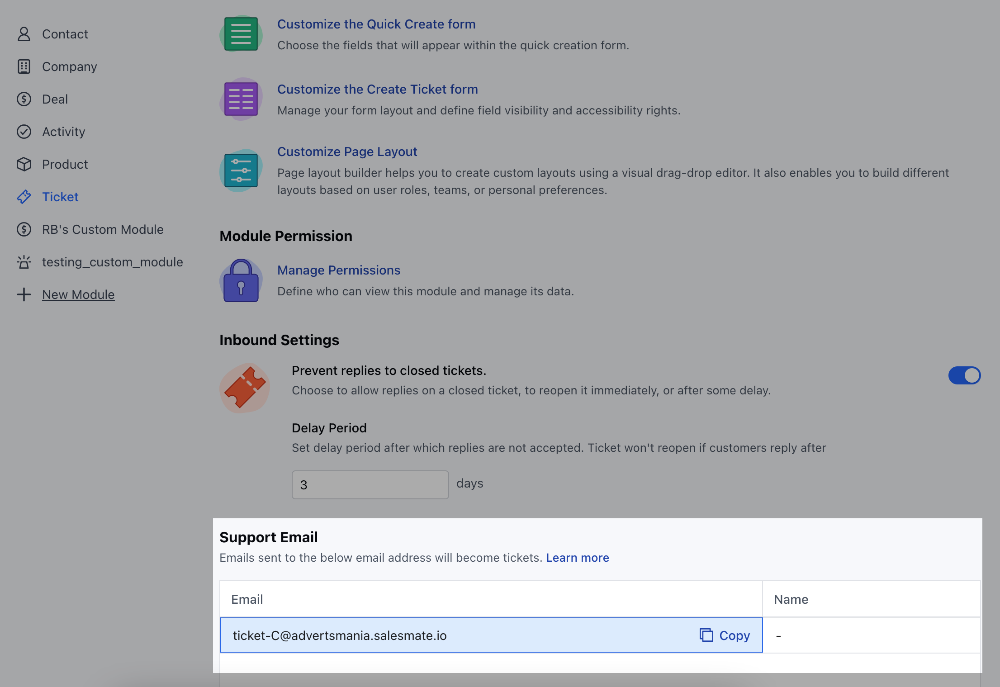

Now, customers have the capability to generate a ticket simply by sending an email to Salesmate. This feature enables users to establish a forwarding rule within their email client, particularly if they employ a support email address to manage their customers' concerns.

### How to Create a Ticket via Email

Similar to email forwarding in Chats, you can set up email forwarding in your email client too for creating tickets via email.

To create a Ticket via Email,

- Navigate to the **Profile Icon** from the top right corner
- Click on the **Set Up**
- Head over to the **Modules** Category
- Click on the **Tickets**

* Head to the Support Email at the bottom * Copy the email address, and set it
up as a forwarding rule in your email client.

* You can also set the reply-to name for this email address, by editing it and
providing the name.

* When any emails are sent to this email address, their tickets are created in
the Salesmate. * By default, this ticket will be added to the **“Customer
Tickets”** pipeline. * While setting forwarding **Rules** from your Outlook
Account, you need to select the **Redirect To** option.

