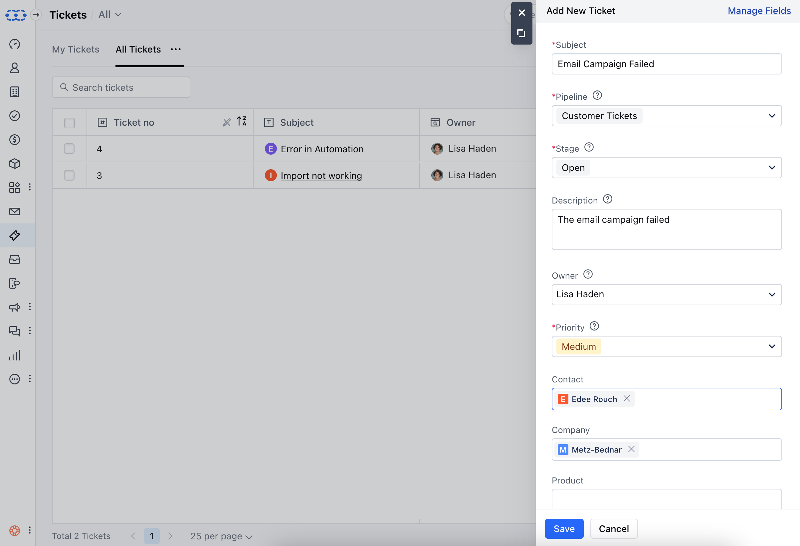

Ticketing System in CRM allows Businesses to enhance their customer support processes, improve response times, and maintain a systematic approach to handling customer issues, ultimately contributing to better customer satisfaction and retention.

<Note>
**Note:** A User with **Manage Permission** Rights can perform this action
</Note>

To Create a Ticket,

*   Navigate to the **Tickets** Module from the left menu bar
*   Click on the **New** option

*   A Quick Create Form will appear, you can choose to create a Ticket with essential fields only 

*   Or expand the form to create a detailed ticket and enter the details
*   You will have to choose the **Ticket Type / Pipeline** for which you want to create a ticket.
*   Select the Stage
*   By default, the logged-in user is selected in the **Owner** field, you can change the owner if required
*   The default **Priority** of the ticket is none, but it is mandatory to choose a value.
*   You can associate a **Contact, Company, or Product** with the Ticket
*   Once done, click on **Save**.

