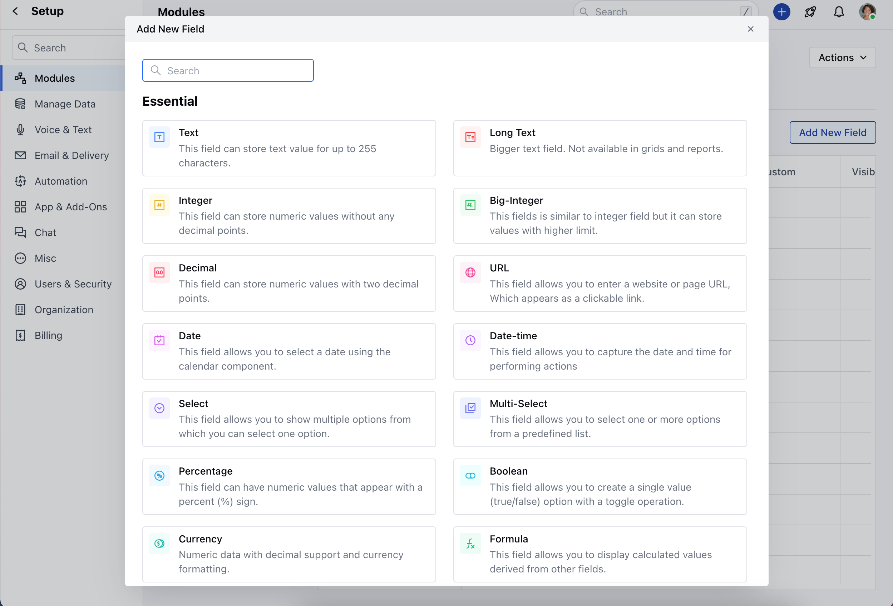
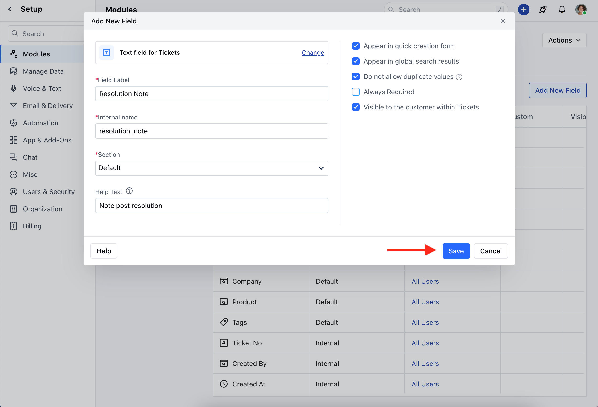

The ability to create custom fields for a ticketing system is instrumental in tailoring the system to the organization's unique needs, improving data accuracy, and enhancing overall efficiency in managing customer interactions and support tickets.

<Note>
  **Note:** A User with **Manage Permission** Rights can perform this action
</Note>

To create a new custom field for the Tickets module,

- Navigate to the **Profile Icon** on the top right corner
- Click on **Set Up**
- Head over to the **Modules** category
- Click on **Tickets**

- Locate the **All Detail Form Fields** Section
- Click on the **Add New Field** option

- A popup will appear displaying a list of essential and useful field types to choose from. You can search for a field using the search bar. 
- Choose the **Field Types.**

- Once you've selected a field type, provide the following details for the field: 
  - Field Label Name - Specify the field name for clear and easy identification 
  - Internal Name - Enter Internal Name for API integrations 
  - Section - Select the Section you wish the Field to fall under 
  - Help Text - Add the Help Text to provide additional information to help your teammates to understand the purpose of the field \* 
- Once you have added the details, you can select,  
  - **Appear in quick creation form:** To display this field in the quick creation form. 
  - **Appear in global search results:** To allow searching the field via global search. 
  - **Do not allow duplicate values:** To prevent the creation of a duplicate Ticket. 
  - **Required:** If the Field should be mandatory.
  - **Visible to the customer within Tickets**: If the field should be visible to the customers 
- Once done, **Save** the details.

