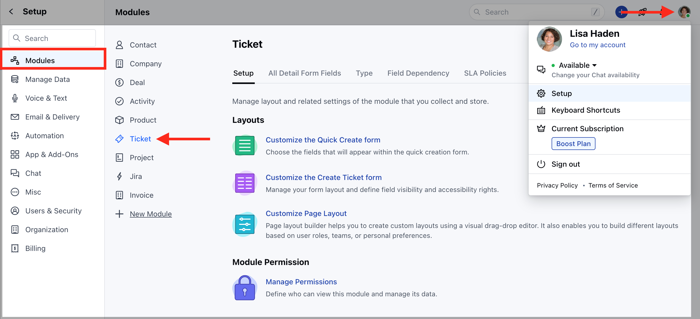
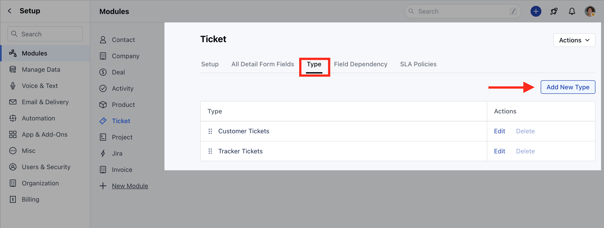
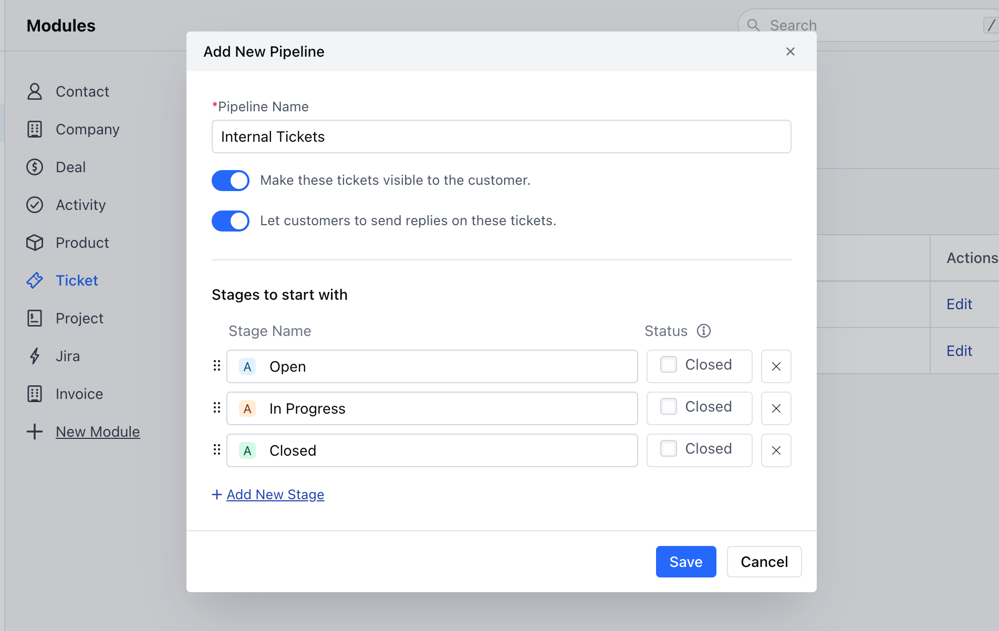
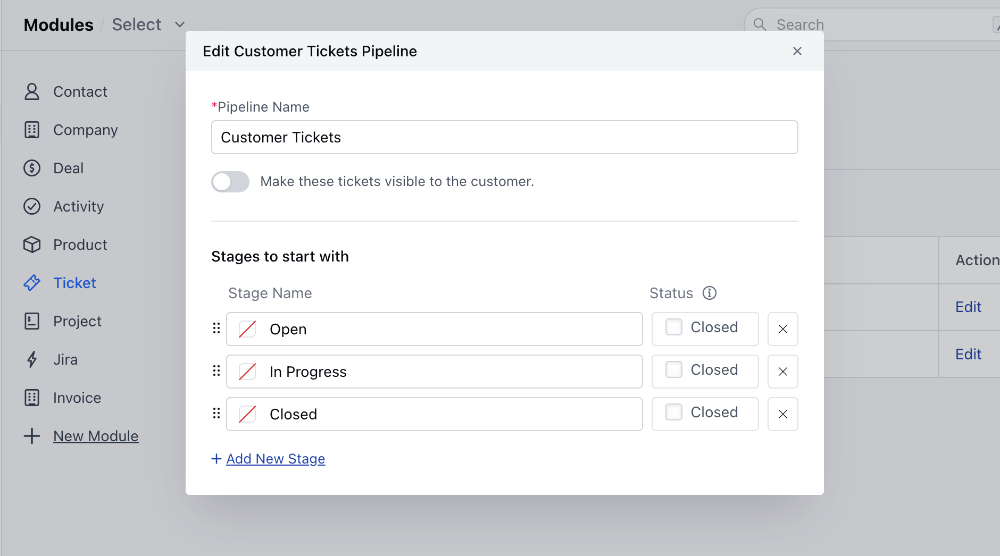
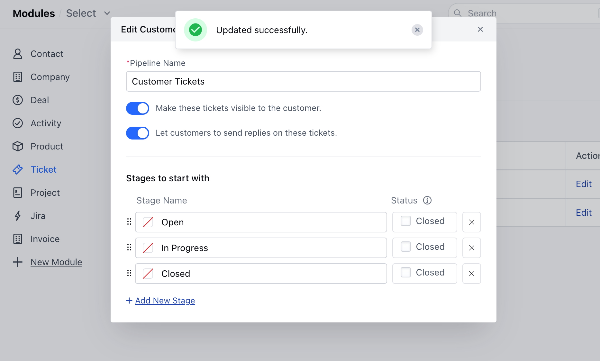

With Ticket Pipeline organizations can enhance their customer support operations by ensuring a systematic and organized approach to handling customer inquiries

Topics Covered:

*   [How to Create a Ticket Pipeline Type](https://support.salesmate.io/hc/en-us/articles/26032699254169-How-to-Set-a-Ticket-Pipeline-Type#h_01HGYRKKCA8YRVN3SQ867HTG4F)
*   [How to Edit the Default Pipeline Type](https://support.salesmate.io/hc/en-us/articles/26032699254169-How-to-Set-a-Ticket-Pipeline-Type#h_01HGYRM6S9N2JM8MAC4ZVNJH57)

### How to Create a Ticket Pipeline Type

To create a Ticket Pipeline Type,

*   Navigate to the **Profile Icon** on the top right corner
*   Click on **Set Up**
*   Head over to the **Modules** category
*   Click on the **Tickets** module

*   Navigate to the **"Types"** section and select the **"Add New Type"** option to include a new category

*   A popup would appear asking for the following details that you need to provide:
    *   **Pipeline Name -** A name for your pipeline that will be displayed in board view, filters, reports, and other places
    *   **Make these tickets visible to the custome**r - Enable this option if you wish the pipeline to be visible to your customers.
    *   As soon as you enable this option another option will appear.
    *   **Let customers to send replies on these tickets** - Enable this option if you want your customers to engage in ticket discussions and add their comments on it
    *   **Stage** **Name** -You can rename the stage and change the color, that works the same as the current Stage Title in the pipeline.
    *   **Status** - Choose whether the stage should be considered open or closed. 
*   You can also add a new stage by clicking on the option **“Add New Stage”**
*   You can also reorder the stages here by drag and drop.
*   Once done, hit on the **Save** option to create a Pipeline Type

### How to Edit the Default Pipeline Type

To Edit the default Pipeline Type,

*   Navigate to the **Profile Icon** on the top right corner
*   Click on **Set Up**
*   Head over to the **Modules** category
*   Click on the **Tickets** module

*   Navigate to the **"Types"** section
*   Select the Pipeline Type you wish to edit and click on the **Edit** option

*   Here you can make the necessary changes and the changes will get auto Updated with the **"Updated Successfully"** message

