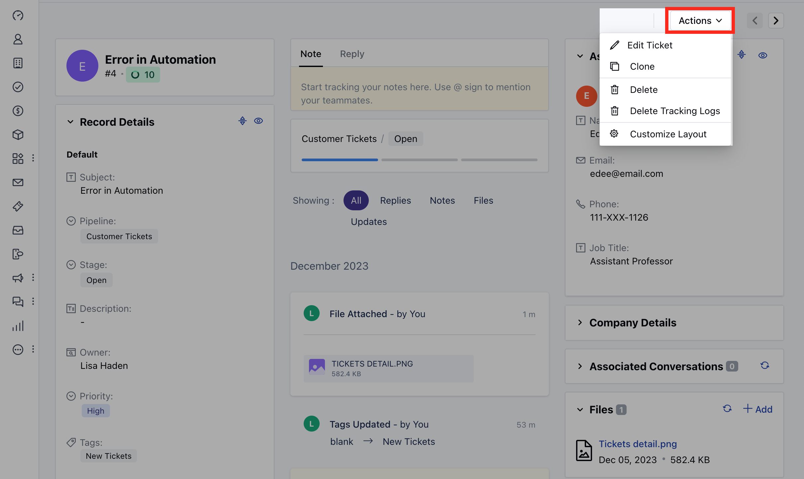
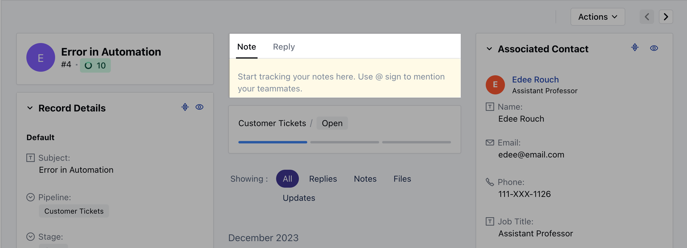
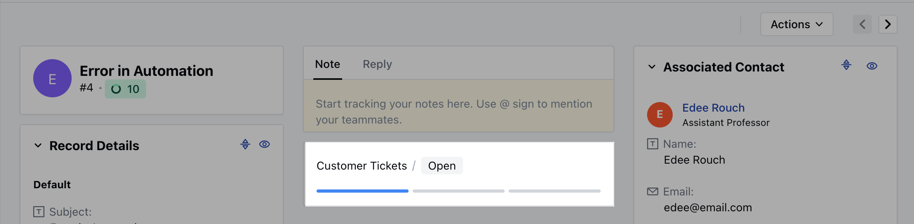
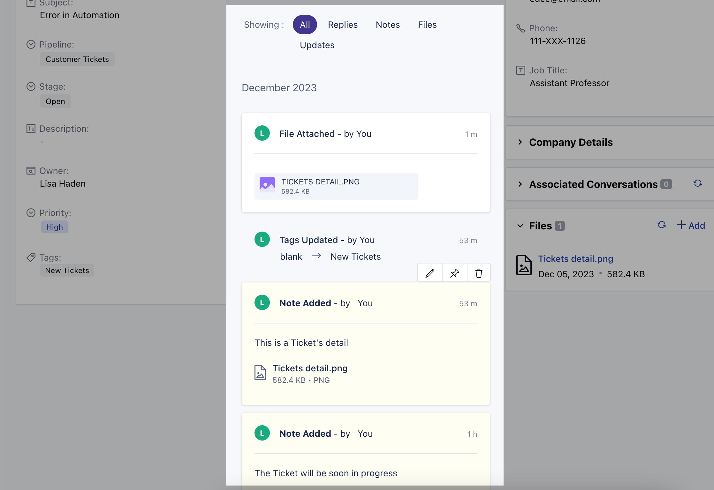

Having Ticket Details within a system ensures that customer support teams have the necessary information to address issues promptly, track progress, and maintain a record of interactions. This contributes to efficient customer service, improved communication, and a better customer experience.

To View the Ticket details,

- Navigate to the **Tickets** module from the left menu bar
- Select and click on the **Title** of the created ticket, you will be redirected to the detail screen

- This detail screen has the following widgets by default, \* **Ticket
  Card:** This gives you the details of the Ticket Title, ID, Ticket Thumbnail which appears based on the title and, Upcoming SLA due time \* **Ticket
  Details:** This Widget displays all the Ticket details \* **Stage Details:** This will display the current pipeline and stage of the ticket \* **Editor:** This allows you to post a reply or note on the ticket. \* **Associated Contact:** This widget displays the details of the Contact associated with the Ticket \*

- _Company Details:_\* This widget displays the details of the Company associated with the Ticket \* **Associated Conversations:** This widget will display the conversation that is associated with the ticket. \* **Files:** This will display uploaded attachments that are associated with the ticket.

- You can perform the following actions on the ticket from the **Action** button
- **Edit Ticket**

- **Clone**
- **Delete Ticket**
- **Delete Tracking Logs**
- **Customize Layout**

- You can post a **Note or Reply** to the ticket

- You can also Update the **Stage** of the Ticket

- The timeline will display various timeline entries about the events that occurred in the ticket history, internal notes posted by users, replies posted by users, and contacts.

