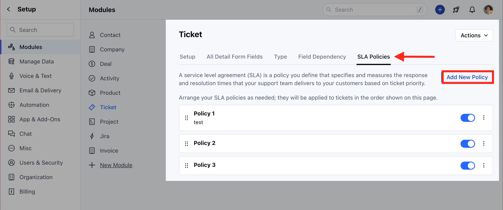
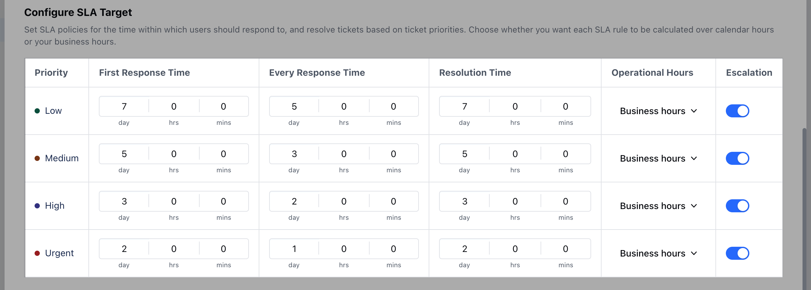

Configure SLA targets in Salesmate for delivering exceptional customer service, optimizing team efficiency, fostering accountability, and maintaining compliance with contractual agreements

To Configure SLA Target,

*   Navigate to the **Profile Icon** on the top right corner
*   Click on **Set Up**
*   Head over to the **Modules** category
*   Click on **Tickets**

*   Head to the **SLA Policies** section
*   You can configure SLA Target while creating a new policy
*   Click on **Add New Policy** to create a new policy

*   Head to **Configure SLA Target**

Here, you can set the following details,

*   [Priority](https://support.salesmate.io/hc/en-us/articles/26678152976793-How-to-Configure-SLA-Target#h_01HJ5QHFSKW4QFA9339R0PFSJ5) 
*   [First response time](https://support.salesmate.io/hc/en-us/articles/26678152976793-How-to-Configure-SLA-Target#h_01HJ5QNX0YNN02FG0RAP63J66V)
*   [Every response time](https://support.salesmate.io/hc/en-us/articles/26678152976793-How-to-Configure-SLA-Target#h_01HJ5RB2X9RSZMNA1WW6DVMJZ5)
*   [Resolution time](https://support.salesmate.io/hc/en-us/articles/26678152976793-How-to-Configure-SLA-Target#h_01HJ5S3TS46QGYWRAZPV04GGBZ)
*   [Operational Hours](https://support.salesmate.io/hc/en-us/articles/26678152976793-How-to-Configure-SLA-Target#h_01HJ5SFY2Q5Z0WWR43CQ2PWGES)
*   [Escalation](https://support.salesmate.io/hc/en-us/articles/26678152976793-How-to-Configure-SLA-Target#h_01HJ5SHT8C10RHJZR7CZWTBZ71)

#### **Priority**

*   Set the given SLA Priority as
    *   **Low** - Tickets marked with a Low-priority SLA may have longer allowed response and resolution times compared to higher-priority items.
    *   **Medium** - Tickets marked with a medium SLA priority usually have moderate response and resolution times
    *   **High** - Tickets marked with a high SLA priority typically have shorter allowed response and resolution times
    *   **Urgent** - Tickets marked with an "Urgent" SLA priority would need immediate attention and require the fastest possible turnaround for resolution.

#### **First response time**

*   Choose the specific timeframe within which the Customer/User should receive an initial response once the Ticket is submitted

#### **Every response time**

*   Choose the specific timeframe within which the Customers/Users should expect to receive a response each time they reply to your communications

#### **Resolution Time**

*   Choose the specific timeframe within which the Tickets matching the SLA criteria should be resolved

#### **Operational Hours**

*   Choose whether these response times will work based on Business or Calendar Hours

#### **Escalation**

*   Choose whether an escalation reminder or violation should run for this priority. Simply enable the option for given priorities as per your business process