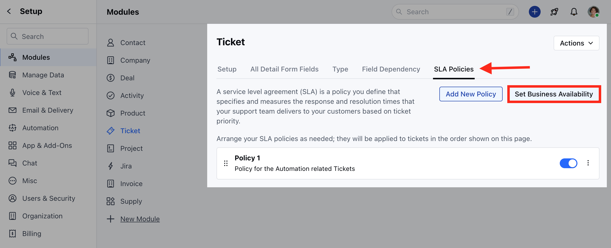
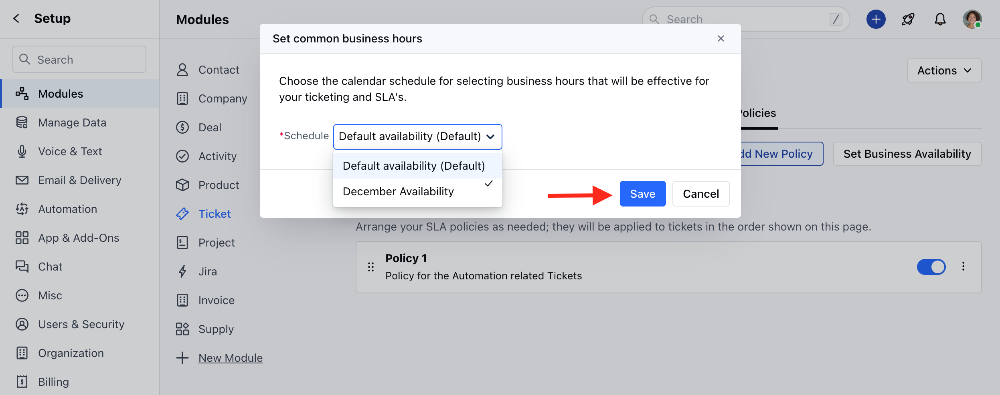
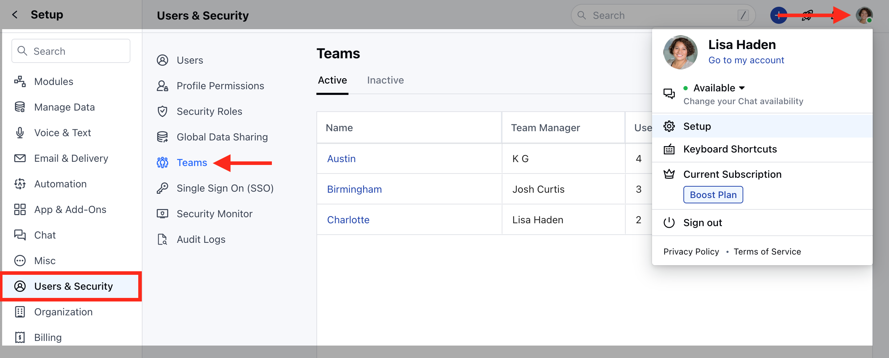
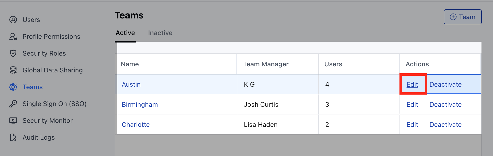
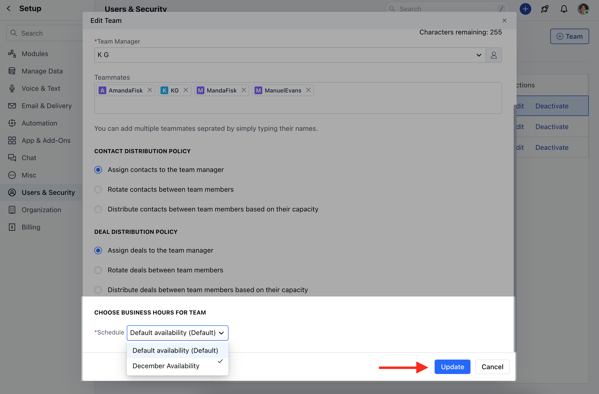

In Salesmate, the availability master feature allows you to set and customize business hours for any type of business. You can leverage this availability master to establish and specify the working hours that align with your Service Level Agreements (SLA).

### **Topics covered:**

- [How to Set Business Availability for SLA](#how-to-set-business-availability-for-sla)

- [How to Set Team-Specific Business Hours](#how-to-set-team-specific-business-hours)

### How to Set Business Availability for SLA

To Set the Business Availability for SLA,

- Navigate to the **Profile Icon** on the top right corner
- Click on **Set Up**
- Head over to the **Modules** category
- Click on **Tickets**

* Head to the **SLA Policies** section * Click on the **Set Business
Availability** option

* Select your Availability option from the **Schedule** dropdown and click on**
Save**

### How to Set Team-Specific Business Hours

To Set Team Specific Business Hours,

- Navigate to the **Profile Icon** on the top right corner
- Click on **Set Up**
- Head over to the **Users & Security** Category
- Click on **Teams**

* Select the Team that you wish to Set the Availability for and click on the
- *Edit** option

* Head to the **CHOOSE BUSINESS HOURS FOR TEAM** at the bottom * Select your
Availability option from the **Schedule** dropdown and click on **Update**

