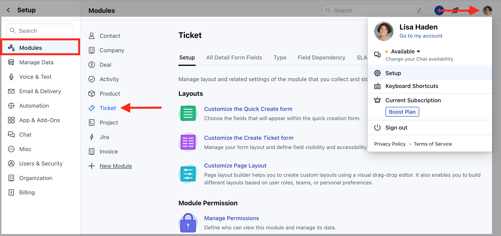

In Salesmate, you have the flexibility to establish multiple Service Level Agreement (SLA) policies tailored to your business needs. These policies can be applied and enforced on tickets, taking into account various criteria such as customer segments, company classifications, or specific ticket attributes.

- **Topics covered:**

*
[How to Create an SLA](#how-to-create-an-sla)
*
[How to Edit SLA](#how-to-edit-sla)
*
[How to Clone SLA](#how-to-clone-sla)
*
[How to Delete SLA](#how-to-delete-sla)

### How to Create an SLA

To create an SLA policy,

- Navigate to the **Profile Icon** on the top right corner
- Click on **Set Up**
- Head over to the **Modules** category
- Click on **Tickets**

* Head to the **SLA Policies** section * Click on **Add New Policy** to create a
new policy

Here, you would need to enter the following details,

- **Name** - Enter an appropriate name for the policy

- **Description** - Enter the brief description explaining the Policy you are creating.

- **Configure SLA Trigger conditions** - Mention the Condition to determine when the Policy should be applied. 

* **Configure SLA Target** - Set SLA policies for the time within which users
should respond to, and resolve tickets based on ticket priorities. [Learn
More](https://support.salesmate.io/hc/en-us/articles/26678152976793) *
- *Priority** * **First response time** * **Every response time** * **Resolution
time** * **Operational Hours** * **Escalation**

* **Notify Users of approaching SLA deadlines - ** Set Up reminders to notify
Users when the SLA is approaching the deadlines. You can choose single or
multiple active Users/Teams to be notified * **When** - Choose the Metric for
when the User should be notified * **Approaches in** - Select the Time for the
User to be notified * **Send Reminder to** - Select the User/Team that should
receive a Notification while the deadline is approaching

* **Send escalation when SLA is breached** \- Set Up escalation to send an
alert to the Users when the SLA is violated. You can choose single or multiple
active Users/Teams to be notified. * **When** - Choose the Metric for when the
User should be notified * **Is not met, escalation** - Select the time to send
an alert * **To** - Select the User/Team that should receive an alert when SLA
is breached

### How to Edit SLA

To Edit SLA,

- Navigate to the **Profile Icon** on the top right corner
- Click on **Set Up**
- Head over to the **Modules** category
- Click on **Tickets**

* Find the required SLA from the already defined **SLAs**. * Click on the three
dots (active menu) and choose the **EDIT** option.

* Make the Necessary changes and click on Update to save the changes

### How to Clone SLA

To Clone SLA,

- Navigate to the **Profile Icon** on the top right corner
- Click on **Set Up**
- Head over to the **Modules** category
- Click on **Tickets**

* Find the required SLA from the already defined **SLAs**. * Click on the three
dots (active menu) and choose the **Clone** option. * Make the necessary changes
if required and hit on Save

### How to Delete SLA

To Delete SLA,

- Navigate to the **Profile Icon** on the top right corner
- Click on **Set Up**
- Head over to the **Modules** category
- Click on **Tickets**

* Find the required SLA from the already defined **SLAs**. * Click on the three
dots (active menu) and choose the **Delete** option.

* Confirm the Action to continue Deleting the SLA

