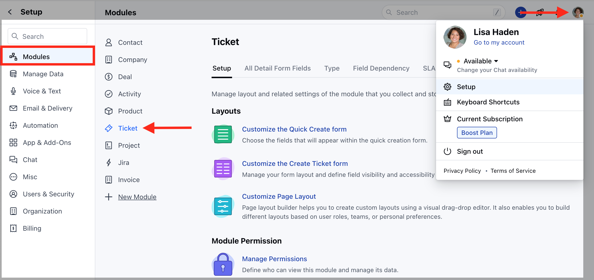
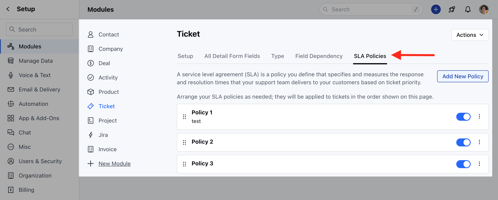
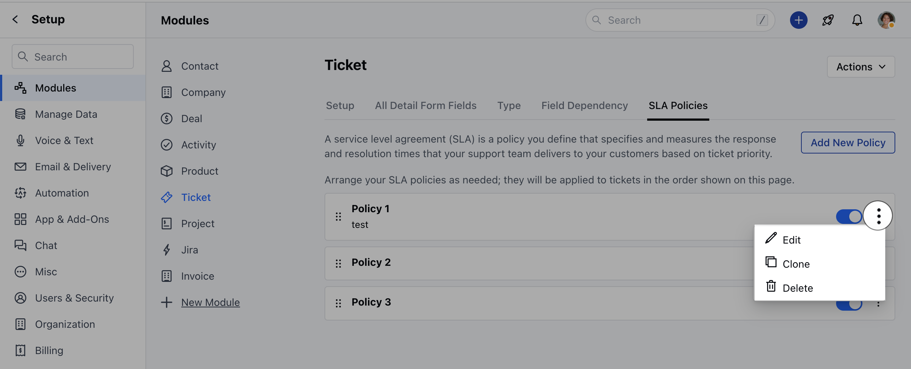

To manage the SLA Listing,

*   Navigate to the **Profile Icon** on the top right corner
*   Click on **Set Up**
*   Head over to the **Modules** category
*   Click on **Tickets**

*   Head to the **SLA Policies** section
*   Here, you will find the list of all available  SLA Policies
*   Here you can enable/disable the Policies when there is a change in your business process

*   You can click on the three dots to,
    *   **Edit** 
    *   **Clone** 
    *   **Delete**

