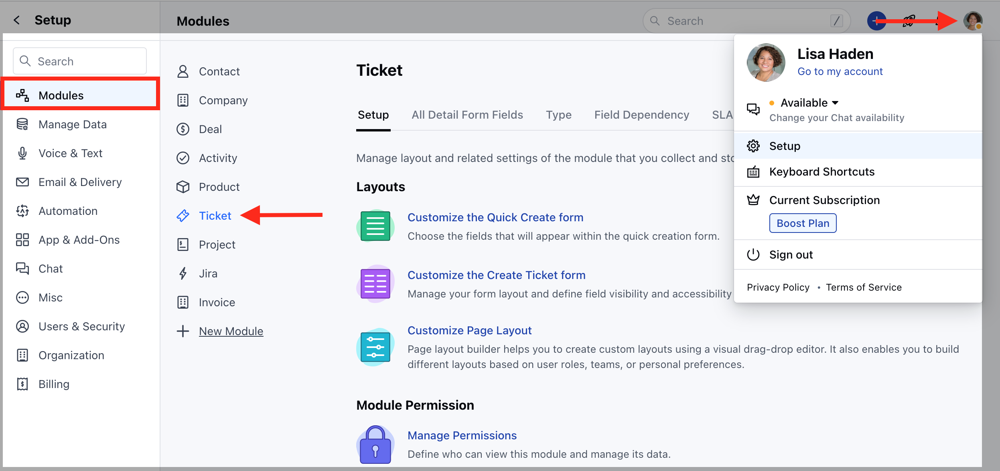
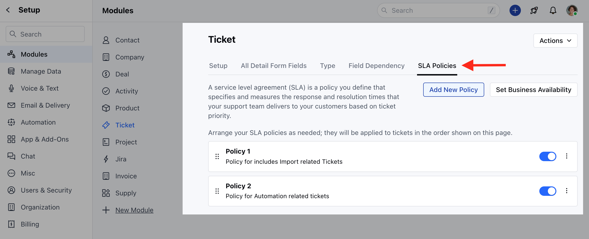
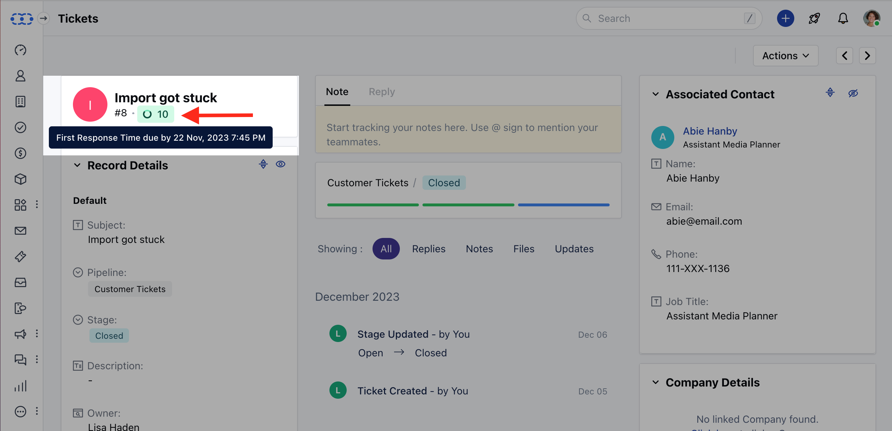

###  SLA Priority/Order

Prioritizing SLAs allows organizations to differentiate service levels based on the urgency or criticality of specific issues. This ensures that different types of requests receive appropriate attention and resources.

###  How to Set SLA Priority

To set the SLA Priority,

- Navigate to the **Profile Icon** on the top right corner
- Click on **Set Up**
- Head over to the **Modules** category
- Click on **Tickets**

* Head to the **SLA Policies** section * Drag and drop the Policies to set the
Priority/order 

###  SLA Status

SLA status is shown as colored badges based on the remaining time to complete it.

- SLA Status would be identified based on the following colors,
- **Green:** Time is greater than 15 minutes.

- **Orange:** Time is lower than 15 minutes but greater than 0.

- **Red:** Time is 0 minutes or less (SLA has breached.)
- You can view the SLA Status on the Tickets Detail View

